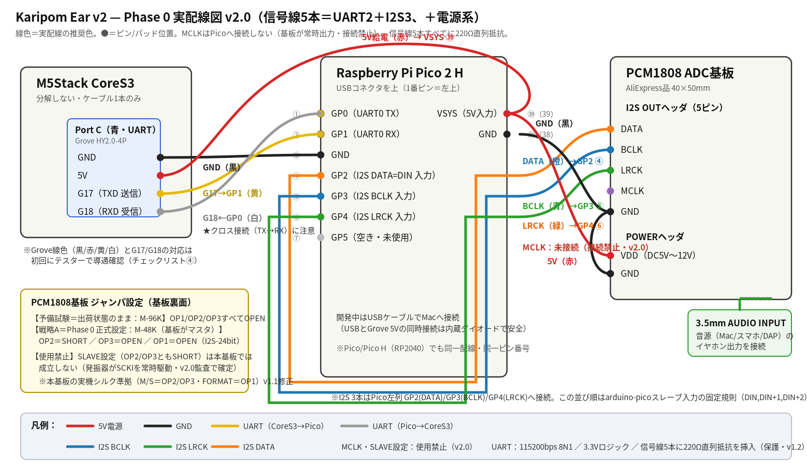

# Karipom Ear v2 — Phase 0 実装仕様書

- **文書番号**：KPE-IMPL-001
- **版数**：**v2.0（ゼロベース設計監査の結果を反映。v1.2以前からの必須変更あり——§0参照）**
- **作成日**：2026-07-12（v2.0改訂同日）
- **上位文書**：Karipom Ear v2 正式アーキテクチャ設計書 v1.0（KPE-ARCH-001）
- **前提コード**：karipom_20260712_0612_IDLE_LR_DISABLED.ino（FW stable_2.2、9,491行）
- **目的**：**誰が実装しても迷わない**レベルまでPhase 0を具体化する（コードは含まない）

## §0 v2.0での変更（監査結果・必読）

一次情報（arduino-pico 5.6.1のI2Sライブラリ実ソース・PCM1808データシート）に基づくゼロベース監査で、以下を修正した。**v1.2以前の配線・手順で作業していた場合、I2Sの3本は繋ぎ直しが必要。**

| # | 変更 | 理由（一次情報） |
|---|---|---|
| E1 | **I2S配線の役割変更：GP2=DATA(DIN)、GP3=BCLK、GP4=LRCK**（旧：GP2=BCLK/GP3=LRCK/GP4=DATA） | arduino-pico 5.6.1のスレーブ入力実装（pio_i2s_in_slave_program_init）は「**DIN, DIN+1=BCLK, DIN+2=LRCK の連番固定・setBCLK()は無視**」。旧配線ではライブラリ仕様上、動作しない |
| E2 | **戦略B（PicoマスタでPCM1808をSLAVE駆動）を全廃** | PCM1808データシート：スレーブ時LRCKはSCKIと同期必須（ずれ±6BCK超でADC停止・ゼロ出力）。本基板は発振器がSCKIを常時駆動しており、Pico側クロックとは原理的に同期不能 |
| E3 | **I2S受信は setBitsPerSample(32) 固定**（24指定は禁止） | 基板マスタはBCK=64fs（32クロック/半フレーム）。24bit設定はautopush境界がフレームとずれ、データが回転して壊れる。32bitで受け、上位24bit相当を利用する |
| E4 | MCLKは**恒久的に未接続**（GP5は空きへ） | E2の帰結。基板MCLKピンは24.576MHz出力であり、Picoから駆動すると衝突 |

## Phase 0 のゴールと絶対条件

**ゴール**：Macを使わず、PCM1808に3.5mmで入力した音楽で「FFT Face（グライコフェイス）」と「口パク」が動く。

**絶対条件**：既存かりポムコードの変更は「追加のみ・3か所・約120行」に限定する（§4）。既存関数の中身は1行も変更しない。Groveケーブルを抜けば従来のかりポムに完全に戻ること。

**Phase 0でやらないこと**：VAD（本格版）・ビート検出・ダンス・MEMSマイク・バイナリプロトコル・ソース調停。口パクのトリガは「簡易レベルゲート」（RMS閾値+ハングオーバ）で代用する。これはVADではない（Phase 2で置換前提の暫定実装）。

---

## 1. 部品一覧

### 1.1 購入済み（手元にあるもの）

| # | 部品 | 用途 | 確認事項 |
|---|---|---|---|
| 1 | M5Stack CoreS3（かりポム本体） | 表現担当 | Port C（青コネクタ）が空いていること |
| 2 | PCM1808 ADC基板（AliExpress品） | ライン入力→I2S変換 | 裏面ジャンパがいじられていないこと（出荷デフォルト=M-96K） |
| 3 | Grove HY2.0-4Pケーブル | CoreS3⇔Pico接続 | サーボ用と混同しないこと。20cm以下推奨 |
| 4 | Mac + USBケーブル（USB-A/C→micro-B or USB-C） | Pico書き込み・シリアルモニタ | PicoのUSBコネクタ形状に合うこと（Pico 2 H＝micro-B）。**データ通信対応であること（充電専用ケーブル不可・v1.2）** |
| 5 | 3.5mmステレオケーブル（オス-オス） | 音源→PCM1808 | 手持ち可 |

### 1.2 追加購入が必要

| # | 部品 | 数量 | 実売目安 | 購入先例 | 備考 |
|---|---|---|---|---|---|
| 1 | **Raspberry Pi Pico 2 H** | 1 | 約1,000〜1,300円 | 秋月電子（通販コード130982）／スイッチサイエンス | 手持ちにPico/Pico Hがあれば**Phase 0はそれで開始可**（同一配線・同一手順） |
| 2 | ブレッドボード（ハーフサイズ以上） | 1 | 約300円 | 秋月・Amazon等 | Phase 0は基板化せずブレッドボードで確認 |
| 3 | ジャンパワイヤ オス-メス | 10本〜 | 約300円 | 同上 | PCM1808ヘッダ→ブレッドボード用 |
| 4 | ジャンパワイヤ オス-オス | 10本〜 | 約300円 | 同上 | ブレッドボード内配線用 |
| 5 | **Groveコネクタ変換ケーブル**（HY2.0-4P→ジャンパピン メス or オス） | 1 | 約150〜300円 | 秋月「Grove-ジャンパ変換」／M5Stack公式ケーブル切断でも可 | Port CとブレッドボードをつなぐPhase 0の要 |
| 6 | **抵抗 220Ω（1/4W）** | 5本＋予備 | 約100円 | 同上 | **信号線保護用（v1.2追加）**：UART2本＋I2S3本の各直列に挿入。誤設定・誤配線時の出力衝突電流を約15mAに制限し破損を防ぐ |

合計：約2,000〜2,500円。はんだ付けは**Phase 0では不要**（Pico 2 H＝ヘッダ実装済み、PCM1808基板＝ピンヘッダ実装済みの場合。未実装ならピンヘッダはんだ付けのみ発生）。

---

## 2. 配線図

### 2.1 実配線図（色付き）



### 2.2 配線一覧表（結線チェック用・全10本）

作業時はこの表を上から順にチェックしていく。**電源系→UART→I2Sの順に配線し、最後にGroveを挿す。**

| ✓ | 線色 | 区間 | From（ピン） | To（ピン） | 信号 |
|---|---|---|---|---|---|
| ☐ | 黒 | CoreS3→Pico | Port C GND | Pico GND（物理38番 等） | 共通GND |
| ☐ | 赤 | CoreS3→Pico | Port C 5V | Pico **VSYS（物理39番）** | 5V給電 |
| ☐ | 黄 | CoreS3→Pico | Port C **G17（TXD）** | Pico **GP1**（物理2番・UART0 RX） | コマンド（将来用） |
| ☐ | 白 | CoreS3→Pico | Port C **G18（RXD）** | Pico **GP0**（物理1番・UART0 TX） | **特徴量（主データ）** |
| ☐ | 赤 | Pico→PCM1808 | ブレッドボード5Vレール（**Step 1〜2＝VBUS(物理40番)から給電、Step 3以降＝Grove 5Vへ差し替え**。§6 Step 3参照） | PCM1808 **VDD**（POWERヘッダ） | 5V給電 |
| ☐ | 黒 | Pico→PCM1808 | GNDレール | PCM1808 **GND**（POWERヘッダ） | GND |
| ☐ | 橙 | PCM1808→Pico | I2S OUT **DATA** | Pico **GP2**（物理4番・DIN） | 音声データ（**v2.0変更**） |
| ☐ | 青 | PCM1808→Pico | I2S OUT **BCLK** | Pico **GP3**（物理5番・DIN+1） | ビットクロック（**v2.0変更**） |
| ☐ | 緑 | PCM1808→Pico | I2S OUT **LRCK** | Pico **GP4**（物理6番・DIN+2） | LRクロック（**v2.0変更**） |
| ― | ― | （接続しない） | I2S OUT **MCLK** | ― | **恒久的に未接続（v2.0）**。基板が24.576MHzを常時出力しており、Picoから触る場面は存在しない。GP5は空きピン |

**重要注意5点：**

1. **UARTはクロス接続**。「PicoのTX（GP0）→CoreS3のRX（G18）」。ストレートに繋ぐと無通信（壊れはしない）。
2. **Grove線色（黄/白）とG17/G18の対応はロットで異なる場合がある**。初回にテスターでPort Cコネクタのピンと変換ケーブル先端の導通を確認する。
3. **【v2.0】連番規則はスレーブ入力専用のもの：DATA(DIN)=GP2、BCLK=GP2+1、LRCK=GP2+2 の3連番固定**（5.6.1実装の制約。`setBCLK()`はスレーブ入力では無視される）。マスタ入力（Phase 2のINMP441）は従来どおり BCLK=n/LRCK=n+1/DATA任意 で、規則が**異なる**ことに注意。
4. **【v1.2】信号線5本（UART黄・白＋I2S青・緑・橙）には220Ω直列抵抗を挿入する**。誤ってPico側I2Sをマスタ設定にした場合（基板マスタとクロック出力が衝突）やTX同士の誤接続時に、電流を約15mAに制限して破損を防ぐ。6.144MHzでも波形への影響は無視できる。
5. **通電中の配線変更・抜き差しはしない**（全Step共通）。配線変更は必ずUSBと電源を抜いてから行う。

### 2.3 PCM1808基板ジャンパ設定（基板裏面・はんだジャンパ）

**【v1.1重要修正】実機基板（裏面シルク実写）を確認した結果、ジャンパ体系が当初参照したAliExpress掲載写真（別リビジョン）と異なる。** 本基板は **M/S設定＝OP2・OP3、FORMAT設定＝OP1** であり、OP4もM-64K設定も存在しない。以下が正しい設定表（基板裏面シルクの転記）：

| 設定 | OP1（FORMAT） | OP2 | OP3 | 使う場面 |
|---|---|---|---|---|
| 出荷状態：M-96K | OPEN（I2S-24） | OPEN | OPEN | **はんだ変更前の受信予備試験はこのまま実施可**（LRCK=96kHz） |
| **M-48K（基板マスタ・Phase 0正式設定）** | OPEN（I2S-24） | **SHORT** | OPEN | 予備試験合格後に移行。基板の24.576MHz発振器（Y1・実機で刻印確認済）が全クロックを生成 |
| ~~SLAVE~~ | ― | ― | ― | **使用禁止（v2.0）**：基板発振器がSCKIを常時駆動するため、PCM1808のLRCK-SCKI同期要件（±6BCK）を外部クロックでは満たせない。設定してもADCはゼロ出力になる |

- 実機表面のパッドDP1〜DP3（シルク表記。裏面表のOP1〜OP3に対応）は**3つとも未はんだ＝出荷状態はM-96K・I2S-24**であることを写真で確認済み（組立時に導通でも再確認する）。
- **M-48K化はOP2を1か所はんだSHORTするだけ**（唯一のはんだ作業）。OP1・OP3は触らない。

**クロック期待値（実測検証用・オシロ/ロジアナはI2S OUTヘッダの各ピン vs GND）：**

| 設定 | MCLK（=SCKI） | BCLK（64fs） | LRCK（duty約50%） |
|---|---|---|---|
| M-96K（出荷状態） | 24.576MHz | 6.144MHz | 96.000kHz |
| M-48K（戦略A） | 24.576MHz | 3.072MHz | 48.000kHz |

---

## 3. Pico側 開発環境・ライブラリ

### 3.1 ボード定義（必須）

| 項目 | 内容 |
|---|---|
| 名称 | **Arduino-Pico（earlephilhower版 RP2040/RP2350コア）** |
| GitHub | https://github.com/earlephilhower/arduino-pico |
| バージョン | **5.x系の最新安定版**（2026年時点で5.6以降。4.x以上ならPhase 0要件を満たす） |
| インストール | Arduino IDE → 環境設定 → 追加のボードマネージャURL に下記を追加 → ボードマネージャで「Raspberry Pi Pico/RP2040/RP2350」をインストール |
| URL | `https://github.com/earlephilhower/arduino-pico/releases/download/global/package_rp2040_index.json` |
| ボード選択 | ツール → ボード → 「Raspberry Pi Pico 2」（RP2040機なら「Raspberry Pi Pico」） |
| 書き込み | 初回：BOOTSELボタンを押しながらUSB接続→UF2ドライブに自動書き込み。2回目以降：IDEから直接可 |

※ 公式「Arduino Mbed OS RP2040 Boards」コアは**使わない**（I2S入力・PIO制御・RP2350対応が不十分）。

### 3.2 ライブラリ一覧

| ライブラリ | 提供元/GitHub | バージョン | インストール | Phase 0での用途 |
|---|---|---|---|---|
| **I2S**（arduino-picoコア同梱） | earlephilhower/arduino-pico 内蔵 | コアと同一 | **不要**（コアに含まれる） | PCM1808からのI2S受信（PIO+DMA）。`I2S(INPUT)`モード使用 |
| **arduinoFFT** | https://github.com/kosme/arduinoFFT | **v2.0.x**（v2系を明示指定） | Arduino IDE ライブラリマネージャで「arduinoFFT」検索 | 512点FFT→8バンド集約 |
| （標準）Serial1/Serial2 | arduino-picoコア内蔵 | ― | 不要 | UART0でのテキスト送信 |

**これだけ**である。Phase 0で外部ライブラリはarduinoFFT 1つ。依存が少ないことが保守性の担保になる。

- arduinoFFT v1系とv2系はAPIが異なる（v2はテンプレート化・`FFT.compute(FFTDirection::Forward)`形式）。**v2系で統一**する。
- 万一arduinoFFTが使えない場合の代替：Pico SDK同梱のkissfft移植、または自前のradix-2固定小数点FFT（Phase 0の8バンド用途なら128〜512点で十分）。

### 3.3 Pico側スケッチ構成（ファイル1本・約300行想定）

```
Karipom_Ear_Pico.ino
 ├─ 設定定数ブロック   … サンプルレート48k、FFT点数512、送信レート25Hz、
 │                      EAR_SPEAK_TH（レベルゲート閾値）、EAR_SPEAK_HANG_MS(500)
 ├─ setup()           … I2Sスレーブ入力初期化（DIN=GP2固定・§3.3規則）、UART0＝Serial1初期化（115200）、
 │                      USBシリアル初期化（デバッグ用・UARTとは別系統）
 ├─ loop()            … I2Sブロック読み→FFT→8バンド化→25Hz周期でUART送信
 ├─ computeBands()    … FFT結果→8バンド（対数間隔）→0〜100スケール
 ├─ levelGate()       … RMS閾値+ハングオーバでSPEAK_START/STOP判定（簡易・暫定）
 └─ sendFrames()      … "FFT:a,b,c,d,e,f,g,h\n" と SPEAK_START/STOP\n をUART0へ
```

**【v2.0】I2S初期化の正式規則（5.6.1実ソースで確定）**：

```
I2S i2s(INPUT);
i2s.setSlave();              // 基板がマスタ、Picoはスレーブ受信
i2s.setDATA(2);              // DIN=GP2 → BCLK=GP3・LRCK=GP4 が自動で決まる
i2s.setBitsPerSample(32);    // 必ず32。24は禁止（フレームずれ）
i2s.begin(96000);            // fsは実測LRCKと一致させる（M-96K=96000/M-48K=48000）
```

- `setBCLK()`・`swapClocks()`はスレーブ入力では**無視される**（呼んでも害はないが意味がない）
- 1回のread32で「32BCLKクロック分の半フレーム」=1チャネルを取得。有効データは上位24bit相当（I2Sの1bit遅延によりMSBはbit30始まり）。特徴量用途では int32 のまま扱い、振幅の絶対値校正はStep 1の実測で行う
- `begin()`のfs引数はスレーブでは分周に使われないが、内部バッファ計算に使うため実クロックと一致させておく

**【v1.2】Arduinoオブジェクト名に注意**：arduino-picoでは **`Serial`＝USB CDC（デバッグモニタ）、`Serial1`＝UART0（GP0/GP1）**。CoreS3への送信は必ず `Serial1`（`Serial1.setTX(0); Serial1.setRX(1); Serial1.begin(115200);`）。`Serial.print` はUSBにしか出ない（最頻出ミス）。また**I2Sは必ず `setSlave()` 付きで初期化**すること。`setSlave()`を忘れてマスタ入力で起動すると、**PicoがBCLK/LRCKピンを出力として駆動し、基板の出力と正面衝突する**（220Ω抵抗が破損を防ぐ最後の砦になる）。

**送信仕様（Phase 0テキストプロトコル）— 既存UDP書式と完全同一：**

| 送信内容 | 書式 | 頻度 |
|---|---|---|
| FFT 8バンド | `FFT:25,13,0,0,0,0,0,0\n`（0〜100、低音→高音） | 25Hz（12.5Hz設定も可） |
| 発話開始/継続 | `SPEAK_START\n` | ゲート開時1回＋開いている間1秒毎（ハートビート） |
| 発話終了 | `SPEAK_STOP\n` | ゲート閉時1回 |

既存CoreS3コードのタイムアウト（FFT 400ms／SPEAK 5000ms）にそのまま適合する。

---

## 4. CoreS3側 変更仕様（追加のみ・3か所・約120行）

### 4.1 変更方針

- 新規タブ（.inoファイル分割）は**使わない**。既存1ファイル構成を維持し、追加ブロックには `// ===== KARIPOM EAR v2 (Phase 0) =====` コメントで囲い目印を付ける
- すべて `#define EAR_UART_ENABLED` で囲い、**未定義にすれば完全に元のコードと同一バイナリ**になること（安全弁）
- クラスは追加しない（既存コードがクラスレス設計のため流儀を合わせる）

### 4.2 追加箇所一覧（3か所）

**追加①：グローバル定義ブロック（1458行付近、`bool macAudioLinkEnabled` の直後）**

| 追加するもの | 内容 |
|---|---|
| `#define EAR_UART_ENABLED` | 全体スイッチ（62行付近の `#define FFT_DISPLAY_TEST` の隣でも可） |
| `EAR_UART_BAUD` (115200) | 定数 |
| `earRxLineBuf[64]` / `earRxLen` | 行受信バッファ（固定長・String不使用。ログ汚染とヒープ断片化防止） |
| `earRxFrames` / `earRxErrors` | 受信統計カウンタ（10秒毎ログ・Cockpit表示用） |
| `lastEarRxTime` | 最終受信時刻（リンク状態表示用） |

**追加②：`handleEarUart()` 関数本体（5810行付近、`handleUDP()` 定義の直後）**

処理内容（約80行）：

1. `Serial2.available()` の間、1バイトずつ読み `\n` で行確定（63バイト超は破棄してエラーカウント）
2. 行が `FFT:` で始まる → 既存handleUDP()のFFTパース（5693〜5702行）と**同じ処理**で `fftLevel[8]` と `lastFftPacketTime` を更新。**ログは出さない**（既存のFFTログ抑止ポリシーと同一）
3. 行が `SPEAK_START` → 既存処理（5758〜5791行）と**同じ状態遷移**（`externalSpeaking`、`lastSpeakPacketTime`、`wakeUp()`、`soundBusy`停止、`lastInteractionTime`）を実行
4. 行が `SPEAK_STOP` → 既存処理（5793〜5804行）と同じ（口閉じ・`resetTalkMicroMotion()`）
5. 10秒毎に `addLog("EAR RX: frames=... errors=...")` を1行だけ出力

※ 実装時の注意：2〜4は既存コードの該当ブロックを**コピーして関数化はしない**（既存側を触らないため、Phase 0は重複コードを許容する。共通化はPhase 1の課題として明記）。

**追加③：呼び出し2行**

| 場所 | 追加内容 |
|---|---|
| `setup()` 内・`udp.begin(UDP_PORT)`（9059行付近）の直後 | `Serial2.setRxBufferSize(2048);` → `Serial2.begin(115200, SERIAL_8N1, 18, 17);` → `addLog("EAR UART INIT: RX=G18 TX=G17 115200bps buf=2048");`（**setRxBufferSizeは必ずbegin前に呼ぶ・v1.2**） |
| `handleCommunication()` 内・`handleUDP();`（1880行付近）の直後 | `handleEarUart();` |

※ `handleUDP()` はmoveSmooth中など複数箇所（3017/3030/3071/3770/5318/5430/5448行）からも呼ばれているが、**Phase 0ではそれらに `handleEarUart()` を追加しない**。【v1.2訂正】長い首振り（1.5秒級）では25Hz×約30バイトの蓄積が約1.1KBとなり、デフォルトRXバッファ256バイトを超え得る。このため追加③の **`Serial2.setRxBufferSize(2048)` を必須**とした（実通信量約0.7〜0.9KB/s換算で約2〜3秒分。UART理論最大11.5KB/s換算では約0.18秒分）。拡大後も取りこぼしが観測された場合のみ追随を検討する（§8）。

### 4.3 変更しないもの（明示）

- `handleUDP()`・`updateExternalMouth()`・`mouthPakuPaku()`・Visualizer Face描画（9209〜9393行）・watchdog群 → **一切変更なし**
- Web Cockpit → Phase 0では変更なし（EARステータス表示はPhase 1）。受信確認はシリアル/Webログの `EAR RX` 行で行う
- 音声入力ソース設定はデフォルトの「UDP(Mac)」のまま使う（`macAudioLinkEnabled=true` が前提。この状態でEarのSPEAKが既存経路と同じに扱われる）

---

## 5. ディレクトリ構成

```
Karipom_Ear/                      ← 新規リポジトリ or 既存かりポムフォルダ内に新設
├── README.md                     ← 概要・このフォルダの読み方・現在のStep進捗
├── Docs/
│   ├── KPE-ARCH-001_設計書_v1.0.docx / .md
│   ├── KPE-IMPL-001_実装仕様書_v1.0.docx / .md   ← 本書
│   ├── wiring_phase0.png         ← 実配線図
│   └── debug_flow_phase0.png     ← デバッグフローチャート
├── Pico/
│   └── Karipom_Ear_Pico/
│       └── Karipom_Ear_Pico.ino  ← Ear本体（Phase 0は1ファイル）
├── CoreS3/
│   ├── patches/
│   │   └── ear_phase0_変更点.md  ← §4の追加①②③の適用記録（適用日・行番号・diff）
│   └── （かりポム本体inoは従来の管理場所のまま。ここには置かない＝二重管理防止）
└── Tools/
    └── uart_monitor.md           ← 動作確認コマンド集（screenコマンド等のメモ）
```

方針:本体inoの置き場所は現状の管理方法を変えない。Karipom_Ear/はEar側の開発とドキュメントの置き場に徹する。CoreS3/patches/に「いつ・どの行に・何を足したか」を記録し、本体FWのバージョンアップ時に追随できるようにする。

---

## 6. 実装順序（Step 0〜6）

各Stepは**前のStepが成功条件を満たすまで次へ進まない**。所要目安は合計2〜3日（1日1〜2時間想定）。

| Step | 内容 | 使う機材 | かりポム本体 |
|---|---|---|---|
| **0** | 環境準備：Arduino-Picoコア導入、PicoにLチカ書き込み、PCM1808ジャンパ3つ全OPEN（出荷状態）の導通確認・電源確認 | Pico+Mac | 触らない |
| **1** | **Pico単体でI2S受信**：PCM1808を配線し、音楽を入れてUSBシリアルにRMS値とFFT8バンドを表示 | Pico+PCM1808+Mac | 触らない |
| **2** | **UART送信**：テキストプロトコル送出開始。UART TX（GP0）の出力をUSBシリアルへエコーして書式確認 | 同上 | 触らない |
| **3** | **CoreS3受信**：本体へ追加①②③を実装・書き込み。Grove接続し「EAR RX」ログを確認 | 全機材 | **ここで初めて変更** |
| **4** | **FFT Face表示**：音楽再生でグライコフェイスのバーが動くことを確認 | 全機材 | 変更なし（確認のみ） |
| **5** | **口パク**：レベルゲート閾値を調整し、音が鳴っている間口パクすることを確認 | 全機材 | 変更なし（Pico側調整のみ） |
| **6** | **仕上げ**：Mac UDP経路との共存確認・8時間連続稼働・§10チェックリスト消化 | 全機材 | 変更なし |

**Stepごとの詳細：**

- **Step 0**：Pico 2 HをBOOTSEL押下でUSB接続→UF2ドライブ表示を確認→IDEからLチカ書き込み。PCM1808は**この時点では無改造**（§2.3の事前確認のみ：3ジャンパOPEN・POWER極性・5V投入でAMS1117出力3.3V・MCLK/LRCK出力の存在）。
- **Step 1**：§2.2の表のI2S系のみ配線（Grove系はまだ）。PicoはUSB給電、PCM1808のVDDはPicoのVBUS（物理40番）から仮給電。スケッチはI2S受信＋RMS/FFT表示まで。**ここが技術リスク最大点**。まず**出荷状態（M-96K・96kHz）のまま**受信を試す→確立したらOP2をSHORTしてM-48Kへ移行し、BCLKが6.144→3.072MHz、LRCKが96→48kHzに変わることを確認。不成立時は§8.3（配線順→32bit設定→fs一致→ロジアナ実測の順で疑う。**戦略Bという逃げ道は存在しない**）。**M-48K移行時はPico側fs定数を96000→48000へ変更**（忘れるとFFTバンドが1オクターブずれる）。
- **Step 2**：sendFrames()を実装。送信内容をUSBシリアルにも同時表示し、`FFT:` 行が毎秒25回・値が音に反応して変わることを目視。
- **Step 3**：**最初にブレッドボード5VレールをVBUS(40番)からGrove 5Vへ差し替える（VBUSジャンパ撤去。忘れると「USB接続中だけ動き、単独稼働で死ぬ」症状になる・v1.2）**。次にかりポム本体へ追加①②③（§4.2）。書き込み前に現行inoをバックアップ（`_pre_ear_backup` サフィックス）。Grove接続→起動ログに `EAR UART INIT`、10秒毎に `EAR RX: frames=250 errors=0` 相当が出ることを確認。
- **Step 4**：Web Cockpit詳細設定でグライコフェイス=ON（デフォルトON）。音楽を再生し、FFT Faceの8本バーが低音→高音で動くことを確認。
- **Step 5**：静寂→無反応、音楽→口パク開始、停止→1秒以内に口閉じ、を確認。閾値（EAR_SPEAK_TH）はPico側の定数で調整（CoreS3は触らない）。
- **Step 6**：(1) Grove接続のままMacからUDP送信しても動作が破綻しないこと（Phase 0は「後着優先」の並走を許容、実運用はどちらか一方）(2) 8時間連続でerrors増加率0.1%未満・かりポム既存機能（首振り/ジョイスティック/スリープ/Web）に劣化がないこと。

---

## 7. 動作確認方法（Step別成功条件）

| Step | 成功条件 | 確認方法（具体的手順） |
|---|---|---|
| 0 | PicoのLED点滅／PCM1808事前確認合格（3ジャンパOPEN・3.3V・クロック出力あり） | 目視＋テスター。可能ならオシロ/ロジアナで§2.3期待値表と照合 |
| 1 | **USBシリアルにRMSとFFT8バンドが表示され、音楽のON/OFF・音量に追従する** | Arduino IDEシリアルモニタ（115200）。無音時：全バンド≒0。音楽時：低音バンドが大きく変動。音量2倍→RMS明確に増加。**LRCK実測値とFW内fs定数の一致も確認（v1.2）** |
| 2 | **UART送信行が正しい書式・正しいレート** | USBシリアルへのエコーで `FFT:` 行を目視＋1秒間の行数≒25を確認。可能ならUSB-UART変換でGP0を直接モニタ（なければエコー確認で可） |
| 3 | **CoreS3ログに受信統計が出る** | 事前に**5VレールのGrove移行（VBUSジャンパ撤去）**を完了。CoreS3のシリアルモニタまたはWebログ画面で、起動時 `EAR UART INIT`・10秒毎 `EAR RX: frames=約250 errors=0` を確認。errorsが数%あれば§8へ |
| 4 | **FFT Faceのバーが音楽に合わせて動く** | かりポム画面目視。音源停止→400msでバー減衰開始（既存仕様どおり）も確認 |
| 5 | **口パクが音と同期**：音楽中は開閉、停止後1秒以内に口閉じ、静寂中は誤発火なし（5分間） | 目視＋CoreS3ログに `SPEAK_START handled` / `EXTERNAL STOP` が対で出ること |
| 6 | 8時間連続稼働でエラー率0.1%未満・既存機能無劣化・Grove抜去で完全に従来動作 | `EAR RX` 統計の推移をWebログで確認。抜去テストは必須（安全弁の実証） |

---

## 8. デバッグ方法

### 8.1 フローチャート


### 8.2 補足：切り分けに使える道具

| 道具 | 用途 |
|---|---|
| Pico USBシリアル（常設） | UART送信と独立しているため、**Earの内部状態はいつでもここで見える**（Phase 0最強のデバッグ手段） |
| CoreS3 Webログ画面（既存） | `EAR RX` 統計・`SPEAK_START handled` の確認。SDログにも残る |
| テスター | Grove線色特定・ジャンパ導通・電源電圧（VSYSで4.5V以上あるか） |
| Grove抜去 | 「Ear起因か本体起因か」の最終切り分け。抜けば従来のかりポムに完全復帰する |

### 8.3 典型症状と対処（フローチャートの補足早見表）

| 症状 | 最有力原因 | 対処 |
|---|---|---|
| Step 1で全バンド0のまま | ジャンパがM-96Kのまま／BCLK未接続 | OP1導通確認→BCLK/LRCK/DATA配線再確認 |
| Step 1で値がランダムノイズ | LRCKとBCLKの取り違え／DATA線違い | 青・緑・橙の入れ替え確認 |
| Step 1でどうしても不可 | 実装規則違反が大半 | **確認順（v2.0）**：①配線順が GP2=DATA/GP3=BCLK/GP4=LRCK か（旧v1.2配線のままなら繋ぎ直し）②`setSlave()`を呼んでいるか ③`setBitsPerSample(32)`か（24は不可）④fs定数とLRCK実測の一致 ⑤ロジアナで§2.3期待値表と照合。すべて合格でも不可なら基板不良を疑い予備基板、最終手段はINMP441（MEMSマイク）前倒し。**戦略B（Picoマスタ化）は本基板では原理的に不成立のため存在しない** |
| Step 3でEAR RXが出ない | クロス接続ミス／G17-G18線色逆 | 黄白を入れ替えて再試験（最頻出ミス） |
| errorsが多い（>1%） | ケーブル長すぎ／サーボ線と並走 | 20cm以下に短縮・サーボ線から離す・GND再確認 |
| 口が開きっぱなし | 閾値低すぎ／音源ノイズフロア高い | EAR_SPEAK_TH引き上げ（Pico側のみで完結） |
| 首振り中だけFFT Faceがカクつく | moveSmooth中の読み出し間隔 | 仕様内（UDP経路も同条件）。気になる場合のみ4.2※の追随箇所追加を検討 |

---

## 9. ライブラリのリスク評価

| 対象 | 保守状況（2026年時点） | 更新停止リスク | 将来性 | 代替手段（保険） |
|---|---|---|---|---|
| **Arduino-Pico コア（earlephilhower）** | 活発。RP2350対応済み・リリース頻度高・コミュニティ大 | **低**。Raspberry Pi公式Pico SDKの薄いラッパ構造のため、仮に停止してもSDK直書きへ移行可能 | RP2350世代も主力サポート。数年スパンで最有力 | Pico SDK（C/C++）直使用。PIOのI2S受信例はSDK公式サンプルにあり |
| **I2Sライブラリ（コア同梱）** | コアと一体で保守 | 低（コアと同運命） | スレーブ受信対応は比較的新しい機能のため、**Phase 0 Step 1で実機検証を必須工程化済み** | 戦略B（Picoマスタ）／自前PIOプログラム（コミュニティ実装多数） |
| **arduinoFFT（kosme）** | 定番・v2系で安定。更新は緩やかだが「完成品」に近い | 中（更新頻度低）。ただし**数式ライブラリのため陳腐化しない**。バージョン固定で使い続けられる | 問題なし | kissfft移植／CMSIS-DSP（RP2350のArm純正DSPライブラリ・むしろ高性能）／自前radix-2 |
| Phase 0テキストプロトコル | 自前仕様のため外部依存ゼロ | なし | Phase 1でバイナリv1へ移行予定（設計書§8） | ― |

**総合評価**：外部依存は実質2つ（コア＋arduinoFFT）で、いずれも代替経路を確保済み。**最大の技術リスクはライブラリの存続ではなく「I2Sスレーブ受信の実機相性」**であり、これはStep 1の1時間ルール＋戦略B切替で吸収する設計とした。

---

## 10. Phase 0 終了条件（完成チェックリスト)

**A. 機能（すべて必須）**

- ☐ PCM1808入力成功（Step 1：USBシリアルでRMS/FFTが音に追従）
- ☐ FFT取得成功（Step 1：8バンドが低音→高音の順で妥当に分布）
- ☐ UART送信成功（Step 2：`FFT:` 25行/秒＋SPEAK_START/STOP送出）
- ☐ CoreS3受信成功（Step 3：`EAR RX` 統計 errors=0）
- ☐ FFT Face表示成功（Step 4：Macなしでバーが音楽に同期）
- ☐ 口パク成功（Step 5：開始/停止が音に同期、静寂5分で誤発火なし）

**B. 安定性（すべて必須）**

- ☐ 【v1.2】信号線5本の220Ω直列抵抗が実装済み・5VレールはGrove給電へ移行済み（VBUSジャンパ撤去）
- ☐ 8時間連続稼働でエラー率0.1%未満・ハング/リセットなし
- ☐ 既存機能の無劣化（首振り・ジョイスティック・スリープ/起床・Web Cockpit・カメラ・SDログが従来どおり）
- ☐ Groveケーブル抜去で従来のかりポムに完全復帰（抜いたまま1時間問題なし）
- ☐ `EAR_UART_ENABLED` を未定義にしてビルドすると既存と同一動作（安全弁の実証）
- ☐ Ear途絶テスト：稼働中にPicoのUSBを抜く→CoreS3が400ms/5秒タイムアウトで平常顔へ（暴走しない）

**C. 記録（すべて必須）**

- ☐ CoreS3/patches/ に変更3か所の適用記録（行番号・内容・適用日）を保存
- ☐ 採用fs（96k/48k）と、Step 1で観測したノイズフロア値をREADMEに記録
- ☐ EAR_SPEAK_TH の最終調整値を記録
- ☐ 本体inoのバックアップ（変更前）を保管

**A+B+C 全項目チェックでPhase 0完成。** 以降のPhase 1（バイナリプロトコル・Cockpit表示・ソース調停）、Phase 2（MEMSマイク・VAD本格化）は設計書v1.0 §14.2のロードマップに従う。

---

## 付録：Phase 0で意図的に先送りした項目（忘備録）

| 項目 | 先送り先 | 理由 |
|---|---|---|
| FFT/SPEAKパース処理の共通関数化（UDP/UART重複解消） | Phase 1 | 既存handleUDP()を触らないため |
| Web CockpitのEARステータス表示 | Phase 1 | 表示はログで代替可能。本体変更を最小化 |
| バイナリプロトコル＋CRC | Phase 1 | テキストで十分（UDPと同等の信頼性）。まず動くこと優先 |
| ソース調停（Ear優先/UDPフォールバック） | Phase 1 | Phase 0は並走許容で問題なし |
| moveSmooth等ブロッキング区間でのUART読み出し追随 | 必要時 | FIFO容量計算上不要。実測で問題が出た場合のみ |
| MEMSマイク（INMP441）・VAD本格版・ビート検出・ダンス | Phase 2〜3 | 依頼どおりPhase 0対象外 |
