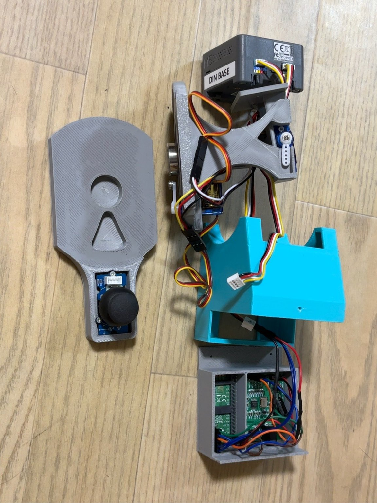
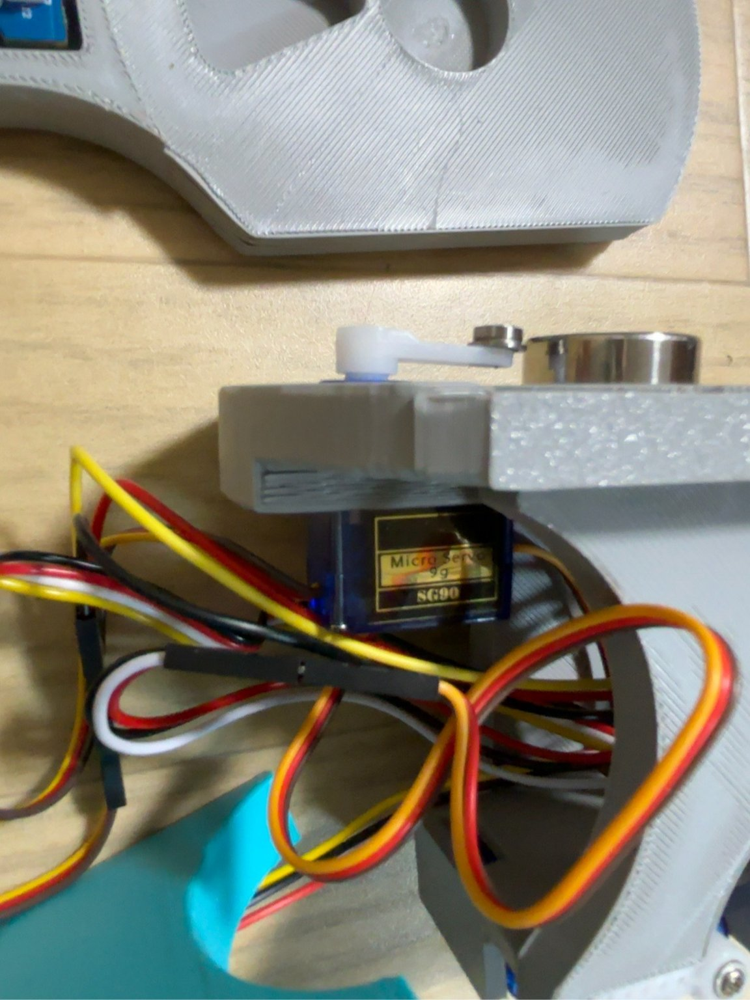
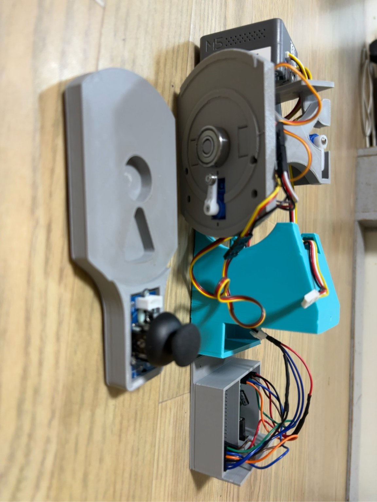
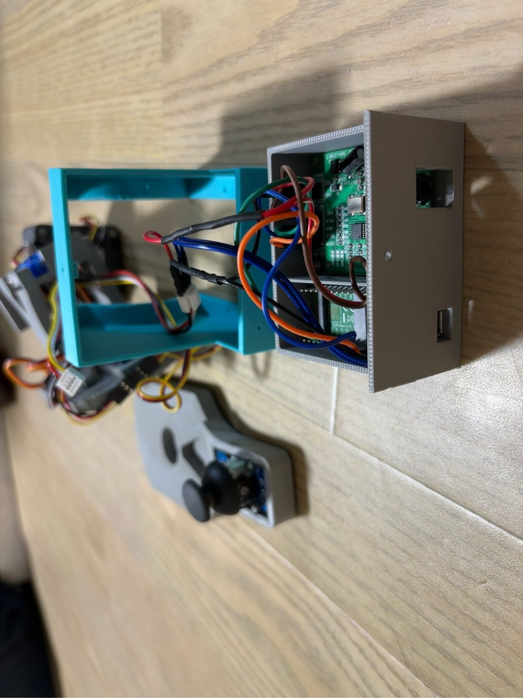

{width=4.2in}

このたびは「かりポム（KariPom）」をお迎えいただき、ありがとうございます。
本書は、電子工作がはじめての方でも、かりポムを安心して楽しんでいただけるように作られたユーザーマニュアルです。ご使用の前に必ずお読みいただき、いつでも読み返せるよう大切に保管してください。

```{=openxml}
<w:p><w:r><w:br w:type="page"/></w:r></w:p>
```

# 第1章 はじめに

## 1.1 本書について

本書は、しゃべって、動いて、耳をすませる小さなアニマトロニクス・ロボット「かりポム」の取扱説明書です。

かりポムは、市販の完成品家電とは少し違い、**M5Stack CoreS3**（エムファイブスタック・コアエススリー）という小型コンピュータを頭脳にした電子工作ロボットです。とはいえ、難しい知識は必要ありません。本書の手順どおりに進めれば、プログラミングの経験がない方でも、電源を入れてWi-Fiにつなぎ、スマホやパソコンから操作できるようになります。

本書では、次のような読者を想定しています。

- Arduino（アルデュイーノ）やM5Stackという言葉を初めて聞いた方
- 電子工作はほとんどしたことがない方
- ChatGPTなどのAIには興味があるけれど、機械いじりは不安な方

専門用語が出てくるときは、そのつど説明します。また、巻末には**用語集**（第23章）もありますので、分からない言葉が出てきたらそちらもご覧ください。

かりポムはGitHubで公開されている、今も継続してアップデートが続くプロジェクトです。本書の内容と実機の動作が異なる場合は、最新のWebUI表示を優先してください（更新履歴は第22章）。

**GitHubでは、次の5点セットを公開しています。**

| 公開物 | 内容 |
|---|---|
| 本書（かりポム ユーザーマニュアル） | 「何ができるか」「どう遊ぶか」「どこから始めるか」を中心にした、初めての方向けの説明書です。 |
| Karipom Ear 設計・製作マニュアル | CoreS3にPCM1808＋Pico2を追加してPCなしでBBXを楽しむための、配線・回路・組み立て手順を扱う発展編です。 |
| かりポム本体ソフト（Arduinoファームウェア） | かりポム本体（CoreS3）を動かす制御ソフトウェアです。 |
| PCアプリケーション（Companion・Desktop） | KariPom Companion・KariPom Desktopなど、PC側のプログラムです（詳しくは第2章）。 |
| 3Dプリントデータ | 筐体（ボディ）を3Dプリントするための設計データです。 |

電子工作・回路設計・配線図といった技術的な内容は、あえて本書には詳しく書いていません。それらは**「Karipom Ear 設計・製作マニュアル」**にまとめてあり、本書では「詳しくはKaripom Ear設計・製作マニュアルをご覧ください」という形でご案内します。2冊で同じ内容を重複して説明することを避け、それぞれの役割をはっきり分けています。

💡 本書は、人が読むことはもちろん、ChatGPTやClaudeなどのAIに読み込ませながら作業を進めることも想定して書かれています。「このマニュアルの内容と、今出ているエラーを踏まえて、次に何をすればいいか教えて」のように、本書とソースコード・エラーメッセージをまとめてAIに渡しながら進める使い方もおすすめです。

## 1.2 本書の読み方

はじめてお使いになる方は、**第4章「安全上の注意」→ 第7章「初回セットアップ」→ 第8章「Wi-Fi設定」→ 第9章「WebUIの使い方」** の順に読み進めてください。この4つの章を終えると、かりポムの基本操作がひととおりできるようになります。

そのあとは、興味のある機能の章（表情、独り言、マイク機能、Visualizer、Lightingなど）を好きな順番でお読みいただけます。

困ったときは、**第20章「トラブルシューティング」** と **第21章「FAQ」** をご覧ください。

## 1.3 本書で使うマークについて

| マーク | 意味 |
|---|---|
| ⚠️ **警告** | 守らないと、けがや故障につながるおそれがある重要な注意事項です。 |
| ❗ **注意** | 守らないと、かりポムの動作不良や寿命の低下につながる事項です。 |
| 💡 **ヒント** | 知っていると便利な情報です。 |

```{=openxml}
<w:p><w:r><w:br w:type="page"/></w:r></w:p>
```

# 第2章 かりポムとは

## 2.1 かりポムのプロフィール

かりポム（KariPom）は、机の上に置いて楽しむ、手のひらサイズのアニマトロニクス・ロボットです。

「アニマトロニクス」とは、テーマパークのキャラクターや映画の特殊効果などで使われる、**モーターで生き物のように動く機械人形**のことです。かりポムは、その技術を家庭サイズにぎゅっと詰め込んだロボットです。

【図：かりポムの正面写真（ピンク）と、頭が動いている様子の連続写真】

かりポムの頭脳には「M5Stack CoreS3」という、画面・スピーカー・マイク・カメラ・Wi-Fiがひとつになった小型コンピュータが入っています。頭は上下・左右に動き、画面には表情が表示され、スピーカーからおしゃべり（独り言）が流れます。

かりポムの筐体（きょうたい：本体の外側のこと）は3Dプリントで製作するため、色は自由に選べます。本書に登場する2台は、作者の製作例（**ピンク機**・**ティファニーブルー機**）です。中身の機能はどちらも同じです。

また、WebUIの設定で「かりポム」と「Miss かりポム」という2種類のキャラクター表示を切り替えられます（第19章）。見た目や機能に大きな違いはなく、気分に合わせて選べる小さなお楽しみです。

## 2.2 プロジェクトのあゆみ（かりポムが生まれるまで）

かりポムは、もともとM5Stack向けに公開されている人気キャラクター「Stack-chan（スタックちゃん）」を自分でも作ってみたい、という思いつきから始まったプロジェクトです。

作っていくうちに、「ただ表情を表示するだけでなく、ChatGPTと自然に会話しているように見せたい」という目標が生まれました。専用の音声認識・音声合成APIは使わず、「音の大きさに合わせて口を動かす」というシンプルな仕組み（リップシンク／口パク）だけで、それらしく見せられないか——という研究から始まったのが、今の口パク機能の原点です。

ところが、口パクの精度を追い込んでいた最中に、思いがけない出来事が起こりました。音楽を流すと発話判定が細かく揺れ動き、かりポムがまるでビートを刻むように、ノリノリで首と口を動かしてしまったのです。本来なら「判定のブレ」として直すべき不具合でしたが、あまりに楽しい動きだったため、欠点として直すのではなく、新しい遊び方として育てる方向へ舵を切りました。この偶然の発見が、プロジェクトの方向性を大きく広げるきっかけになりました。

本書では、「Beat Box」から着想を得て、この音楽に合わせてノリノリに動く、かりポム独自の世界観を「**BBX**」と呼んでいます。BBXは口パクだけを指す言葉ではありません。音に合わせた口パクや首振りに、音を聞き取る「Karipom Ear」、音を画面いっぱいに映し出す「Visualizer」、背景を彩る「Lighting」などの演出を組み合わせて楽しむ、かりポムならではの体験全体を指す呼び方です。

この発見をもとに、音を聞き取る「**Karipom Ear**」（第12章）、音を画面いっぱいに映し出す「**Visualizer**」（第13章）、背景を彩る「**Lighting**」（第14章）という3つの機能が次々に生まれ、単なる口パクロボットから、音と一緒に楽しむ「**BBXプロジェクト**」へと発展していきました。

現在では、CoreS3の実機を持っていない方でも、PCだけで動く「**KariPom Desktop**」（2.3）でこの世界を体験できるようになっています。さらに、CoreS3にPCM1808マイクとRaspberry Pi Picoを追加した拡張構成（第12章）では、PCを使わずにBBXを楽しめます。この拡張の設計図・回路図・組み立て手順は、**「Karipom Ear 設計・製作マニュアル」**としてGitHubで公開しています。かりポムは、この構成も含めて今も継続的に改良が続けられているプロジェクトです。

💡 かりポムはGitHubで公開されているプロジェクトで、今もあゆみの途中です。ここに書かれていない新しい機能が、今後も追加されていく予定です。

## 2.3 KariPom Desktop — PCだけで楽しむかりポム

**KariPom Desktop**は、CoreS3を使わず、**BBXの中核である「音に合わせた口パク」体験を独立させたスタンドアロン版**として、GitHubで公開されている姉妹プロジェクトです。CoreS3があれば体験できることの一部を代わりに見せる「体験版」ではなく、口パク体験そのものをPC単体で完結させた、独立したアプリという位置付けです（VisualizerやLightingなど、画面いっぱいの演出はCoreS3実機ならではの楽しみ方です）。

- **対応OS** — Windows・macOS・Linuxのいずれでも動作します。
- **専用ハードウェア不要** — CoreS3やArduino、センサー類は一切使わず、Pythonのプログラムだけで動きます。
- **AIと会話しているように見える** — 起動すると自動でブラウザのChatGPTが開き、音声で会話するとその声に合わせてかりポムが口を動かします。話していないときも、瞬きや鼻の動きで生きているような表情を見せます。
- **初心者でも試せる** — セットアップは、配布されているPythonファイルをChatGPTなどのAIに読み込ませ、使っているPCの環境に合わせて案内してもらいながら進める方式です。AIには、動かして終わりにせず、次回からはダブルクリックだけで起動できるランチャーまで作ってもらうことをおすすめします（詳しくはKariPom Desktopリポジトリの導入ガイドをご覧ください）。

KariPom DesktopのGitHubリポジトリ：`https://github.com/kariagepompadour/KariPom-Desktop`

💡 KariPom CompanionとKariPom Desktop、どちらを使えばいいか迷ったときは、第15章（15.1）の比較図をご覧ください。

## 2.4 かりポムの楽しみ方

かりポムには、大きく分けて4つの楽しみ方があります。どれも「音に合わせて生きているように見える」という同じ世界観でつながっています。

1. **そばに置いて眺める** — 電源を入れておくだけで、ときどき頭を動かしたり（アイドルモーション）、ランダムなタイミングで独り言をつぶやいたりします。
2. **スマホやパソコンから操作する** — Wi-Fi経由でかりポムの「設定画面（WebUI）」を開き、表情を変えたり、しゃべらせたり、動かしたりできます。
3. **音に反応させる（BBX体験）** — 音声入力機能「Karipom Ear（かりポム・イヤー）」で、内蔵マイク・PC音声（Wi-Fi）・LINE INの3つの音源を切り替えて、音に合わせて口を動かせます。さらに**Visualizer（第13章）**を使うと、音そのものを画面いっぱいの光や図形として楽しめます。
4. **画面の演出を眺める** — **Lighting（第14章）**で、ディスコ調の光の演出やレトロゲーム風のスクリーンセーバーなど、音とは独立した画面の演出も楽しめます。

CoreS3の実機がなくても3の一部はKariPom Desktop（2.3）で、CoreS3の全機能はKariPom Companion（第9章・第15章）と組み合わせることで楽しめます。かりポム本体がAPIを使って自律的に会話する機能は、本書執筆時点では開発中です。

## 2.5 どこから始める？（3つの構成）

初めての方が「自分はどこから始めればいいか」を一目で分かるよう、かりポムの3つの構成を紹介します。難しい技術知識がなくても大丈夫です。

| 構成 | 必要なもの | 体験できること |
|---|---|---|
| **① KariPom Desktop** | PCのみ（CoreS3不要） | PCだけでBBXを楽しめるスタンドアロン版（2.3） |
| **② CoreS3＋KariPom Companion** | かりポム本体＋PC（任意） | WebUIやBBXなど、かりポムの主要機能をひととおり楽しめる標準構成（第9章・第15章） |
| **③ CoreS3＋Karipom Ear（PCM1808＋Pico2）** | かりポム本体＋拡張ハードウェア | PCなしでもBBXを楽しめる発展構成（第12章、詳しくはKaripom Ear設計・製作マニュアル） |

**① KariPom Desktop** — PCだけでBBXを楽しめるスタンドアロン版です。かりポムとの会話や口パクを気軽に楽しめます（2.3）。

↓

**② CoreS3＋KariPom Companion** — 標準構成です。WebUIやBBXなど、かりポムの主要機能をひととおり楽しめます（第9章・第15章）。

↓

**③ CoreS3＋Karipom Ear（PCM1808＋Pico2）** — 発展構成です。「Karipom Ear 設計・製作マニュアル」の設計図・回路図・組み立て手順を使って拡張すると、PCを使わずにBBXを楽しめる構成へと発展させられます（第12章）。このマニュアルでは、さらに発展させたい方向けのオプション（LINE OUT増設・Bluetooth入力）も設計資料として紹介しています。

💡 まずは①か②から始めて、慣れてきたら③に挑戦する、という進み方がおすすめです。③は今後も機能追加が予定されている、継続的にアップデート中の構成です。

```{=openxml}
<w:p><w:r><w:br w:type="page"/></w:r></w:p>
```

# 第3章 特徴・できること

## 3.1 機能一覧

**■ 本体機能**

| 機能 | 内容 | 参照章 |
|---|---|---|
| 頭部の動き | サーボモーター2つで、頭を上下・左右に動かします。待機中はランダムなアイドルモーション、会話中は口パクに合わせた小さな頭の動き（マイクロモーション）を行います。WebUIのボタンでも操作できます。 | 第16章 |
| 表情表示 | 本体の画面に表情を表示します。WebUIのFace Galleryから切り替えられます。 | 第10章 |
| 睡眠・起床モード | しばらく操作がないと自動的に眠り、眺めて楽しいSleep表示（Sleep Lighting Carousel）を行います。触れる・話しかける・動かすと目を覚まします。 | 第10章 |
| 独り言（Mutter） | SDカードに入れた音声ファイルを、ランダムなタイミングで自動的につぶやきます。手動再生もできます。 | 第11章 |
| ジョイスティック操作 | 本体背面（尻尾部分）のジョイスティックで首の向きを直接操作できます。押し込むと独り言を再生します。 | 第16章 |
| WebUI | スマホ・パソコンのブラウザから、すべての設定と操作ができます。 | 第9章・第19章 |
| ファイル管理 | 音声ファイルの追加・削除・試聴がWebUIからできます。 | 第17章 |
| ログ機能 | かりポムの動作記録をブラウザで確認できます。 | 第18章 |
| カメラ（実験的機能） | 本体正面のカメラで周囲の動きを検知する機能です。本書執筆時点では開発途中で、既定では無効になっています。 | 第19章 |

**■ BBX機能（音に反応する機能）**

| 機能 | 内容 | 参照章 |
|---|---|---|
| Karipom Ear | PC音声（Wi-Fi）・LINE IN・内蔵マイクの3音源を切り替えて、音に合わせて口を動かします。PCM1808＋Pico2拡張を追加すると、PCなしでも楽しめます。 | 第12章、詳しくはKaripom Ear設計・製作マニュアル |
| Talk（PC連携口パク） | PCで再生中の音声に合わせて、リアルタイムに口パクします。 | 第15章 |
| Visualizer（音の可視化） | 音の強さやリズムを、画面いっぱいのグラフや図形として表示します。8種類から選べます。 | 第13章 |
| Lighting（背景演出） | ディスコ調の光やレトロゲーム風のスクリーンセーバーなど、16種類の画面演出を楽しめます。Visualizerと組み合わせ可能です。 | 第14章 |

**■ PC連携**

| 機能 | 内容 | 参照章 |
|---|---|---|
| KariPom Companion | WebUI表示・音声連携（Talk）・ログ確認をまとめて使える、PC用の統合管理ツールです。 | 第9章・第15章 |
| KariPom Desktop | CoreS3の実機がなくても、PC（Windows・macOS・Linux）だけでかりポムの世界を楽しめる姉妹プロジェクトです。 | 第2章 |

## 3.2 かりポムの中身（かんたん解説）

「どうして動くの？」に興味がある方のために、しくみをかんたんに説明します。読み飛ばしても大丈夫です。

- **頭脳：M5Stack CoreS3** — ESP32-S3というチップを積んだ小型コンピュータです。Wi-Fi、画面、マイク、スピーカー、カメラ、SDカードスロットを内蔵しています。
- **筋肉：サーボモーター×2** — 「サーボモーター」とは、指定した角度まで正確に回るモーターです。かりポムでは、上下用（UD）と左右用（LR）の2つを使って頭を動かします。
- **耳：Karipom Ear** — 内蔵マイクなどから音の大きさを常に測り、「誰かが話しているか」を判定します。
- **口と声：画面とスピーカー** — 音の大きさに合わせて口の開き具合を変えることで、「しゃべっている」ように見せています。これを**リップシンク（口パク）**と呼びます。
- **画面の演出：Visualizer と Lighting** — 音を可視化する層（Visualizer）と、背景の光の演出（Lighting）を重ねて表示できます。顔はどちらの演出よりも常に手前（最前面）に表示されるよう作られているため、演出が派手なときでもかりポムの表情は隠れません。

【図：かりポムの分解イメージ図。CoreS3、サーボ2つ、SDカードの位置関係が分かるイラスト】

```{=openxml}
<w:p><w:r><w:br w:type="page"/></w:r></w:p>
```

# 第4章 安全上の注意

ご使用の前に必ずお読みください。

## 4.1 ⚠️ 警告（けが・事故防止のために）

- **小さなお子様の手の届かない場所で使用・保管してください。** SDカードなどの小さな部品を誤って飲み込む危険があります。
- **濡れた手で触れたり、水のかかる場所で使用したりしないでください。** 感電や故障の原因になります。かりポムは防水ではありません。
- **改造中・分解中は必ず電源（USBケーブル）を抜いてください。**
- 煙が出る、異臭がする、異常に熱いなどの症状があった場合は、**直ちにUSBケーブルを抜き**、使用を中止してください。

## 4.2 ❗ 注意（故障防止のために）

### 頭部とサーボモーターについて（特に重要）

かりポムの頭部は、見た目よりも**重い**構造です。そのため、頭を動かすサーボモーターには常に負荷がかかっており、使い方によってはサーボが故障することがあります。

- **頭を手で無理に動かさないでください。** サーボモーターは、手で回すと内部のギアが欠けることがあります。
- **頭が障害物に当たる位置に物を置かないでください。** 動こうとして動けない状態が続くと、サーボが過熱・故障します。
- **「ジーッ」「キーッ」という音が続くときは、まずサーボの故障を疑ってください。** 詳しくは第20章のトラブルシューティングをご覧ください。ソフトウェアの不具合と思い込んで放置すると、サーボの損傷が進むことがあります。
- 長時間使わないときは、WebUIの**サーボ安全停止（safeServoShutdown）**を実行してから電源を切ることをおすすめします（第16章参照）。

### その他の注意

- 直射日光の当たる場所、高温多湿の場所、ほこりの多い場所での使用・保管は避けてください。
- SDカードの抜き差しは、必ず電源を切ってから行ってください。
- USBケーブルは、定格に合った品質のよいUSB Type-Cケーブルをお使いください。

```{=openxml}
<w:p><w:r><w:br w:type="page"/></w:r></w:p>
```

# 第5章 用意するもの

かりポムを製作・使用するにあたって、以下のものをご用意ください。基本のかりポムに必須のもの・工具・Karipom Ear拡張・任意のオプションに分けて説明します。

※本リストは標準的な構成例です。実際に必要なものは製作方法や環境により異なる場合があります。

## 5.1 基本のかりポムに必要なもの

| # | 品目 | 数量 | 備考 |
|---|---|---|---|
| 1 | M5Stack CoreS3 - ESP32S3 IoT開発キット（DIN Base付属） | 1 | CoreS3は分解・改造せずそのまま使用します。付属のDIN BaseをCoreS3に装着し、Grove Port A/B/Cを利用します |
| 2 | SG90サーボモーター | 2 | 上下（UD）・左右（LR）用。一般的な安価なSG90で、特定メーカー・ブランドの指定はありません。付属のサーボホーンをそのまま使用します |
| 3 | GROVE－サーボ用2分岐ケーブル | 1 | DIN BaseのPort Aから、SG90×2（3ピン）へ分岐して接続するために使用します |
| 4 | Groveケーブル | 1 | Port B（ジョイスティック接続）用 |
| 5 | Grove ジョイスティックモジュール（Seeed Studio製） | 1 | 秋月電子通商 販売コード109279／型番101020028（COM90133P）。Port Bで使用します |
| 6 | microSDカード | 1 | Wi-Fi接続情報の保存に使用するため必須です（独り言用音声ファイル・ログにも使用）。フォーマット形式はFAT32を使用します（第17章参照） |
| 7 | USB Type-Cケーブル（データ通信対応） | 1 | 給電・ファームウェア書き込み用。充電専用ケーブルでは書き込みができません |
| 8 | 3Dプリント筐体一式 | 9パーツ | body／chest／hip／pelvis／spinal_cord／left_shoulder／right_shoulder／ears／feetの9点。GitHubで公開している3Dプリントデータ（`3d_models/`）から製作します。色は自由に選べます |
| 9 | MF63ZZ ダブルフランジ・シールドボールベアリング（3×6×2.5mm） | 2 | 首の左右に使用。軸は金属棒ではなく3Dプリント部品を使用します |
| 10 | 608ベアリング | 1 | 胴体と土台の回転部分に使用。特定ブランドの指定はありません |
| 11 | さらタッピングビス 2×8mm | 要確認 | 組み立て全般に使用（大部分がこのサイズ） |
| 12 | さらタッピングビス 2×10mm | 要確認 | 組み立ての一部に使用 |
| 13 | 本書（ユーザーマニュアル） | 1 | |

❗ ビス（#11・#12）の使用箇所・必要本数は、本書執筆時点ではまだ確定していません。組み立て時は、各3Dプリント部品の穴のサイズに合わせて、手持ちのビスで仮止めしながら進めてください。

{width=4.5in}

📝 写真は作者製作機の一例です。筐体色・配線色・配線の取り回しは製作例であり、指定仕様ではありません。

💡 **組み立て途中でも動作確認できます**：サーボ・ジョイスティック・Karipom Ear（PCM1808＋Pico2）は、いずれか未接続の状態でもCoreS3本体は動作を続けます。サーボ未接続時は駆動信号が出るだけで実際には動かず、ジョイスティック未接続時は「未接続」として扱われて操作待ちで止まることはなく、Karipom Ear未接続時はその音声入力からのデータが来ないだけです。組み立て中に1パーツずつ動作確認したい場合の参考にしてください（ただし、これらを同時にすべて外した状態での動作確認は作者自身は行っていません）。もちろん、外した部品に対応する機能（頭の動き・ジョイスティック操作・Karipom Earでの音声反応）はその間使えません。

## 5.2 工具・製作用設備

| 品目 | 備考 |
|---|---|
| Arduino IDEをインストールしたパソコン（Windows・macOS・Linuxいずれでも可） | ファームウェアの書き込みに使用 |
| USBケーブル（データ通信対応） | 書き込み用。5.1のケーブルと兼用可 |
| 3Dプリンター、または3Dプリントサービス | 3Dプリント筐体一式の製作用。お手持ちのプリンターがない場合は、外部の3Dプリントサービスもご利用いただけます |
| #1プラスドライバー（使用するビスに適合するもの） | 組み立て用 |

{width=3.8in}

📝 写真は作者製作機の一例です。

{width=4.5in}

📝 写真は作者製作機の一例です。

## 5.3 Karipom Ear（音声入力拡張）を使う場合

PCを使わずにBBX（音に反応するかりポムの世界）を楽しみたい場合は、Karipom Ear拡張（第12章）を追加します。主な部品は次のとおりです。

| 品目 | 備考 |
|---|---|
| PCM1808搭載I2S ADC基板 | 3.5mmライン入力・I2S出力・DC5V駆動のもの |
| Raspberry Pi Pico 2 H（ピンヘッダ実装済み完成品） | |
| Grove－デュポン変換ケーブル | CoreS3（DIN Base）のPort CとKaripom Ear回路を接続するために使用 |
| ジャンパーワイヤー | PCM1808とPico 2 H間の配線に使用（Grove－デュポン変換ケーブルとは別の用途です） |

詳しい部品表・配線図・組み立て手順は「Karipom Ear 設計・製作マニュアル」をご覧ください。

💡 同じ「PCM1808搭載I2S ADC基板」でも、販売元により端子配置やジャンパー設定が異なる場合があります。Karipom Ear設計・製作マニュアルの配線図・ジャンパー設定と、お手元の基板が一致しているか確認してからご使用ください。

{width=3.8in}

📝 写真は作者製作機の一例です。配線の色・取り回しは指定仕様ではありません。

## 5.4 任意のオプション

Karipom Earをさらに発展させたい方向けに、以下の設計資料も公開しています。いずれも省略可能で、基本のかりポムには搭載されていません。

- **LINE OUT増設** — Karipom Earに入力した音を外部スピーカーへも同時に出力できるようにする工作です。
- **Bluetooth入力（MH-M18）** — ケーブルなしで音源を入力できるようにする、設計検討まで完了しているオプションです。

いずれも詳しい部品表・手順は「Karipom Ear 設計・製作マニュアル」に掲載しています。

自作にあたって不明な点がある場合は、本書や「Karipom Ear 設計・製作マニュアル」を確認するか、ChatGPTなどのAIに相談しながら進めることもおすすめです。

```{=openxml}
<w:p><w:r><w:br w:type="page"/></w:r></w:p>
```

# 第6章 各部名称

【図：かりポムの正面・背面・側面の写真に、以下の番号を振った図】

| 番号 | 名称 | はたらき |
|---|---|---|
| ① | 頭部 | 上下・左右に動きます。画面（顔）が付いています。 |
| ② | 画面（ディスプレイ） | 表情や口の動きを表示します。M5Stack CoreS3の画面です。 |
| ③ | 内蔵マイク | Karipom Ear機能で周囲の音を聞き取ります。 |
| ④ | 内蔵スピーカー | 独り言などの音声を再生します。 |
| ⑤ | ジョイスティック（背面・尻尾部分） | 首の向きを手動で操作します。押し込むと独り言を再生します。 |
| ⑥ | microSDカードスロット | 音声ファイル（WAV）を保存するSDカードを挿します。 |
| ⑦ | USB Type-C端子 | 給電用です。パソコンやUSB電源アダプタにつなぎます。 |
| ⑧ | 上下サーボ（servoUD） | 頭を上下に動かすモーター（内部部品）。 |
| ⑨ | 左右サーボ（servoLR） | 頭を左右に動かすモーター（内部部品）。 |
| ⑩ | 内蔵カメラ（実験的機能） | 本体正面のカメラです。本書執筆時点では機能を開発中で、既定では無効になっています（第19章）。 |

💡 **ヒント**：「UD」はUp/Down（上下）、「LR」はLeft/Right（左右）の略です。WebUIやログにもこの表記が出てきます。

```{=openxml}
<w:p><w:r><w:br w:type="page"/></w:r></w:p>
```

# 第7章 初回セットアップ

ここからは、かりポムを初めて動かすまでの手順を説明します。所要時間は約10〜15分です。

## 7.1 準備するもの

- かりポム本体
- USB電源（パソコンのUSBポート、またはスマホ用のUSB電源アダプタ）
- USB Type-Cケーブル
- Wi-Fi環境（2.4GHz帯。※重要：後述）
- スマートフォンまたはパソコン（設定画面を開くために使います）

❗ **注意（Wi-Fiについて）**：かりポムの頭脳（ESP32-S3）は、**2.4GHz帯のWi-Fiにのみ対応**しています。ご家庭のルーターが5GHz専用の設定になっている場合はつながりません。ルーターのSSID（ネットワーク名）に「-A」「5G」などが付いているものは5GHz帯のことが多いので、「-G」「2.4G」などの付いたSSIDをお使いください。

## 7.2 設置場所を決める

- 平らで安定した場所に置いてください。
- 頭が動く範囲（前後左右）に、物がぶつからないスペースを確保してください。
- スピーカーやテレビの真横は避けると、マイク機能（Karipom Ear）の誤反応が減ります。

## 7.3 SDカードの確認

独り言機能を使うには、音声ファイル（WAV形式）の入ったmicroSDカードが必要です。

1. 電源が入っていないことを確認します。
2. SDカードスロット（第6章⑥）にmicroSDカードを、カチッと音がするまで差し込みます。
3. SDカードの中身の構成については、第17章「SDカード管理」をご覧ください。独り言の音声は `/sounds/mutter/` というフォルダに入れます。

💡 SDカードが入っていなくても、起動やAPモードでの初期設定（第8章）は可能です。ただし、保存済みWi-Fiへの接続情報（SSID・パスワード）はSDカード内の `/wifi.txt` に保存される仕様のため、通常のWi-Fi自動接続にはSDカードの装着が必要です。独り言機能を使わない場合でも、Wi-Fi運用のためにSDカードを入れておくことをおすすめします。

## 7.4 電源を入れる

かりポムに電源ボタンの操作は不要です。USBケーブルをつなぐと自動的に起動します。

1. USB Type-Cケーブルをかりポムの端子に接続します。
2. 反対側をUSB電源につなぎます。
3. 画面が点灯し、起動処理（設定の読み込み → Wi-Fi接続 → SDカードの初期化）が順番に実行されます。

【図：起動直後の画面の写真】

起動が完了すると、かりポムは保存済みのWi-Fiに自動接続します。初回でまだWi-Fi設定がない場合の手順は、次の第8章に進んでください。

```{=openxml}
<w:p><w:r><w:br w:type="page"/></w:r></w:p>
```

# 第8章 Wi-Fi設定

かりポムの操作は、すべてWi-Fi経由でブラウザから行います。この章では、かりポムをご家庭のWi-Fiにつなぐ手順を説明します。

## 8.1 接続のしくみ

かりポムは、起動すると**保存済みのWi-Fiへ自動的に接続**します。接続できなかった場合（初回や、引っ越しなどでWi-Fiが変わった場合）は、**自動的にAPモードに切り替わります**。

**APモードとは**：かりポム自身が一時的なWi-Fiの電波の発信元（アクセスポイント）になるモードです。この電波にスマホから直接つなぐことで、ご家庭のWi-Fi情報をかりポムに教えることができます。

## 8.2 初回のWi-Fi設定（APモードでの設定）

1. 電源を入れます。保存済みWi-Fiに接続できない場合、かりポムは自動的にAPモードになります。
2. スマホのWi-Fi設定画面を開き、かりポムの発する電波（本体画面に表示されます）に接続します。
3. ブラウザで設定画面を開き、ご家庭のWi-FiのSSID（ネットワーク名）とパスワードを入力して保存します。
4. かりポムがご家庭のWi-Fiに接続されます。以降は起動のたびに自動接続されます。

## 8.3 IPアドレスの確認

Wi-Fi接続が完了すると、かりポムに**IPアドレス**が割り当てられます。

**IPアドレスとは**：Wi-Fiにつながった機器一台一台に割り振られる「住所」のような番号です（例：`192.168.1.50`）。この番号をブラウザに入力すると、かりポムの設定画面が開きます。

IPアドレスは、次の2か所で確認できます。

- **かりポム本体の画面** — 起動後に表示されます。
- **WebUI** — 一度接続できれば、WebUI上でも確認できます。

💡 **名前でも表示できます**：WebUIで「かりポムの名前」を設定すると（第19章）、本体画面やWebUIの表示がIPアドレスの代わりに名前で表示されるようになります。

## 8.4 接続できたかの確認

スマホまたはパソコンを**かりポムと同じWi-Fi**につなぎ、ブラウザ（Safari、Chromeなど）のアドレス欄に、かりポムのIPアドレスを入力します。

```
例）http://192.168.1.50/
```

かりポムのWebUI（設定画面）が表示されれば、接続成功です。

💡 **ヒント**：IPアドレスはルーターの設定によって変わることがあります。頻繁に使う場合は、ルーターの「DHCP固定割り当て」機能でかりポムのIPアドレスを固定しておくと便利です（設定方法はお使いのルーターの説明書をご覧ください）。自宅と外出先など、**複数のWi-Fi環境を行き来する場合はIPアドレスが変わりやすい**ので、接続できないときはまずこの点を疑ってください。

💡 **長時間つないだままにする方へ**：かりポムには、長時間稼働で通信が途切れないよう、Wi-Fiの省電力モード（モデムスリープ）を無効化する設定が組み込まれています。特別な操作は不要です。

```{=openxml}
<w:p><w:r><w:br w:type="page"/></w:r></w:p>
```

# 第9章 WebUIの使い方

## 9.1 WebUIとは

WebUI（ウェブ・ユーアイ）とは、かりポムの中に入っている「設定用ホームページ」のことです。アプリのインストールは不要で、ブラウザから開くだけで使えます。

WebUIを開く方法は2通りあります。どちらで開いても、表示される内容や操作方法は同じです。

- **ブラウザで直接開く** — スマホ、またはパソコンのブラウザで、かりポムのIPアドレスを直接開きます。一番手軽な方法です。9.2で説明します。
- **KariPom Companionで開く（PCの場合）** — Windows・macOS・Linuxのいずれでも、付属アプリ「KariPom Companion」を起動すると、アプリの中にWebUIがそのまま表示されます。WebUI表示だけでなく、音声連携やログ確認までまとめて扱える統合管理ツールです。9.3で説明します。

## 9.2 ブラウザで直接開く（スマホ・パソコン）

ブラウザでかりポムのIPアドレスを開くと、トップページ（Home）が表示されます。

【図：WebUIトップページ（Home）のスクリーンショット】

## 9.3 KariPom Companionで開く（PCの場合）

**KariPom Companion（カリポム・コンパニオン）**は、単なるWebUI表示ソフトではなく、WebUI表示・音声連携（Talk）・ログ確認（Log／健康診断）・PC単独お試し（KariPom BBX）をまとめて扱える統合管理ツールです。Windows・macOS・Linuxのいずれでも動作します。

1. 初回は、ターミナル（Windowsの場合はコマンドプロンプトやPowerShell）で、`karipom_companion.py`があるフォルダから次のコマンドを実行します。
   ```
   python karipom_companion.py
   ```
   💡 Python環境の準備がまだの方や、エラーが出た場合は、本マニュアルと`karipom_companion.py`をChatGPTなどのAIに読み込ませ、お使いのPC環境に合わせて案内してもらいながら進めてください。**このとき、インストールして一度動かすだけで終わらせず、「次回からはターミナルを使わず、ダブルクリックだけで起動できるランチャー（例：macOS／Linuxなら`.command`や`.desktop`、Windowsなら`.bat`）まで作ってほしい」とAIに依頼することをおすすめします。** どんな形のランチャーが適切かはお使いの環境によって変わるため、実際にセットアップを行うAIに判断してもらってください。一度作ってしまえば、2回目以降はそのランチャーをダブルクリックするだけで起動できます。
2. アプリが開いたら、上部の「設定」欄にかりポムのIPアドレスを入力し、「💾 保存」を押します（IPアドレスの確認方法は第8章参照）。
3. 保存すると、最初のタブ「🌐 KariPom Lab」にWebUIのトップページが自動的に表示されます。

【図：KariPom Companion起動直後の画面（KariPom Labタブ）】

💡 タブの中にWebUIが表示されない場合は、PyQtWebEngineという部品が未導入の可能性があります。その場合も、タブ右上の「外部ブラウザで開く」ボタンから、いつも通りブラウザでWebUIを開けます。

KariPom Companionには、WebUI表示（KariPom Lab）のほかに、次の3つのタブがあります。

- **💬 Talk** — PCで再生している音声を解析し、UDP経由でかりポムにリアルタイムで口パクさせます。
- **🚽 Log／健康診断** — かりポムの動作ログをPCに取り込んで解析し、不具合の兆候をまとめて確認できます。
- **🐰 KariPom BBX** — かりポム本体（CoreS3）が手元になくても、PC画面の中だけで顔の表示と口パクの動作を試せるお試し・モニター用タブです。

いずれも詳しい使い方は第15章で説明します。

## 9.4 ページ一覧

WebUIには、機能ごとに次のページが用意されています。各ページの上部には共通のナビゲーション（ページ間の移動リンク）があり、どのページからでも他のページへ移動できます。

| ページ | 内容 | 参照章 |
|---|---|---|
| **Home** | トップページ。基本操作、頭部の手動操作、Visualizer・Lighting・カメラなどの設定セクションへの入り口。 | 本章・第13章・第14章 |
| **🐰 Karipom Ear** | 音声入力（音源切替・マイク感度）の設定。 | 第12章 |
| **Sound** | 音声関連の設定・操作。 | 第11章 |
| **Mutter管理** | 独り言ファイルのアップロード・削除・試聴・再生。 | 第11章・第17章 |
| **Face Gallery** | 表情の一覧と切り替え。 | 第10章 |
| **File Manager** | SDカード内のファイル管理。 | 第17章 |
| **Log Viewer** | 動作記録（ログ）の閲覧。 | 第18章 |
| **Toilet Log / Gallery** | 各種ログとカメラ・監視系スナップショットを集約した記録ページ。 | 第18章 |
| **System Information** | 本体情報（IPアドレス・ファームウェア情報・メモリ状況など）の表示。 | 第18章 |

💡 Home画面の中には、開閉できる「詳細設定」欄（📊 Audio Visualizer、💡 Lighting など）がいくつかあります。ページを移動しなくても、Home画面の中でほとんどの演出設定が完結します。

## 9.5 基本の操作の流れ

1. ブラウザ、またはKariPom Companionでかりポムのトップページ（Home）を開く
2. ナビゲーションから使いたい機能のページに移動する（またはHome画面内の詳細設定欄を開く）
3. ボタンを押す／数値を変える
4. 設定は保存するとすぐに反映されます（再起動が必要な項目には、本文中にその旨を記載しています）

💡 **設定はどこに保存されるの？**：WebUIで変更できる主な設定値は、本体内の**NVS**（エヌブイエス：電源を切っても消えない保存領域）に記憶されます。ただし**Wi-Fi接続情報（SSID・パスワード）だけは例外**で、SDカード内の `/wifi.txt` に保存されます。そのため、Wi-Fi設定以外はSDカードを抜いても消えませんが、Wi-Fi設定を保持するにはSDカードの装着が必要です（第17.1章）。

```{=openxml}
<w:p><w:r><w:br w:type="page"/></w:r></w:p>
```

# 第10章 表情変更

## 10.1 Face Gallery（表情ギャラリー）

かりポムの画面には「顔」が表示され、表情を切り替えることができます。

表情の切り替えは、WebUIの**Face Gallery**ページで行います。搭載されている表情が一覧で表示され、選ぶだけでかりポムの顔が切り替わります。

【図：Face Galleryページのスクリーンショット】

【図：表情一覧（各表情の画面写真を並べたもの）】

## 10.2 口パクと表情の関係

音声の再生中や、Karipom Earで音に反応しているときは、表示中の表情のまま口の開閉が音に合わせて変化します。Visualizer（第13章）やLighting（第14章）の演出中も、顔は常に一番手前に表示されるため、表情が演出で隠れることはありません。

💡 表情は今後のファームウェア更新で追加されることがあります。最新の表情はFace Galleryページでご確認ください。

## 10.3 睡眠モード（Sleep）

かりポムは、しばらく操作がないと自動的に眠ります。無理に起こす必要はなく、話しかけたり触れたりすればすぐに目を覚まします。

**睡眠に入るタイミング**

約15分間、操作（WebUI操作・音・タッチ・動きなど）がないと、あくびをしてから眠りに入ります。

**眠り始めの3分間**

眠りに入ってから最初の3分間は、目を閉じたまま静止し、「Zzz」の演出が表示されます。

**3分経過後：眺めて楽しいSleep表示（Sleep Lighting Carousel）**

3分経過すると、以下の2パターンをランダムに切り替えながら表示する「Sleep Lighting Carousel」が始まります。切り替え周期は3分です。

| パターン | 内容 |
|---|---|
| Face Gallery | SDカードの `faces/` フォルダから、ランダムな表情画像を表示します（第17章）。 |
| 目×Lighting | 「目」と「背景演出（Lighting）」をそれぞれランダムに組み合わせて表示します。 |

「目×Lighting」で選ばれる目は、次の3種類のいずれかです。

| 目の種類 | 内容 |
|---|---|
| 時計の目 | 左右の目に現在時刻（時：分）を表示します。時刻が一度も同期できていない端末では選ばれません。 |
| Eye Slotの目 | 第14章のLighting「Eye Slot」と同じ、リール状に絵柄が流れる目です。 |
| 閉じた目 | 眠り始めの3分間と同じ、閉じた目の線です。 |

背景演出には、第14章のLightingのうち「Eye Slot」を除く各種がランダムに使われます（Eye Slotは目の表示自体に使うため、背景としては選ばれません）。「目×Lighting」表示中は、背景の明るさに関わらず、目・鼻・口が黒＋白縁取りで統一表示され、見やすさを確保しています。

💡 「Sleep Lighting Carousel」表示中（Face Gallery・目×Lightingとも）は、Zzzの演出は表示されません。Zzzが出るのは眠り始めの3分間だけです。

💡 Sleep中に選ばれる目・背景演出は、WebUIで普段設定しているLighting・Visualizerの設定には一切影響しません。起床すると、これらの設定は元のとおりに戻ります。

**起こし方**

かりポムに触れる、話しかける（音に反応）、本体を動かす、ジョイスティックを操作する、のいずれかで目を覚まします。

```{=openxml}
<w:p><w:r><w:br w:type="page"/></w:r></w:p>
```

# 第11章 独り言機能（Mutter）

## 11.1 独り言機能とは

かりポムは、SDカードに保存された音声ファイル（WAV形式）を「自分の独り言」として再生できます。この機能を**Mutter（マター：英語で「つぶやく」の意味）**と呼びます。

再生中は音声に合わせて口が動き、本当にしゃべっているように見えます。

## 11.2 独り言が再生される3つのきっかけ

1. **自動再生** — かりポムは、**ランダムなタイミングで自動的に独り言をつぶやきます**。電源を入れて置いておくだけで楽しめます。
2. **ジョイスティックを押し込む** — 登録されている独り言の中からランダムに1つ再生されます。
3. **WebUIから再生する** — Mutter管理ページでファイルを選んで「Speak（しゃべらせる）」を押すと、その音声で独り言を再生します。

## 11.3 独り言用の音声ファイルを追加する

独り言の音声は、SDカードの `/sounds/mutter/` フォルダに入れます。追加の方法は2つあります。

**方法1：WebUIからアップロード（おすすめ）**

1. WebUIのMutter管理ページを開きます。
2. 「アップロード（Upload）」で、パソコンやスマホの中のWAVファイルを選びます。
3. アップロードが完了すると、一覧に表示され、すぐに使えるようになります。

**方法2：SDカードをパソコンに挿して直接コピー**

1. かりポムの電源を切り、SDカードを取り出します。
2. パソコンでSDカードを開き、`sounds` フォルダの中の `mutter` フォルダにWAVファイルをコピーします。
3. SDカードを戻して電源を入れます。

❗ **注意**：かりポムは起動時に独り言リストを読み込んで本体メモリに登録します。**SDカードを直接編集した場合は、電源の入れ直しが必要**です（WebUIからのアップロード・削除はすぐに反映されます）。

💡 **音声ファイルについて**：一般的な**WAV形式（非圧縮）**の音声ファイルが使えます。MP3などの圧縮形式には対応していません。音声合成ソフトやレコーダーで書き出すときは「WAV」を選んでください。

## 11.4 独り言中のマイクの動き（豆知識）

独り言の再生中、かりポムは自分の声を「誰かの声」と勘違いしないように、**内蔵マイクを一時的にお休み**させます。再生が終わると自動的にマイクが復帰しますが、スピーカーの残響を拾わないよう、**終了後もしばらく（約5秒間）はマイク反応を抑制**しています。独り言の直後にマイクが反応しにくいのは正常な動作です。

## 11.5 独り言の頻度・出現しやすさを調整する

WebUIの設定から、独り言の起こりやすさを調整できます（第19章にも一覧があります）。

| 項目 | 選べる値 | 内容 |
|---|---|---|
| 独り言の発生確率 | 0 / 5 / 10 / 20 / 30（標準10） | 数値が大きいほど独り言をつぶやく頻度が上がります。0でつぶやかなくなります。 |
| つぶやき時の顔出現確率 | 0 / 10 / 20 / 25 / 50 / 100%（標準20%） | 独り言のタイミングで、表情もあわせて変化させる確率です。 |

```{=openxml}
<w:p><w:r><w:br w:type="page"/></w:r></w:p>
```

# 第12章 Karipom Ear（音声入力）

## 12.1 Karipom Earとは

**Karipom Ear（かりポム・イヤー）**は、かりポムの「耳」にあたる機能です。3種類の音源を切り替えて、いろいろな音に反応させることができます。

💡 「Karipom Ear」という名前は、この音声入力機能全体の名称であると同時に、12.4で紹介する**PCM1808＋Pico2拡張ハードウェアの製品名**でもあります。拡張ハードウェアの詳しい設計・製作方法は「Karipom Ear 設計・製作マニュアル」にまとめています。

| 音源（ソース） | 内容 |
|---|---|
| **PC音声（Wi-Fi）** | PCから送られてくる音声データに反応します（第15章）。 |
| **LINE IN** | 外部機器からの音声入力に反応します。 |
| **内蔵マイク（MIC）** | かりポム自身のマイクで周囲の音を聞き、反応します。 |

音源の切り替えは、WebUIの「🐰 Karipom Ear」ページで行います。切り替えた設定は保存され、次回起動後も維持されます。

【図：Karipom Earページのスクリーンショット】

❗ **Visualizer・Lightingとの関係**：内蔵マイク（MIC）モードを選んでいる間は、Visualizer（第13章）は表示されません（マイク入力とVisualizerの表示を同時に行うと誤動作しやすいための仕様です）。PC音声（Wi-Fi）またはLINE INを選んでいるときに、Visualizerが利用できます。Lightingの多くの演出はマイクモードでも表示されますが、一部の演出はマイク使用中は表示されません。

## 12.2 内蔵マイクモードのしくみ

内蔵マイクモードでは、かりポムは周囲の音の大きさ（レベル）を常に測っています。

- 音が**開始しきい値（ON）**を超える状態が続くと、「話し声が始まった」と判断して口を動かし始めます。
- 音が**終了しきい値（OFF）**を下回ってから一定時間（**HOLD時間**）たつと、「話が終わった」と判断して口を閉じます。

初期設定値は次のとおりです。

| 項目 | 初期値 | 意味 |
|---|---|---|
| ONしきい値 | 150 | この値を超えると反応開始 |
| OFFしきい値 | 50 | この値を下回ると終了判定へ |
| HOLD時間 | 1000ミリ秒（1秒） | 静かになってから口を閉じるまでの猶予 |

この初期値は、一般的な室内環境を想定して調整されています。環境に合わせてKaripom Earページから変更できます（第19章）。

💡 **調整の目安**：
- 静かな部屋なのに反応しない → ONしきい値を下げる（例：150→100）
- 誰も話していないのに反応する → ONしきい値を上げる（例：150→200）

## 12.3 誤反応を防ぐ4つのしくみ（読まなくてもOK）

かりポムには、「自分のモーター音」や「自分の声の残響」に反応してしまわないよう、次の安全装置が組み込まれています。すべて自動で働くため、操作は不要です。

1. **Weak判定 / Strong判定** — 一瞬の物音（Weak：弱い反応）では口を動かさず、短時間に複数回しきい値を超えたとき（Strong：確かな反応）だけ「話し声」と判断します。
2. **Spike除外** — 極端に大きい瞬間音（物が落ちた音など）は、話し声ではないとみなして無視します。
3. **クールダウン** — 独り言・音声再生の終了後や、音源切り替えの直後、サーボの停止処理の直後は、数秒間マイク反応を抑制します。
4. **サーボ動作中の判定停止** — 頭を動かしている間はモーター音を拾わないよう、マイクの判定を止め、動作終了の少し後に再開します。

💡 マイクを使い始めた直後や独り言の直後に数秒間反応しないのは、これらの安全装置による**正常な動作**です。

## 12.4 発展形：Karipom Ear（PCM1808＋Pico2）

現在のKaripom Earは、標準ではPC音声（Wi-Fi）・LINE IN・内蔵マイクの3系統ですが、さらに発展させたい方向けに、**PCM1808マイク基板＋Raspberry Pi Pico 2**を使った拡張ハードウェアを設計・公開しています。

目的は、**この拡張を追加すると、PCを使わずにBBX（音に反応するかりポムの世界）を楽しめるようにする**ことです。外付けの高音質マイクとPicoの処理能力を組み合わせ、CoreS3にこの拡張を加えることで、PC経由の音声連携なしに音を聞き取り、音楽に反応させられます。

✅ この拡張の基本機能（PCM1808＋Pico2でのFFT Face表示・口パク）は、実機での動作を確認済みです。配線図・部品表・組み立て手順・トラブルシューティングなど、製作に必要な情報はすべて**「Karipom Ear 設計・製作マニュアル」**にまとめてGitHubで公開しています。製作をご希望の方は、そちらをご覧ください。

「Karipom Ear 設計・製作マニュアル」では、さらに発展させたい方向けの任意のオプションとして、次の2つの設計資料も掲載しています。どちらも省略可能で、基本のかりポムには搭載されていません。

- **LINE OUT増設** — 拡張ハードウェアに入力した音を、外部スピーカーへも同時に出力できるようにする工作です。

  > 📝 **作者注**：設計・製作手順は完成していますが、作者自身はまだ実装していません。CDプレーヤーやBluetoothレシーバーなど、音源機器側のLINE OUTを分岐して運用しており、現状それで十分なため、Karipom Ear本体への増設は必要としていないためです。

- **Bluetooth入力（MH-M18）** — ケーブルなしで音源を入力できるようにする、設計検討段階のオプションです。

  > 📝 **作者注**：入力レベル評価などの設計・検討までは完了していますが、作者自身は現在Bluetoothを搭載する予定はありません。LINE OUT構成で十分な利便性が得られており、Bluetooth入力の必要性を現時点では感じなくなったためです。設計資料としては残しています。

💡 本書では概要のみをご紹介しています。詳しい回路図・作業手順・注意事項は「Karipom Ear 設計・製作マニュアル」をご覧ください。

```{=openxml}
<w:p><w:r><w:br w:type="page"/></w:r></w:p>
```

# 第13章 Visualizer（音の可視化）

## 13.1 Visualizerとは

**Visualizer（ビジュアライザー）**は、Karipom Earが受け取っている音を、画面いっぱいのグラフや図形として表示する機能です。カラオケ機やオーディオ機器の画面演出に近いイメージです。

Visualizerは、Home画面の「📊 Audio Visualizer」欄から選びます。設定は保存され、次回起動後も維持されます。

❗ Visualizerは、音源がPC音声（Wi-Fi）またはLINE INのときに表示されます。内蔵マイク（MIC）モードでは表示されません（第12章）。

## 13.2 選べる8種類のVisualizer

| 名前 | どんな見た目か |
|---|---|
| OFF | 何も表示しません。通常の顔のままです。 |
| Graphic EQ（Classic） | 顔に縦棒を重ねて表示する、昔ながらのグラフィックイコライザー風の表示です（左＝低音／右＝高音）。 |
| Audio Halo | 顔を囲むように、音の強さに応じて光の輪が周囲へ大きく広がります。顔の周りに巨大な光の王冠ができるような見た目です。 |
| Mirror Wave | 画面いっぱいに、上下対称のネオン色の波形リボンが音に合わせて揺れ動きます。 |
| 8-Lane Rhythm | Graphic EQの動きを時間方向に流し続けることで、音ゲーの譜面のような縞模様が上から下へ流れます。 |
| Kaleidoscope（万華鏡） | 実物の万華鏡のような、6分割の模様が音に合わせてゆっくり回転・変形します。 |
| Analog VU | 昔のオーディオ機器に並んでいたアナログ針式VUメーターを、8個並べたような見た目で音の帯域ごとの強さを表示します。 |
| **Tetromino Dance**（新機能） | 落ち物パズルを思わせる大きなブロックが、かりポムの顔の周りを落下・回転・横移動します。ブロックの大きさは目や口と同じくらいで、細かい粒がたくさん流れるような演出ではありません。 |

【図：Visualizer各モードの画面写真（8枚）】

💡 どのVisualizerを選んでも、かりポムの顔は常に一番手前（最前面）に表示されるように作られています。Visualizerの演出で顔が完全に隠れてしまうことはありません。

## 13.3 Visualizer Random（おまかせ切り替え）

「🎲 Visualizer Random」をONにすると、OFFを除く7種類の中から一定時間ごとに自動でランダムに切り替わります。切り替え間隔は5分・10分・15分から選べます。個別のVisualizerを手動で選び直すと、Randomは自動的にOFFに戻ります。

```{=openxml}
<w:p><w:r><w:br w:type="page"/></w:r></w:p>
```

# 第14章 Lighting（背景演出）

## 14.1 Lightingとは

**Lighting（ライティング）**は、Visualizerとは別の「背景の光の演出」です。音楽に反応するものもあれば、音とは関係なくゆったり動くものもあります。ディスコの照明のような演出から、レトロなアーケードゲームを思わせるスクリーンセーバー的な演出まで、幅広い種類があります。

Lightingは、Home画面の「💡 Lighting」欄から選びます。

【図：Lighting設定欄のスクリーンショット】

## 14.2 LightingとVisualizerの重なり方

Lightingには「面（背景全体）」の演出と「オーバーレイ（上に重なるビームなど）」の演出があります。

- **面の演出**（Disco Floor、Aurora、Matrixなど、ほとんどのLighting）は、最後に選んだ1つだけが背景として使われます。
- **オーバーレイの演出**（Laser Show）は、面の演出やVisualizerの上に重ねて表示できます。
- 顔は、LightingやVisualizerよりも常に手前（最前面）に表示されます。

つまり、「Disco Floor（背景）＋Laser Show（ビーム）」のように組み合わせて楽しむこともできます。

## 14.3 明るさ（Brightness）の調整

Lighting全体の明るさは、Home画面から調整できます（既定80%）。色味は変えずに、LEDの明るさ感だけを調整するイメージです。

❗ Laser Showだけは、常に鮮やかに見せるためこの明るさ設定の影響を受けません。明るさを下げると背景が暗くなり、Laser Showの緑のビームがより際立ちます。

## 14.4 選べる16種類のLighting

| 名前 | どんな演出か |
|---|---|
| Disco Floor | 画面全体が光るディスコフロアになり、虹色に流れながらビートでフラッシュします。 |
| Laser Show | 緑色のレーザービームが画面を飛び交います（オーバーレイ演出）。 |
| Aurora | 青緑〜紫ピンクの、やわらかいオーロラのような光のカーテンがゆっくり流れます。 |
| Matrix | 黒背景に蛍光グリーンの文字の雨が降るような、近未来的な演出です。 |
| Retro Race | レトロなカーレースゲームを思わせる、自動運転のスクリーンセーバーです。かりポムの黒目がカーブの方向を追います。 |
| Sky Raid | レトロな縦スクロール型フライトゲームを思わせる、自動飛行のスクリーンセーバーです。 |
| Eye Slot | かりポムの黒目だけがスロットマシンのリールのように変わり、絵柄が揃うと控えめに光ります。 |
| Classic Race | 昔ながらの真上視点（トップビュー）のレースゲーム風スクリーンセーバーです。 |
| Asteroid Field | 真っ黒な宇宙空間を、ワイヤーフレームの隕石がゆっくり漂うアート系の演出です。 |
| Tempest Tunnel | 中心へ向かって吸い込まれるような、ワイヤーフレームのトンネル模様が回転します。 |
| PAC-MAN Arcade | ドットを食べ進む昔ながらの迷路ゲームを思わせる、オリジナルデザインの自動デモです。 |
| Fighter Duel | 対戦格闘ゲームを思わせる、2体のキャラクターが自動で戦い続けるデモです。 |
| 8-Bit Runner | 横スクロールアクションゲームを思わせる、自動で走り続けるデモです。 |
| Missile Defense | ミサイル迎撃ゲームを思わせる、自動で敵を迎え撃ち続けるデモです。 |
| Psychedelic / Trance | 予測不能に変化し続ける、強烈で抽象的な光の演出です。 |
| Hypnotic Vortex | 中心に吸い込まれるような、催眠的な渦巻き模様がゆっくり回転します。 |

【図：Lighting各モードの画面写真（代表的なものを数枚）】

💡 これらのゲーム風デモはすべて、実在するゲームの画像やキャラクターを使わないオリジナルデザインで、操作もスコアもありません。眺めて楽しむスクリーンセーバーとしてお楽しみください。

## 14.5 Lighting Random（おまかせ切り替え）

「🎲 Lighting Random」をONにすると、一定時間ごとに演出が自動で切り替わります。切り替え間隔は5分・10分・15分から選べます。個別のLightingを手動で選び直すと、Randomは自動的にOFFに戻ります。

```{=openxml}
<w:p><w:r><w:br w:type="page"/></w:r></w:p>
```

# 第15章 KariPom Companion（統合管理ツール）

## 15.1 KariPom Companionとは

**KariPom Companion（カリポム・コンパニオン）**は、かりポムをより便利に、より楽しく使うための、PC用の統合管理ツールです。開発者向けの特別な道具ではなく、WebUI表示・音声連携・ログ確認を1つのアプリにまとめた、Windows・macOS・Linuxで日常的にお使いいただけるアプリです。1つのウィンドウに4つのタブがまとまっており、起動方法は第9章「9.3 KariPom Companionで開く（PCの場合）」のとおりです。

**KariPom CompanionとKariPom Desktop、どちらを使えばいい？**：お手元にCoreS3があるかどうかで決まります。

```
CoreS3あり
　↓
KariPom Companion（本章）— WebUIやBBXなど、かりポムの全機能を利用

CoreS3なし
　↓
KariPom Desktop（2.3）— BBXの中核である口パク体験を、PC単体のスタンドアロン版で楽しむ
```

💡 KariPom CompanionにもCoreS3なしで使える「🐰 KariPom BBX」タブ（15.3）がありますが、こちらはCompanionというアプリの中の一機能です。CoreS3を持たず、口パク体験だけを独立したアプリとして楽しみたい場合はKariPom Desktopをお使いください。

アプリ上部には、すべてのタブに共通する「設定」欄があります。かりポムのIPアドレスとポート番号（既定80）を入力して保存すると、4つのタブすべてにその設定が反映されます。

各タブの内容は、15.2以降で順に説明します。

## 15.2 🌐 KariPom Labタブ

IPアドレスを保存すると、このタブの中にWebUI（第9章）がそのまま表示されます。ブラウザを別に開く必要はありません。

- **↻ 再読込** — WebUIの表示をやり直します。設定変更後や画面が固まったときに使います。
- **外部ブラウザで開く** — いつも使っているブラウザで同じWebUIを開きます。PyQtWebEngine（タブ内表示に必要な部品）が未導入の環境でも、このボタンからWebUIを利用できます。

## 15.3 🐰 KariPom BBXタブ

かりポムの実機が手元になくても、PC画面の中に「かりポムの顔」を表示し、PC音声に合わせて口パクさせて動作を確認できるタブです。IPアドレスを設定していなくても使えるので、実機到着前のお試しや、音声連携の動作確認に便利です。CoreS3をまだお持ちでない方は、この体験をさらに独立させた**KariPom Desktop**（第2章）もあわせてご覧ください。

## 15.4 💬 Talkタブ（PC連携口パク）

PCで再生している音声（音楽、動画、AIの読み上げ音声など）に合わせて、かりポムが**リアルタイムに口パク**します。たとえば、PC上でChatGPTの音声を再生すれば、かりポムがしゃべっているように見せられます。Visualizer（第13章）と組み合わせれば、音を画面の演出としても楽しめます。

このしくみには、Wi-Fi経由でデータを素早く送る**UDP**という通信方式（ポート番号12345）を使っています。WebUIの音源表示では「**PC音声（Wi-Fi）**」という名前になっています。

**必要なもの**

- Windows・macOS・Linuxのいずれかのパソコン
- かりポムとPCが**同じWi-Fi**につながっていること
- PCの音声をKariPom Companionに取り込むための設定（OSにより異なります）
  - **macOS** — BlackHole 2chなどの仮想オーディオデバイス＋複数出力装置（Multi-Output Device）
  - **Windows** — WASAPI Loopbackを使用するため、追加ソフトは不要です
  - **Linux** — PulseAudio／PipeWireのモニターソースを使用します

❗ **macOSでの注意**：「複数出力装置（Multi-Output Device）」は、Talkを使う間ずっと、**システム設定 → サウンド → 出力で選択されたままにしておく**必要があります。他の操作でOSの出力先が普段のスピーカーへ戻ってしまうと、KariPom Companionが音声を取得できなくなり、口パクが止まります。

💡 音声環境の設定でうまくいかない場合は、本マニュアルと`karipom_companion.py`をChatGPTなどのAIに読み込ませ、お使いのOS・PC環境に合わせて相談しながら進めてください。

**使い方の流れ**

1. （macOSの場合のみ）PCのサウンド出力をBlackHole（または複数出力装置）に切り替えます。Windows／Linuxではこの手順は不要です。
2. KariPom Companionを起動すると、**Talkは自動的に動作を始めます**（IPアドレスが未設定でも、PC音声の解析自体は行われます）。タブ内の「Talk：動作中／停止中」の表示とボタンで、手動での停止・再開もできます。
3. かりポムのWebUI「🐰 Karipom Ear」で、音源を**PC音声（Wi-Fi）**に切り替えます。
4. PCで音声を再生すると、かりポムが口パクします。

【図：PC→（macOSはBlackHole経由）→KariPom Companion（Talk）→Wi-Fi→かりポム のデータの流れ図】

## 15.5 🚽 Log／健康診断タブ

かりポムの動作記録（ログ）をPCに取り込んで解析し、不具合の兆候を確認できるタブです。

| ボタン | 内容 |
|---|---|
| ① Current取得／Prev取得 | かりポム本体から、現在のログ（Current）・ひとつ前のログ（Previous）を取得します。 |
| ② 健康診断 | 取得したログを解析し、キーワード集計・重要イベント（電源断やエラーなど）を一覧表示します。 |
| ③ 時間帯別 | ログを時間帯ごとに分割して表示します。「◀ 前の時間帯」「次の時間帯 ▶」で切り替えられます。ChatGPTなどのAIに貼り付けて相談したいときに便利な単位です。 |
| ④ サマリーコピー | 診断結果の要約をクリップボードにコピーします。 |
| ⑤ 保存 | 診断結果の要約をファイルに保存します。 |

ログ管理欄の「Compress」「Clear」ボタンで、CurrentログとPreviousログをそれぞれ圧縮・消去できます。「Raw Log検索」欄に2文字以上入力すると、取得したログの中から該当箇所を自動でハイライト表示します。

## 15.6 うまく動かないとき

- **口が動かない** → PCとかりポムが同じWi-Fiにいるか、音源が「PC音声（Wi-Fi）」になっているか、（macOSの場合は）出力先がBlackHoleになっているかを確認してください。
- **macOSで、途中から口パクが止まった** → システム設定 → サウンド → 出力で、「複数出力装置（Multi-Output Device）」の選択が外れていないか確認してください。他のアプリの操作などでOSの出力先が普段のスピーカーへ戻ると、KariPom Companionが音声を取得できなくなります。
- **長時間つけっぱなしで反応しなくなった** → かりポム側は省電力による通信切れを防ぐ対策済みですが、PC側のスリープでプログラムが止まることがあります。スリープ設定をご確認ください。それでも直らない場合は、かりポムの電源を入れ直してください。
- **KariPom Labタブに何も表示されない** → IPアドレスを保存したか確認してください。それでも表示されない場合は、「外部ブラウザで開く」ボタンをお使いください。

```{=openxml}
<w:p><w:r><w:br w:type="page"/></w:r></w:p>
```

# 第16章 サーボ制御（頭の動き）

## 16.1 頭の動きの種類

かりポムの頭は、2つのサーボモーターで動きます。

- **servoUD（上下）** — うなずくような上下の動き
- **servoLR（左右）** — 首をかしげる・見回すような左右の動き

動き方には次の4種類があります。

1. **アイドルモーション（自動）** — 待機中に、ランダムなタイミングで自然に頭を動かします。生きているような雰囲気を演出します。頻度はWebUIから4段階（OFF／少なめ／標準／多め）に調整できます（第19章）。
2. **マイクロモーション（会話中・自動）** — 口パク中は、口の動きに合わせて頭も小さく動きます。
3. **ジョイスティック操作（手動）** — 本体背面（尻尾部分）のスティックを倒した方向・量に応じて、首の向きがなめらかに追従します（縦＝上下、横＝左右）。
4. **WebUIのボタン操作（手動）** — Home画面の上下左右ボタンから、ジョイスティックと同じように頭を操作できます。スマホやパソコンだけで頭の向きを調整したいときに便利です。

💡 Home画面には、あらかじめ決められた動き方（デモ）を1回再生する「Demo」ボタンもあります。動作確認や、来客時のちょっとしたお披露目に使えます。

## 16.2 サーボにやさしい設計

かりポムのファームウェアには、サーボを長持ちさせる工夫が入っています。

- **左右サーボの自動Detach（デタッチ：力を抜くこと）** — 左右サーボは、動きが不要なときに自動的に力を抜いて休み、負荷を軽減します。頭がわずかに脱力するのは正常です。
- **サーボ安全停止（safeServoShutdown）** — WebUIから手動で実行できる、サーボを安全に停止させる機能です。電源を切る前や、長時間放置する前に実行すると、サーボへの負担を減らせます。

## 16.3 サーボの音について

- 動作中の小さな動作音（ウィッという音）は正常です。
- **止まっているのに「ジーッ」という音が続く**場合は、頭の重さによる保持負荷か、サーボの劣化の可能性があります。第20章のトラブルシューティングを必ずご覧ください。

```{=openxml}
<w:p><w:r><w:br w:type="page"/></w:r></w:p>
```

# 第17章 SDカード管理

## 17.1 SDカードの役割

SDカード（microSDカード）には、独り言などの**音声ファイル（WAV形式）**に加えて、**Wi-Fi接続情報（`/wifi.txt`）**を保存します。WebUIの主な設定値そのものは本体内（NVS）に保存されるため、SDカードは「声のライブラリ」と「Wi-Fi接続情報の保存場所」を兼ねています。

容量は、一般的なmicroSDカードをご利用ください。音声ファイルは小さいため、大容量である必要はありません。

## 17.2 フォルダ構成

かりポムのmicroSDカードには、次のようなフォルダ構成でデータを置きます。

```
（microSDカードの中身）
├── faces/
│   ├── 表情用PNGファイル
│   └── ...
│
└── sounds/
    ├── wifi_failed_1.wav   ← Wi-Fi接続に失敗したとき
    ├── online_ready.wav    ← Wi-Fi接続完了時
    ├── hungry.wav          ← バッテリー残量低下時
    ├── yawn.wav            ← あくび時
    │
    └── mutter/   ← 独り言用のWAVファイルを入れる専用フォルダ
        ├── ohayo.wav
        ├── onaka_suita.wav
        └── ...
```

- `faces/` — Face Gallery（第10章）やランダムFaceなどで使う表情PNGを入れるフォルダです。
- `sounds/` 直下の4つのWAVファイルは、それぞれ決まった場面で自動再生される固定音声です。ファイル名を変えると認識されませんのでご注意ください。
- `sounds/mutter/` — 独り言用のWAVファイルを入れる専用フォルダです（詳しくは第11章）。

💡 ファイル名は、半角英数字にしておくと確実です。

### ダウンロードしたデータを使う場合

ダウンロードしたKariPom一式の中にある `sdcard` フォルダには、microSDカードで使用できる付属データ（表情PNGや、音声ファイルの配置方法の説明）が入っています。

microSDカードにコピーする際は、`sdcard` フォルダそのものをコピーするのではなく、`sdcard` フォルダの中身（`faces`・`sounds`）を、フォルダ構成を保ったままmicroSDカードのルートへコピーしてください。

```
（正しいコピー方法）
microSD/
├── faces/
└── sounds/

（誤ったコピー方法）
microSD/
└── sdcard/
    ├── faces/
    └── sounds/
```

なお、この付属データにWAV音声ファイルそのものは含まれていません（音声合成サービスや音声素材ごとの利用規約・ライセンスを、この配布データに持ち込まないためです）。音声を使いたい場合は、お好みの音声合成ソフトなどでWAVファイルをご自身でご用意のうえ、上記のファイル名・配置場所に合わせて置いてください。詳しい配置方法は `sdcard/sounds/README.md` にも記載しています。

音声ファイルが無い場合でもかりポム本体のプログラムは停止せず動作を継続しますが、該当する音声の再生だけは行われません。

💡 `/wifi.txt`（Wi-Fi接続情報の保存先）は、この付属データには含まれていません。SDカードとWi-Fiの関係については17.1、Wi-Fiの初期設定については第8章をご覧ください。

## 17.3 WebUIでのファイル管理

SDカードを抜かなくても、WebUIから次の操作ができます。

**Mutter管理ページ（独り言専用）**

| 操作 | 内容 |
|---|---|
| Upload（アップロード） | 新しいWAVファイルをSDカードに追加します（すぐに反映されます）。 |
| List（一覧） | 登録されている独り言ファイルの一覧を表示します。 |
| Listen（試聴） | 選んだファイルを再生して内容を確認します。 |
| Speak（再生） | 選んだファイルを独り言として再生します（口パク付き）。 |
| Delete（削除） | 不要なファイルをSDカードから削除します。 |

**File Managerページ（SDカード全体）**

SDカード内のファイルの確認・管理ができます。

**Toilet Log / Galleryページ**

ログや、カメラ機能（第19章）が有効な場合のスナップショットなどをまとめて確認できるページです。「Toilet」は開発時からの内部呼び名で、内容自体は他のログ・ギャラリーページと同じ「記録の一覧」です。

【図：Mutter管理ページとFile Managerページのスクリーンショット】

## 17.4 SDカードの取り扱い

- 抜き差しは必ず**電源を切ってから**行ってください。
- パソコンで初期化（フォーマット）する場合は、**FAT32形式**を選んでください。
- 大切な音声ファイルは、パソコンにもバックアップを取っておくことをおすすめします。

```{=openxml}
<w:p><w:r><w:br w:type="page"/></w:r></w:p>
```

# 第18章 ログ機能

## 18.1 ログとは

**ログ**とは、かりポムが「いつ・何をしたか」を記録した動作日誌です。ふだん見る必要はありませんが、動作がおかしいときの原因調べにとても役立ちます。

かりポムには、ログに関する3つのページがあります。

| ページ | 内容 |
|---|---|
| **Log Viewer** | 動作ログをリアルタイムに閲覧できます。 |
| **Toilet Log / Gallery** | 各種ログやスナップショットを1か所に集約した記録ページです。 |
| **System Information** | IPアドレス、ファームウェアのビルド日時、メモリの状況など、本体の情報を表示します。 |

💡 **SDカードへのログ保存**：ログを本体のSDカードにも保存するかどうかは、WebUIから「SD Log」のON/OFFで切り替えられます（既定はOFF）。ONにすると、あとからSDカードでもログを確認できるようになります（第19章）。

## 18.2 ログの開き方

WebUIのナビゲーションから「Log Viewer」を開きます。

【図：Log Viewer画面のスクリーンショット】

## 18.3 よく見かけるログの読み方

| ログの例 | 意味 |
|---|---|
| `MIC SPEAK START` | マイクが話し声を検知し、口パクを始めました。 |
| `MIC SPIKE IGNORED` | 突発的な大きい音を検知しましたが、話し声ではないと判断して無視しました（Spike除外）。 |
| `LR SERVO AUTO DETACH` | 左右サーボが自動で休止状態に入りました（正常動作）。 |
| `STATE HEARTBEAT` | 30秒ごとの生存報告です。「今も正常に動いています」の意味です。 |
| `Build: ...` | 起動時に表示される、ファームウェアの作成日時です。 |

💡 **ヒント**：トラブルの相談をするときは、症状が出た前後のログを控えておくと、原因の特定が早くなります。

```{=openxml}
<w:p><w:r><w:br w:type="page"/></w:r></w:p>
```

# 第19章 設定画面の説明

WebUIで変更できる主な設定項目をまとめます。変更した値は保存するとすぐに反映され、多くの項目は本体（NVS）に記憶されるため、電源を入れ直しても維持されます。ただし**Wi-Fi接続情報（SSID・パスワード）だけは例外**で、SDカード内の `/wifi.txt` に保存されます（第17.1章）。

## 19.1 Karipom Ear（音声入力）設定

「🐰 Karipom Ear」ページで設定します。

| 項目 | 初期値 | 説明 |
|---|---|---|
| 音源（Audio Source） | PC音声（Wi-Fi） | PC音声（Wi-Fi）／LINE IN／内蔵マイクから選択。 |
| ONしきい値 | 150 | 口パク開始の感度。小さくすると敏感になります。 |
| OFFしきい値 | 50 | 口パク終了の判定値。 |
| HOLD時間 | 1000ms | 静かになってから口を閉じるまでの猶予時間。 |

## 19.2 Visualizer・Lighting設定

Home画面の各詳細設定欄から行います（第13章・第14章）。

| 項目 | 説明 |
|---|---|
| Visualizer選択 | 8種類から1つ選択。 |
| Visualizer Random | ON/OFFと切り替え間隔（5/10/15分）。 |
| Lighting選択 | 16種類から選択（面演出は1つ、オーバーレイは重ねて選択可）。 |
| Lighting Random | ON/OFFと切り替え間隔（5/10/15分）。 |
| Lighting Brightness | Lighting全体の明るさ（既定80%）。 |

## 19.3 動き・音の頻度設定

| 項目 | 選べる値 | 説明 |
|---|---|---|
| アイドルモーション頻度 | OFF／少なめ／標準／多め | 待機中の自然な頭の動きの頻度。 |
| 独り言の発生確率 | 0/5/10/20/30（標準10） | 自動でつぶやく頻度。 |
| つぶやき時の顔出現確率 | 0/10/20/25/50/100%（標準20%） | 独り言と一緒に表情も変える確率。 |

## 19.4 かりポムの名前とキャラクター

| 項目 | 説明 |
|---|---|
| かりポムの名前 | 最大32文字までの好きな名前を設定できます。設定すると、IPアドレスの代わりに名前が表示されます（第8章）。空欄にするとIPアドレス表示に戻ります。 |
| キャラクタースタイル | 「かりポム」「Miss かりポム」の2種類から選べます（第2章）。 |

## 19.5 カメラ機能（実験的機能）

Home画面から、本体正面のカメラのON/OFFと、「Toilet Cam」（カメラのスナップショットをToilet Log / Galleryへ記録する機能）のON/OFFを切り替えられます。

⚠️ **この機能は本書執筆時点では開発途中です。** 既定では両方ともOFFになっており、ONにしても現時点では見た目の変化が少ない場合があります。今後のアップデートで、周囲の動きに応じてかりポムが自然に顔や視線を向けるような機能への発展を予定しています。

## 19.6 サーボの操作

サーボ安全停止（safeServoShutdown）はWebUIから手動で実行できます。長時間放置する前や電源を切る前の実行をおすすめします。

```{=openxml}
<w:p><w:r><w:br w:type="page"/></w:r></w:p>
```

# 第20章 トラブルシューティング

困ったときは、まずこの章をご覧ください。

## 20.1 電源・起動

**Q. 電源を入れても画面がつかない**

- USB Type-Cケーブルと電源アダプタを別のものに替えて試してください（充電専用ケーブルでは動かないことがあります）。
- パソコンのUSBポートに直接つないで試してください。

**Q. 起動途中で止まる／再起動を繰り返す**

- SDカードをいったん抜いて起動するか試してください。SDカードの不良やフォーマット形式の問題が考えられます。
- 改善しない場合は、症状とログを控えて製作者にご相談ください。

## 20.2 頭の動き・サーボ ⚠️重要

**Q. 「ジーッ」「キーッ」という異音が続く／頭が震える**

⚠️ **まずサーボモーター本体の故障（ハードウェアの問題）を疑ってください。** かりポムの頭部は重いため、サーボは消耗しやすい部品です。過去には、ソフトウェアの不具合と思われた異音の原因が、実際にはサーボの物理的な故障だった事例があります。

確認手順：

1. WebUIから**サーボ安全停止（safeServoShutdown）**を実行し、異音が止まるか確認します。
2. 電源を切った状態で、頭が異常に傾いていないか、部品が引っかかっていないかを目視で確認します。**手で無理に動かさないでください。**
3. 電源を入れ直しても異音が続く場合は、サーボ交換が必要な可能性があります。製作者にご相談ください。

**Q. 頭がまったく動かない**

- ジョイスティック（背面・尻尾部分）またはWebUIの上下左右ボタンで動くか試してください。
- Log Viewerでサーボ関連のエラーが出ていないか確認してください。
- 左右サーボは負荷軽減のため自動で休止（Detach）することがあります（正常）。操作すれば復帰します。

**Q. 頭が少し脱力して傾く**

- 左右サーボの自動Detachによる正常な動作です。

## 20.3 Wi-Fi・WebUI

**Q. WebUIが開けない**

- スマホ／パソコンが、かりポムと**同じWi-Fi**につながっているか確認してください（スマホがモバイル回線になっていると開けません）。
- IPアドレスが変わっていないか、本体画面で確認してください（ルーターの再起動などで変わることがあります）。
- かりポムの電源を入れ直してください。

**Q. かりポムがAPモードになってしまう**

- 保存済みのWi-Fiに接続できないときの正常な動作です。ルーターの電源、SSID・パスワードの変更有無を確認し、第8章の手順でWi-Fiを設定し直してください。

**Q. しばらくすると操作を受け付けなくなる**

- かりポム側には長時間稼働対策（Wi-Fi省電力の無効化）が入っていますが、ルーター側の設定や電波状況によっては切断されることがあります。かりポムをルーターに近づける、電源を入れ直す、をお試しください。

## 20.4 マイク（Karipom Ear）

**Q. 話しかけても反応しない**

- 音源が**内蔵マイク**になっているか確認してください（UDPやLINE INのままだと内蔵マイクは働きません）。
- 独り言の直後・音源切り替えの直後は、数秒間反応しません（クールダウンによる正常動作です）。少し待ってから話しかけてください。
- ONしきい値を下げてみてください（例：150→100）。

**Q. 誰も話していないのに口が動く**

- ONしきい値を上げてみてください（例：150→200）。
- テレビ・スピーカー・エアコンの近くを避けて設置してください。

## 20.5 音声・独り言

**Q. 独り言が再生されない**

- SDカードが正しく挿さっているか、`/sounds/mutter/` フォルダにWAVファイルがあるか確認してください。
- SDカードをパソコンで直接編集した場合は、電源を入れ直してください（起動時に一覧を読み込みます）。
- ファイルがWAV形式（非圧縮）であるか確認してください。MP3は再生できません。
- 独り言の発生確率が0に設定されていないか、Home画面で確認してください（第19章）。

## 20.6 Talk（PC連携口パク）

第15章「15.6 うまく動かないとき」をご覧ください。

## 20.7 Visualizer・Lighting

**Q. Visualizerを選んでも何も表示されない**

- 音源が内蔵マイク（MIC）になっていないか確認してください。Visualizerは内蔵マイクモードでは表示されません（第12章・第13章）。
- Visualizer Randomがオフのまま、選択自体がOFFになっていないか確認してください。

**Q. 画面がずっと同じ演出のまま変わらない**

- Random機能（Visualizer RandomまたはLighting Random）をONにすると、一定時間ごとに自動で切り替わります（第13章・第14章）。

```{=openxml}
<w:p><w:r><w:br w:type="page"/></w:r></w:p>
```

# 第21章 FAQ（よくある質問）

**Q. 電源はつけっぱなしで大丈夫？**
A. 基本的には連続稼働を想定して設計されています。ただし、頭部の保持でサーボに負荷がかかり続けるため、長期間使わないときはサーボ安全停止を実行するか、電源を切ることをおすすめします。

**Q. スマホだけで使えますか？**
A. はい。Wi-Fi設定後は、スマホのブラウザからWebUIのすべての機能が使えます。PCが必要なのはTalk（PC連携口パク、第15章）だけです。

**Q. CoreS3の実機がなくても試せますか？**
A. はい。PCだけでかりポムの世界を体験できる**KariPom Desktop**という姉妹プロジェクトがあります（第2章）。実機を購入する前に、まず雰囲気を試してみたい方にもおすすめです。

**Q. Desktopだけでも遊べますか？**
A. はい。Desktopだけでも十分楽しめます。CoreS3を導入すると、CompanionやWebUIなど、さらに多くの機能を利用できます。

**Q. 独り言の声は自分で作れますか？**
A. はい。WAV形式（非圧縮）の音声ファイルを用意して `/sounds/mutter/` に追加すれば、好きな声・言葉をしゃべらせられます。音声合成ソフトで作った声も使えます。

**Q. 独り言はどのくらいの頻度でつぶやきますか？**
A. ランダムなタイミングで自動再生されます。頻度はWebUIから調整でき（第11章・第19章）、ジョイスティックの押し込みやWebUIから、好きなときに再生させることもできます。

**Q. 筐体の色は決まっていますか？**
A. いいえ、自由に選べます。筐体は3Dプリントで製作するため、お好きな色・フィラメントで作れます。本書に登場するピンクとティファニーブルーは、作者が製作した2台の例です。機能に色による違いはありません。「かりポム」「Miss かりポム」というキャラクター表示の違いも、機能的な差はありません。

**Q. ChatGPTと会話できますか？**
A. かりポム本体がAPIを使って自律的に会話する機能は、本書執筆時点では開発中です。ただし、「AIと会話しているように見える」体験は、今すぐ2通りの方法で楽しめます。

1. **CoreS3実機＋KariPom Companion** — PCでChatGPTなどのAI音声を再生しながら、音源をPC音声（Wi-Fi）モード（第15章）にすると、かりポムがその声に合わせて口パクします。
2. **KariPom Desktop**（第2章） — 起動するだけで自動的にブラウザのChatGPTが開き、音声会話に合わせてかりポムが口パクします。CoreS3の実機がなくても体験できます。

**Q. カメラは何に使えますか？**
A. 本書執筆時点では開発途中の実験的機能です（第19章）。既定ではOFFになっており、今後のアップデートで機能が拡張される予定です。

**Q. VisualizerとLightingは同時に使えますか？**
A. はい。Lightingが背景、Visualizerが音の可視化という別の層になっているため、組み合わせて表示できます（第14章）。

**Q. 水拭きしてもいい？**
A. 固く絞った布での軽い拭き取りにとどめ、水分が内部に入らないよう注意してください。防水ではありません。

**Q. ファームウェア（内部ソフト）の更新はできますか？**
A. 更新はArduino IDEというパソコン用ソフトを使って行います。一般ユーザー向けの手順は本書の範囲外です。更新が必要な場合は製作者にご相談ください。

**Q. 配線図・回路図・部品表はどこにありますか？**
A. 本書には詳しい電子工作の内容をあえて載せていません。CoreS3にPCM1808＋Pico2を追加する拡張の配線図・部品表・組み立て手順は、「**Karipom Ear 設計・製作マニュアル**」としてGitHubで公開しています。かりポム本体のArduinoファームウェア、PCアプリケーション（Companion・Desktop）、3Dプリントデータもあわせて公開しています（1.1）。

**Q. 今後も機能は増えますか？**
A. はい。かりポムはGitHubで公開されている、今も継続的にアップデートが続くプロジェクトです。最新の対応状況はGitHubリポジトリをご確認ください。

```{=openxml}
<w:p><w:r><w:br w:type="page"/></w:r></w:p>
```

# 第22章 更新履歴

## 本書の更新履歴

| 版 | 日付 | 内容 |
|---|---|---|
| Ver. 1.0 | 2026年7月 | 初版発行 |
| Ver. 2.0 | 2026年7月 | Visualizer（第13章）・Lighting（第14章）の章を新設。カメラ機能、かりポムの名前、キャラクタースタイル、独り言頻度設定などを追記。WebUIの頭部操作ボタン・Demoボタンを追記。Mac連携アプリを`karipom_companion.py`（KariPom Companion）として第15章に再構成し、KariPom Lab／KariPom BBX／Talk／Log・健康診断の4タブを追記。第9章にKariPom Companion経由でWebUIを開く手順を追記。 |
| Ver. 3.0 | 2026年8月 | GitHub公開版として全面アップデート。第2章をプロジェクトの成り立ちが伝わる構成に書き換え、KariPom Desktop（PC単体版）の説明を追加。KariPom Companionを「統合管理ツール」として再整理。Python環境構築の説明を最小限にし、ChatGPTなどのAIに相談する運用へ統一。対応OSをWindows・macOS・Linuxに更新（音源表示名も「PC音声（Wi-Fi）」に統一）。Karipom EarにPCM1808＋Pico2拡張構想（開発中）を追記。 |
| Ver. 3.1 | 2026年8月 | 読みやすさ向上のための微調整。第3章の機能一覧を「本体機能／BBX機能／PC連携」の3カテゴリに整理。第15章KariPom Companionの冒頭を、日常的に使うPCアプリという印象が伝わる表現に調整。用語集「BBX」の説明順を、独自呼称であることが先に伝わる形に修正。 |
| Ver. 3.2 | 2026年8月 | 第2章のみ微調整。PCM1808＋Pico2を「将来構想」ではなく「発展的なオプション構成」として紹介し、設計図・回路図・製作マニュアルのGitHub公開予定に言及（継続改良中である点も明記）。第2章末に「2.5 どこから始める？（3つの構成）」を新設し、KariPom Desktop→CoreS3＋Companion→CoreS3＋PCM1808＋Pico2という3段階の始め方を紹介。 |
| Ver. 4.0 | 2026年8月 | 「Karipom Ear 設計・製作マニュアル Ver.2.0」の同時公開に合わせ、2冊が補完し合う構成へ整理。GitHub公開構成（ユーザーマニュアル／Karipom Ear設計・製作マニュアル／Arduinoソース／Pythonソース／3Dデータ）を1.1に明記し、電子工作の詳細はKaripom Ear設計・製作マニュアルへ委ねる方針を明確化。2.5にDesktop／Companion／Karipom Earの3構成比較表を追加。第12章「Karipom Ear」の名称の二重性（機能名／拡張ハードウェア製品名）を明記し、PCM1808＋Pico2の状況を「開発中」から「基本機能は実機確認済み」へ更新、LINE OUT増設・Bluetooth入力（MH-M18）オプションへの導線を追加。FAQ・用語集に設計図の参照先を追加。 |
| Ver. 4.1 | 2026年8月 | GitHub公開前の最終ブラッシュアップ。第2章のKariPom Desktopの説明を「体験版」から「BBX機能だけを独立させたスタンドアロン版」という位置付けへ修正。第15章にKariPom CompanionとKariPom Desktopの使い分けが一目でわかる比較図を追加。第12章のLINE OUT増設・Bluetooth入力（MH-M18）に、作者自身は未実装である旨と理由を記した作者注を追加。FAQに「Desktopだけでも遊べますか？」を追加。1.1のGitHub公開物一覧を「Arduinoファームウェア／PCアプリケーション（Companion・Desktop）／3Dプリントデータ」という初心者向けの表現へ統一。 |
| Ver. 4.2 | 2026年8月 | GitHub公開前の最終査読。実装済み機能が未完成に見えないよう「開発中」相当の表現を整理（本当に未実装のカメラ機能・自律会話機能は据え置き）。第2章のBBXの説明を「口パクだけでなく、首振り・Karipom Ear・Visualizer・Lightingを組み合わせた世界観全体」であることが伝わるよう補強。第2章・第15章で重複していたCompanion/Desktopの説明を整理。査読の結果、Desktopの紹介文が新しいBBXの定義と矛盾していた点（「BBX＝口パク」に読める表現）を「BBXの中核である口パク体験」という表現へ全箇所で修正。第12章の技術情報の参照先表記も明確化。 |
| Ver. 4.3 | 2026年8月 | GitHub公開前のブラッシュアップ（文章調整のみ）。用語集・第2章のBBXの説明を「Beat Boxから着想を得て、独自に名付けた」という表現へ調整し、独自呼称であることがより自然に伝わるよう修正。2.5のKariPom Desktopの説明を「PCだけでBBXを楽しめるスタンドアロン版」へ簡潔化（詳しい説明は2.3に維持）。第12章LINE OUT増設の作者注に「CDプレーヤーやBluetoothレシーバーなど」という具体例を追記。FAQ「Desktopだけでも遊べますか？」の回答を簡潔化。1.1の公開物一覧の「Arduinoファームウェア」を「かりポム本体ソフト（Arduinoファームウェア）」へ変更。章構成・ページレイアウトは変更なし。 |
| Ver. 4.4 | 2026年8月 | 第5章「用意するもの」を、GitHub公開版として第三者が自作できる内容へ全面改訂。5.1基本のかりポムに必要なもの（M5Stack CoreS3・DIN Base・SG90サーボ×2・Grove関連ケーブル・ジョイスティック・microSDカード・3Dプリント部品一式・ベアリング・ビス等）、5.2工具・製作用設備、5.3 Karipom Earを使う場合、5.4任意のオプションの4節構成に整理し、作者製作機の分解写真4枚を掲載（写真はいずれも作者の製作例である旨を明記）。筐体色・配線色等は正式仕様と混同しないよう注記を統一。第5章以外は変更なし。 |
| Ver. 4.5 | 2026年8月 | 表紙のイラスト説明文を、作者製作機（ピンク・ティファニーブルーのかりポム2台とKariPom Lab画面）の実機写真へ差し替え。第5章の実機写真4枚について、docx出力時にサイズ指定が正しく反映されていなかった問題を修正し、実際に写真本体が表示されることを確認。第7.3章・第9.5章・第17.1章・第19章のSDカード／NVSに関する説明を、Wi-Fi接続情報はSDカード内`/wifi.txt`に保存され、その他の主要設定はNVSに保存されるという実際のファームウェア仕様に合わせて修正。 |
| Ver. 4.6 | 2026年8月 | GitHub公開直前の最終整理。表紙写真をGitHub公開用の正式版（karipom_cover.png）へ差し替え。2.3のKariPom DesktopのGitHubリポジトリURLプレースホルダーを、実在するリポジトリURLへ置き換え。本文内容の変更はなし。 |
| Ver. 4.7 | 2026年8月 | 実機の実装状況に合わせて更新。第10章に「10.3 睡眠モード（Sleep）」を新設し、Sleep Lighting Carousel（眠り始め3分間の閉じ目＋Zzz、以降のFace Gallery／目×Lightingの3分周期切り替え）を追記（第3章の機能一覧にも追加）。第15章・第20章にmacOS「複数出力装置」に関する注意点を追記。第5章に、サーボ・ジョイスティック・Karipom Earが未接続でもCoreS3本体は動作を続ける旨の補足を追記。第9章・第2章のAIによるセットアップ案内に、ダブルクリックで起動できるランチャー作成を依頼する運用を追記。 |

※かりポムは、ファームウェアの更新により機能が追加・変更される場合があります。本書の内容と実機の動作が異なる場合は、最新のWebUI表示を優先してください。

```{=openxml}
<w:p><w:r><w:br w:type="page"/></w:r></w:p>
```

# 第23章 用語集

| 用語 | 読み・意味 |
|---|---|
| M5Stack CoreS3 | エムファイブスタック・コアエススリー。かりポムの頭脳となる小型コンピュータ。画面・マイク・スピーカー・カメラ・Wi-Fi・SDスロットを内蔵。 |
| ESP32-S3 | CoreS3に入っている中心チップの名前。Wi-Fi通信機能を持つ。 |
| Arduino | アルデュイーノ。電子工作用のプログラム開発環境。かりポムの内部ソフトはこれで作られている。 |
| ファームウェア | 機器の中に入っている制御ソフトウェアのこと。 |
| サーボモーター | 指定した角度まで正確に回転するモーター。かりポムの首の動きを担当。 |
| servoUD / servoLR | 上下（Up/Down）用サーボと左右（Left/Right）用サーボの名前。 |
| Detach（デタッチ） | サーボの力を抜いて休ませること。負荷軽減のための機能。 |
| アイドルモーション | 待機中に行うランダムな自然な頭の動き。頻度はWebUIから調整可能。 |
| マイクロモーション | 会話（口パク）中に行う小さな頭の動き。 |
| リップシンク（口パク） | 音声に合わせて口の動きを同期させること。 |
| WebUI | ウェブ・ユーアイ。ブラウザから使う設定・操作画面。 |
| IPアドレス | ネットワーク上の機器の住所にあたる番号（例：192.168.1.50）。 |
| SSID | Wi-Fiの電波の名前（ネットワーク名）。 |
| 2.4GHz帯 | Wi-Fiの周波数の種類のひとつ。ESP32は2.4GHz帯のみ対応。 |
| APモード | 本体自身がWi-Fiの電波の発信元になるモード。Wi-Fi設定に使用。 |
| UDP | ユーディーピー。データを素早く送る通信方式。PC連携の口パク（Talk）に使用（ポート12345）。 |
| ポート番号 | 通信の「窓口」の番号。かりポムのUDP通信は12345番を使用。 |
| BlackHole | macOSの音声をソフト間で受け渡すための無料の仮想オーディオデバイス。Windows／Linuxでは不要。 |
| Python | パイソン。プログラミング言語。PC側プログラム（karipom_companion.py・karipom_desktop.py）の実行に使用。 |
| KariPom Companion | カリポム・コンパニオン。`karipom_companion.py`で起動する、Windows・macOS・Linux対応の統合管理ツール。KariPom Lab／KariPom BBX／Talk／Log・健康診断の4タブでWebUI表示やPC連携機能をまとめて使える（第15章）。 |
| KariPom Desktop | CoreS3の実機がなくても、PCだけでかりポムの世界を体験できる、GitHub公開の姉妹プロジェクト。Windows・macOS・Linux対応（第2章）。 |
| BBX | かりポムプロジェクトが独自に使っている呼称です。「Beat Box」から着想を得て、音楽に合わせてノリノリに動く世界観全体を表す言葉として名付けました（第2章）。KariPom BBXタブの名前の由来。 |
| KariPom Lab | KariPom Companion内のタブ名。WebUIをアプリ内に表示する。 |
| KariPom BBX | KariPom Companion内のタブ名。実機なしでPC単独の顔・口パクをお試し表示する。 |
| Talk | KariPom Companion内のタブ名。PC連携口パク（旧称：UDP口パクモード）のオン・オフを操作する。 |
| ターミナル | コマンドを入力して操作するアプリ（macOSは標準搭載のターミナル、Windowsはコマンドプロンプト／PowerShell）。KariPom Companion・KariPom Desktopの起動に使用。 |
| WAV | ワブ／ウェーブ。非圧縮の音声ファイル形式。独り言に使用。 |
| Mutter | マター。「つぶやく」の意味。かりポムの独り言機能の名称。 |
| Karipom Ear | かりポムの音声入力（耳）機能の名称。PC音声（Wi-Fi）／LINE IN／内蔵マイクを切替可能。PCM1808＋Pico2拡張ハードウェアの製品名でもある（第12章、詳しくはKaripom Ear設計・製作マニュアル）。 |
| Karipom Ear 設計・製作マニュアル | PCM1808＋Pico2拡張（およびLINE OUT増設・Bluetooth入力オプション）の配線・回路・組み立て手順をまとめた、GitHub公開の発展編マニュアル。 |
| Visualizer | ビジュアライザー。音の大きさやリズムを画面いっぱいの図形として表示する機能。8種類。 |
| Lighting | ライティング。画面の背景演出機能。16種類。音に反応するものと反応しないものがある。 |
| Random（🎲） | VisualizerまたはLightingを、一定時間ごとに自動でランダム切り替えする機能。 |
| Tetromino Dance | 落ち物パズルを思わせる大型ブロックが顔の周囲を動くVisualizerの名称。 |
| キャラクタースタイル | 「かりポム」「Miss かりポム」を切り替える表示設定。機能差はない。 |
| Toilet Log / Gallery | ログやカメラのスナップショットなどを集約した記録ページの名称（開発時からの内部呼称）。 |
| しきい値 | 「ここを超えたら反応する」という境目の値。 |
| HOLD時間 | 音が静かになってから口を閉じるまでの猶予時間。 |
| Weak判定 / Strong判定 | 一瞬の物音（Weak）と確かな話し声（Strong）を区別するしくみ。 |
| Spike除外 | 極端に大きい瞬間音を「話し声ではない」と判断して無視するしくみ。 |
| クールダウン | 誤反応を防ぐため、一定時間マイク反応を抑えるしくみ。 |
| NVS | エヌブイエス。本体内の、電源を切っても消えない設定保存領域。 |
| ログ | 動作の記録。トラブル時の原因調べに役立つ。 |
| ハートビート | 「正常に動いています」という定期的な生存報告ログ。 |
| LINE IN | 外部機器から音声を取り込む入力。 |

---

かりポム ユーザーマニュアル Ver. 4.6
Copyright (c) 2026 Kariage POMPADOUR Entertainment Corporation
