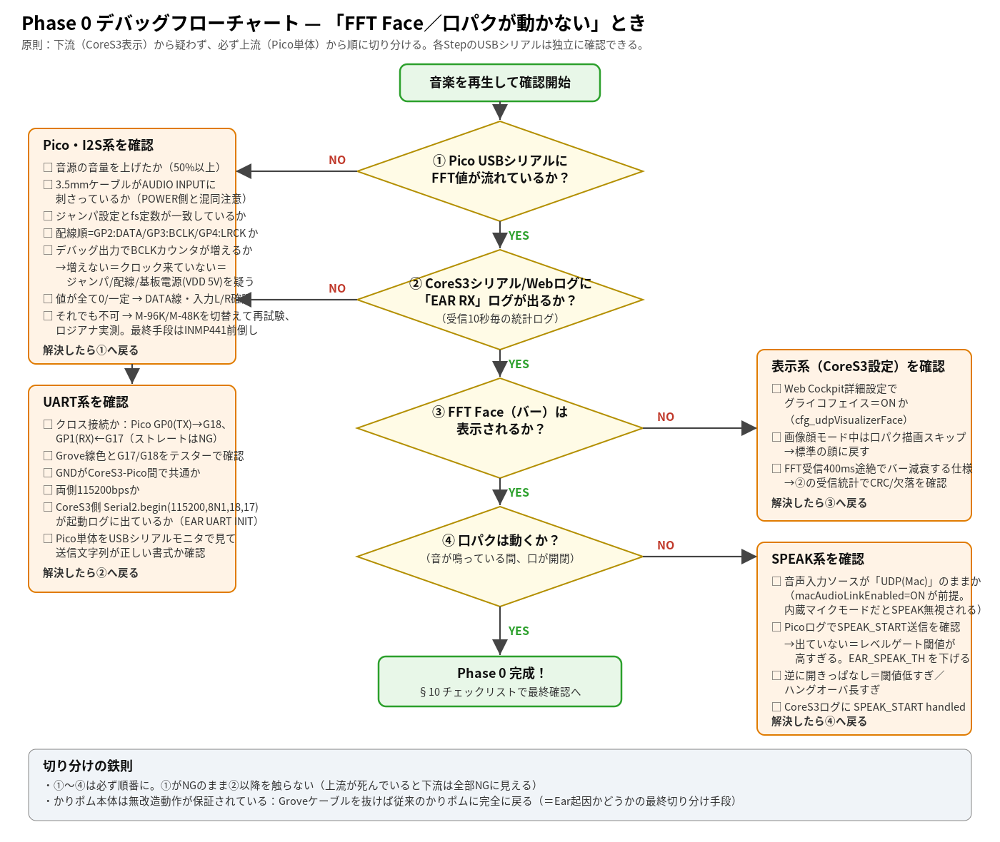

【図：完成したKaripom Ear拡張ユニット（Pico 2 H＋PCM1808）の写真】

このたびは「かりポム（KariPom）」の発展的な拡張構成にご興味をお持ちいただき、ありがとうございます。
本書は、CoreS3に**PCM1808マイク基板＋Raspberry Pi Pico 2**を追加し、PCを使わずにBBX（音に反応するかりポムの世界）を楽しめるようにするための、設計・製作マニュアルです。あわせて、任意のオプション工作である**LINE OUT増設**（第11章）と**Bluetooth入力（MH-M18）**（第12章）についても、本書1冊で理解・製作できるようにまとめています。**Karipom Earに関するハードウェア拡張の正式マニュアルは、現在のところ本書のみです。** GitHubで公開している設計図・回路図とあわせてご利用ください。

```{=openxml}
<w:p><w:r><w:br w:type="page"/></w:r></w:p>
```

# 第1章 はじめに

## 1.1 本書について

本書は、「かりポム ユーザーマニュアル」の発展編にあたる、**Karipom Ear v2拡張（PCM1808＋Pico2）**の設計・製作マニュアルです。

かりポム本体（CoreS3）は、そのままでも十分に楽しめますが、この拡張を追加すると、**PCを使わずに、CoreS3だけで音楽に反応するBBX体験**ができるようになります。

本書では、次のような読者を想定しています。

- 「かりポム ユーザーマニュアル」をひととおり読み、かりポムの基本操作に慣れた方
- はんだ付けや電子工作の基本操作（部品の実装、配線、テスターの使用）に抵抗がない方
- 「なぜこの設計にしたのか」という技術的な背景まで含めて理解したい方

電子工作の経験が浅い方でも、手順どおりに進めれば製作できるよう、専門用語にはそのつど説明を添えています。ただし、ユーザーマニュアル本編よりも技術的な内容が多くなりますので、あわてず1つずつ確認しながら進めてください。

💡 配線・書き込み・環境構築でつまずいたときは、本書と該当のスケッチファイルをChatGPTなどのAIに読み込ませ、状況を伝えながら相談する方法もおすすめです。

本書は、PCM1808＋Pico2拡張（第2〜10章）を土台として、そこからさらに発展させたい方向けの任意のオプション工作である**LINE OUT増設**（第11章）と**Bluetooth入力（MH-M18）**（第12章）までを収録しています。いずれのオプションも省略して構いません。かりポムはPCM1808＋Pico2拡張だけでも十分に楽しめます。

## 1.2 この拡張でできること

現在のKaripom Earは、PC音声（Wi-Fi）・LINE IN・内蔵マイクの3系統から音を受け取っています。この拡張を追加すると、次のことができるようになります。

- **PCを使わずにBBXを楽しめる** — 3.5mmケーブルで音楽プレーヤーやスマホを直接つなぐだけで、CoreS3がFFT Face（グライコフェイス）と口パクで反応します。
- **より高品質な有線接続** — PC＋KariPom Companion経由のWi-Fi接続（macOSの場合はBlackHole等の仮想オーディオ設定が必要）より、経路がシンプルで安定します。
- **将来の発展の土台になる** — この拡張は「耳」の役割をPico側に切り出す設計になっており、将来的にはマイク追加（空気中の音に反応）や人感センサーなど、CoreS3を分解せずに機能を増やしていく入り口になります。

## 1.3 現在の完成状況

かりポムは継続的に開発が進んでいるプロジェクトです。この拡張についても、現時点の状況を正直にお伝えします。

| 段階 | 内容 | 状況 |
|---|---|---|
| **Phase 0** | PCM1808（ライン入力）→Pico2→CoreS3で、FFT Face表示・口パクが動作すること | ✅ **達成済み**。音楽再生時にグライコフェイスと口パクが実機で確認できています |
| Phase 1 | 通信をバイナリ形式に強化し、エラー検出・Web Cockpit表示などを追加 | 開発中 |
| Phase 2 | I2S MEMSマイクを追加し、「空気中の音」にも反応できるようにする | 開発中（配線・ピンは本設計にあらかじめ予約済み） |
| Phase 3以降 | ビート検出によるダンス同期、音種分類、人感センサーなど | 構想段階 |

つまり、本書の手順どおりに製作すれば、**今すぐPCなしでFFT Face・口パクを体験できます**。マイクによる「部屋の音への反応」や、ダンス同期などは今後のアップデートをお待ちください。GitHubリポジトリでは、進捗に応じて本書と設計図を随時更新していきます。

## 1.4 本書の読み方

はじめて製作する方は、次の順番で読み進めてください。

**第2章「全体設計」→ 第3章「必要なもの」→ 第4章「配線」→ 第5章「Pico2ファームウェアの書き込み」→ 第6章「CoreS3側の変更」→ 第7章「組み立てと動作確認」**

「なぜこの設計になっているのか」を先に知りたい方は第2章を、とにかく手を動かしたい方は第3章から読んでも構いません。困ったときは第9章「トラブルシューティング」をご覧ください。

基本の拡張が完成し、さらに発展させたくなったら、第11章「LINE OUT増設」・第12章「Bluetooth入力（MH-M18）」もあわせてご覧ください。どちらも任意のオプションで、省略しても本体の機能には影響ありません。

## 1.5 本書で使うマークについて

| マーク | 意味 |
|---|---|
| ⚠️ **警告** | 守らないと、部品の破損やけがにつながるおそれがある重要な注意事項です。 |
| ❗ **注意** | 守らないと、正しく動作しない・かりポム本体に影響が出る可能性がある事項です。 |
| 💡 **ヒント** | 知っていると便利な情報です。 |

```{=openxml}
<w:p><w:r><w:br w:type="page"/></w:r></w:p>
```

# 第2章 全体設計（なぜこの構成なのか）

## 2.1 目的

現在のかりポムは、PC（Mac/Windows/Linux）＋KariPom Companion経由のWi-Fi通信で、音量・FFT情報をCoreS3へ送っています。本拡張は、この「PC依存の耳」を、**CoreS3を一切分解せず、Port C（Grove端子）1本だけで接続できる独立音声解析ユニット「Karipom Ear v2」**へ置き換える（または追加する）ためのものです。

## 2.2 設計方針（3原則）

1. **役割分離** — Ear（Pico側）が「聴く・解析する」、CoreS3が「表現する」。CoreS3では重い信号処理（FFTなど）を一切行いません。
2. **CoreS3非侵襲** — 筐体を開けません。接続はPort C（Grove端子）のみ。CoreS3側のソフト変更も最小限（受信処理の追加のみ）です。
3. **Ear側だけで進化** — 通信の約束事（プロトコル）にバージョンを付けて固定し、Pico側のファームウェア更新だけで機能を進化させられる構造にします。

💡 この3原則のおかげで、この拡張は「壊れてもかりポム本体には影響しない安全な追加パーツ」になっています。Groveケーブルを抜けば、いつでも今までのかりポムに完全に戻ります。

## 2.3 システム全体像

```
                        Karipom Ear v2                                CoreS3（かりポム本体）
 ┌─────────────────────────────────────────────────┐      ┌─────────────────────────────────┐
 │                                                 │      │                                 │
 │  3.5mm LINE IN          I2S MEMSマイク           │      │  Port A ── サーボ×2              │
 │  (PC/スマホ/DAP)         (Phase 2で追加)          │      │  Port B ── ジョイスティック        │
 │       │                      │                  │      │                                 │
 │  ┌────▼─────┐                │                  │      │  ┌───────────────────────────┐  │
 │  │ PCM1808  │ I2S       I2S  │                  │      │  │ 音声状態変数群              │  │
 │  │ ADC基板  ├──────┐   ┌─────┘                  │      │  │  fftLevel[8] / 発話中フラグ │  │
 │  └──────────┘      │   │                        │      │  └─────┬─────────────────────┘  │
 │              ┌─────▼───▼──────┐                 │      │        │ 参照のみ                │
 │              │ Raspberry Pi   │   UART 115200   │      │  ┌─────▼─────────────────────┐ │
 │              │ Pico 2 H       ├─────────────────╪══════╡ Port C │ 表現層（既存・無変更）    │ │
 │              │  I2S受信・FFT等│   特徴量フレーム   │Grove │  │ 口パク/表情/Visualizer Face│ │
 │              └────────────────┘                 │4ピン │  └───────────────────────────┘  │
 │                     ▲ 5V給電（Grove経由）         │      │                                 │
 └─────────────────────╂───────────────────────────┘      │                                 │
                       ╚══════════════════════════════════╡ 5V                              │
                                                          └─────────────────────────────────┘
  （併用可）PC + KariPom Companion ──Wi-Fi──► CoreS3   ※既存経路は残り、切り替えて使えます
```

データの流れは「**音 → [Ear] I2S取込 → 解析 → 特徴量（数十バイトのみ） → UART → [CoreS3] 状態更新 → 表現**」です。生の音声波形はUARTに流さないため、通信量もCoreS3の負荷もごくわずかです。

## 2.4 通信方式・マイコン・アーキテクチャの選定理由

「なぜこの部品・この方式なのか」を、比較検討の結果とあわせて記録します。読み飛ばしても製作はできますが、改造・トラブル対応の際の判断材料になります。

**通信方式：UARTを採用**

Port C（Grove端子）は信号線が2本しかありません。

| 評価軸 | UART | I2C | SPI |
|---|---|---|---|
| Port Cで物理的に成立するか | ◎ Port CはCoreS3のUART専用ポート | ○ 2線で成立 | × 最低4線必要。不成立 |
| 通信の主導権 | ◎ 全二重・Pico側から自発的に送信可 | △ CoreS3が常に問い合わせる必要 | — |
| 実装の安定性 | ◎ 双方とも実績豊富 | △ RP2350のI2Cスレーブは制約が多い | — |
| デバッグのしやすさ | ◎ USBシリアルでそのまま確認可 | △ 専用ツールが必要 | — |

**マイコン：Raspberry Pi Pico 2 H を採用**

| 項目 | Pico（無印） | Pico H | Waveshare RP2040-Zero | **Pico 2 H（採用）** |
|---|---|---|---|---|
| チップ | RP2040 | RP2040 | RP2040 | **RP2350** |
| FPU・DSP命令 | なし | なし | なし | **あり** |
| SRAM | 264KB | 264KB | 264KB | **520KB** |
| ヘッダ・デバッグ端子 | 自分ではんだ付け | ヘッダ済み | 一部実装 | **ヘッダ済み・デバッグ端子あり** |
| 国内実売目安 | 約700〜800円 | 約900〜1,000円 | 約900円前後 | **約1,000〜1,300円** |

RP2350はFPU（浮動小数点演算器）とDSP拡張命令を持ち、FFT処理などを余裕を持って実行できます。差額は数百円ですが、将来の機能追加（ビート検出や音種分類など）を見据えると、この余力が効いてきます。

**アーキテクチャ：Pico側で解析する「分離型」を採用**

| 案 | 構成 | 評価 |
|---|---|---|
| A. CoreS3単体で解析 | CoreS3内蔵マイク＋自前で信号処理 | ✕ 表情・サーボ・Webサーバと同じCPUで解析が競合し、安定性最優先の方針と矛盾します |
| B. マイクユニットをPort Cへ直結 | 生の音声信号だけ受け取る | ✕ 結局CoreS3側で解析が必要になり、Aと同じ問題が起きます |
| **C. 分離型（採用）** | **Pico側で解析し、結果（特徴量）だけを送る** | ◎ CoreS3は「表現」に専念でき、Ear側は単体でも開発・検証できます |

## 2.5 実現可能性の検証結果

設計段階で確認した内容を記録しておきます。

| 項目 | 判定 | 内容 |
|---|---|---|
| Port C接続性 | ◎ | CoreS3のPort Cは既存コードで未使用。UARTはハードウェア機能のためCPU負荷はほぼゼロ |
| 電気的整合 | ◎ | CoreS3・Pico・PCM1808はすべて3.3Vロジックで統一。Grove 5VからPicoとPCM1808へ給電可能 |
| 通信帯域 | ◎ | 特徴量送信でも約10kbps。UART 115200bpsの1割未満で十分な余裕あり |
| 音の入口 | ❗ | **PCM1808はライン入力（3.5mm）専用で、マイクを直接つなぐことはできません。** 「部屋の音に反応させたい」場合はI2S MEMSマイクの追加（Phase 2）が必要です |
| 電源容量 | ○ | 拡張全体で最大約80mA。Grove 5Vはサーボと共有するため、組み立て後に実測確認をおすすめします（第7章） |

```{=openxml}
<w:p><w:r><w:br w:type="page"/></w:r></w:p>
```

# 第3章 必要なもの

## 3.1 部品表（BOM）

| # | 部品 | 数量 | 実売目安 | 備考 |
|---|---|---|---|---|
| 1 | Raspberry Pi Pico 2 H | 1 | 約1,000〜1,300円 | 秋月電子・スイッチサイエンス等で入手可。手持ちにPico／Pico Hがあれば、それで始めても構いません（同一配線・同一手順） |
| 2 | PCM1808 ADC基板 | 1 | 約760円 | 3.5mmライン入力・I2S出力・DC5V駆動のもの |
| 3 | Groveケーブル（HY2.0-4P） | 1 | 約100円 | 20cm以下推奨（短いほど信号が安定） |
| 4 | ブレッドボード（ハーフサイズ以上） | 1 | 約300円 | 最初の動作確認用。基板化は動作確認後で構いません |
| 5 | ジャンパワイヤ（オス–メス／オス–オス） | 各10本〜 | 約300円×2 | PCM1808⇔ブレッドボード、ブレッドボード内配線用 |
| 6 | Groveコネクタ変換ケーブル | 1 | 約150〜300円 | Port Cとブレッドボードをつなぐために使用 |
| 7 | 抵抗 220Ω（1/4W） | 5本＋予備 | 約100円 | **信号線保護用。省略しないでください**（4.5節で説明） |
| 8 | 3.5mmステレオケーブル | 1 | 手持ち可 | 音源→PCM1808の接続用 |
| （任意） | I2S MEMSマイク（INMP441等） | 1 | 約300〜500円 | Phase 2で使用。今すぐ用意する必要はありません |

**合計：約2,000〜2,500円程度**（マイクを含めない場合）。

## 3.2 工具

- Arduino IDEをインストールしたパソコン（Windows・macOS・Linuxいずれでも可）
- USBケーブル（Pico 2 Hのコネクタ形状に合うもの。**データ通信対応品**を使用してください。充電専用ケーブルでは書き込みができません）
- テスター（導通チェック・電圧測定用）
- はんだごて一式（ピンヘッダが未実装の部品を使う場合のみ）

```{=openxml}
<w:p><w:r><w:br w:type="page"/></w:r></w:p>
```

# 第4章 配線

## 4.1 ピン割当表

**CoreS3 Port C（Grove）→ Pico 2 H**

| CoreS3 Port C | Grove線色（標準） | Pico 2 H | 役割 |
|---|---|---|---|
| G17（TXD） | 黄 | GP1（UART0 RX） | CoreS3 → Ear（コマンド用・将来利用） |
| G18（RXD） | 白 | GP0（UART0 TX） | Ear → CoreS3（特徴量：主データ） |
| 5V | 赤 | VSYS（物理39番） | Ear給電 |
| GND | 黒 | GND（物理38番等） | 共通GND |

❗ **Grove線色とG17/G18の対応は、ケーブルのロットによって異なることがあります。** 組み立て前にテスターで導通を確認してください。また、UARTは**クロス接続**（PicoのTX→CoreS3のRX）です。ストレートに接続すると通信しませんが、壊れることはありません。

**PCM1808基板 → Pico 2 H（I2S接続）**

| PCM1808基板ピン | Pico 2 H | 備考 |
|---|---|---|
| DATA（I2S OUT） | **GP2** | 音声データ |
| BCLK | **GP3** | ビットクロック（基板が出力・Picoは受信のみ） |
| LRCK | **GP4** | 左右チャンネル切替クロック |
| MCLK | **接続しない** | 基板が24.576MHzを常時出力しているため、Picoからは触りません |
| GND | GND | 共通GND |
| VDD（POWER） | 5V | DC5V〜12V対応基板のため5Vで駆動できます |

❗ **DATA→GP2、BCLK→GP3、LRCK→GP4という並び順は固定です。** Pico側のI2S受信ライブラリの仕様上、「DATA・DATA+1・DATA+2」という3連番でしか受信できません。この並びを変えると受信できませんので、必ずこの順番で配線してください。

**I2S MEMSマイク（INMP441）→ Pico 2 H（Phase 2で追加）**

| INMP441 | Pico 2 H | 備考 |
|---|---|---|
| SCK | GP10 | Picoが出力 |
| WS | GP11 | |
| SD | GP12 | データ入力 |
| L/R | GND | 左チャンネル固定 |
| VDD／GND | 3V3 OUT／GND | 3.3V駆動 |

💡 マイクは今すぐ配線する必要はありません。将来追加する際にすぐ組み込めるよう、あらかじめピンを予約してあります。

## 4.2 配線図

以下の配線図に沿って接続してください。


📝 図中の配線色は識別のための一例です。実際のケーブル色は製品・ロットによって異なる場合があります。色ではなく端子名・信号名（4.1節のピン割当表）を基準に配線してください。

## 4.3 PCM1808基板のジャンパ設定

PCM1808基板の裏面には、動作モードを切り替える「はんだジャンパ」があります。

| 設定 | OP1（FORMAT） | OP2 | OP3 | 使う場面 |
|---|---|---|---|---|
| 出荷状態：M-96K | OPEN | OPEN | OPEN | **最初の動作確認はこのまま実施してください** |
| **M-48K（正式運用時）** | OPEN | **SHORT** | OPEN | 動作確認に合格した後、こちらへ切り替えます |
| ~~SLAVE設定~~ | ― | ― | ― | **使用禁止**。設定すると基板が無音（ゼロ出力）になります |

- 出荷状態（3つとも未はんだ＝OPEN）のままで最初の受信確認を行います。
- 正式運用への切り替えは、**OP2を1か所だけはんだでショートする**だけです。OP1・OP3には触れません。

⚠️ **はんだジャンパの変更は、必ず電源を切った状態で行ってください。**

## 4.4 電源系統

```
CoreS3 Port C 5Vピン ──┬── Pico 2 H VSYS（物理39番ピン）
                       └── PCM1808基板 VDD
CoreS3 Port C GNDピン ──── 共通GND（Pico・PCM1808・マイク）
```

- 想定消費電流：Pico 2 H 約30〜50mA＋PCM1808基板 約20〜30mA＝**最大約80mA**
- Grove 5VはCoreS3内部の電源から供給され、サーボ2軸と共有しています。80mAの追加は軽微ですが、**組み立て後にサーボ動作時の電圧を実測して確認することをおすすめします**（第7章 Step 6）。
- PicoはUSB給電とGrove 5V給電が同時に接続されても、内部のダイオードにより安全に動作します（Pico本体の設計仕様）。ただし、書き込み時はGroveケーブルを抜いておく運用を推奨します。

## 4.5 配線時の注意事項

⚠️ **信号線5本（UART2本＋I2S3本）には、必ず220Ω の抵抗を直列に入れてください。** 万が一の誤配線・誤設定（PicoとPCM1808が同時に信号を出力してしまう等）があっても、電流を安全な範囲に制限し、部品の破損を防ぐための保護策です。省略すると、配線ミス時に部品が壊れる可能性が上がります。

❗ その他の注意点：

- **通電中の配線変更・抜き差しはしないでください。** 配線を変えるときは、必ずUSBとGrove電源の両方を抜いてから行います。
- Groveケーブルの色とG17/G18の対応は、初回に必ずテスターで確認してください（ケーブルのロットで異なる場合があります）。
- I2S信号線は、サーボのモーター線となるべく離して配線してください（ノイズ対策）。

```{=openxml}
<w:p><w:r><w:br w:type="page"/></w:r></w:p>
```

# 第5章 Pico2ファームウェアの書き込み

## 5.1 開発環境の準備

| 項目 | 内容 |
|---|---|
| 開発ツール | Arduino IDE |
| ボードコア | **Arduino-Pico（earlephilhower版）**。公式の「Arduino Mbed OS RP2040 Boards」は使用しません（I2S受信機能が不足しているため） |
| 追加のボードマネージャURL | `https://github.com/earlephilhower/arduino-pico/releases/download/global/package_rp2040_index.json` |
| インストール場所 | Arduino IDE → 環境設定 → 「追加のボードマネージャURL」に上記を追加 → ボードマネージャで「Raspberry Pi Pico/RP2040/RP2350」を検索してインストール |
| ボード選択 | ツール → ボード → 「Raspberry Pi Pico 2」（Pico／Pico H利用時は「Raspberry Pi Pico」） |

## 5.2 必要なライブラリ

| ライブラリ | 入手方法 | バージョン | 用途 |
|---|---|---|---|
| I2S（コア同梱） | 追加インストール不要 | Arduino-Picoコアと同一 | PCM1808からの音声受信 |
| arduinoFFT | ライブラリマネージャで「arduinoFFT」を検索 | **v2.0.x系を指定**（v1系とはAPIが異なります） | FFT解析 |

外部ライブラリはこの2つだけです。

## 5.3 書き込み手順

1. **Pico 2 HをBOOTSELモードにする** — Pico 2 Hの**BOOTSELボタンを押したまま**USBケーブルをパソコンに接続し、接続できたらボタンを離します。「RPI-RP2」という名前のドライブが表示されればOKです。
2. Arduino IDEを起動し、書き込みたいスケッチ（.inoファイル）を開きます。
3. ツール → ボードで「Raspberry Pi Pico 2」を選択します。
4. ツール → ポートで、「UF2 Board」または「RPI-RP2」を選択します（この時点では通常のシリアルポート表示はまだ出ません）。
5. 書き込みボタンを押します。数秒で「Done uploading.」と表示されれば成功です。Pico 2 Hは自動的に再起動します。

## 5.4 起動確認

再起動後、ツール → ポートに表示されるシリアルポートを選び、シリアルモニタをボーレート**115200**で開きます。（ポート名の表示はOSにより異なります。例：macOSでは`/dev/cu.usbmodem******`、Windowsでは`COM3`など、Linuxでは`/dev/ttyACM0`など）

無音時、正常であれば次のような表示が出ます。

```
ST> rmsDb=-98.0 gate=closed fft/s=25 mi=0 ovf=0 lb=--
TX> FFT:0,0,0,0,0,0,0,0
```

確認ポイント：

- ✅ `gate=closed`（音がない状態が正しく判定されている）
- ✅ `fft/s=25`（1秒あたり25回、正しい頻度で送信されている）
- ✅ `mi=0`・`ovf=0`（データの取りこぼしがない）

PCM1808に音楽を接続すると、`gate=open` に変わり、FFT値（`TX>` 行の8つの数字）が音に合わせて変化すれば正常です。

```{=openxml}
<w:p><w:r><w:br w:type="page"/></w:r></w:p>
```

# 第6章 CoreS3側の変更

## 6.1 変更方針

かりポム本体（CoreS3）のファームウェアは、安定動作を最優先し、**追加のみ・既存コードは無改変**という方針で変更します。

- 新しいファイルには分割せず、既存の1ファイル構成を維持します。追加した部分には目印となるコメントを付けます。
- 追加部分はすべて機能スイッチ（`#define`）で囲み、**スイッチを外せば元のコードと完全に同一のバイナリに戻る**ようにします（安全弁）。

## 6.2 追加箇所

CoreS3側の変更は、次の3箇所・合計約150行程度です。

| # | 追加箇所 | 内容 |
|---|---|---|
| 1 | グローバル定義ブロック | UART受信用のバッファ・カウンタ・タイムスタンプ変数を追加 |
| 2 | 新規関数（受信処理） | UARTから届いた行を読み取り、`FFT:` で始まる行と `SPEAK_START`／`SPEAK_STOP` を、**既存のWi-Fi経由の処理と全く同じロジックで**解釈する |
| 3 | 呼び出し2行 | `setup()`にUART初期化を1行、通信処理ループに受信関数の呼び出しを1行、それぞれ追加する |

この設計により、**表示・口パク・タイムアウト監視のロジックは1行も変更せずに済みます**。CoreS3から見れば、「Wi-Fi経由で来ていたのと同じ形式のデータが、Groveケーブル経由でも届くようになる」だけです。

## 6.3 変更しないもの

次の部分は一切変更しません。

- 表情描画・口パク・Visualizer Face・首振りなどの「表現」を担当する処理全般
- 既存のタイムアウト監視（一定時間データが来なければ、平常時の表示に自動的に戻るしくみ）
- 音声入力ソースの切り替え機能（第12章「Karipom Ear」）

❗ Wi-Fi経由の音声連携（KariPom Companion・第15章）は、この拡張を追加してもそのまま使えます。どちらの経路からもデータが来なくなれば、既存の監視機能により自動的に平常時の表示へ戻ります。

```{=openxml}
<w:p><w:r><w:br w:type="page"/></w:r></w:p>
```

# 第7章 組み立てと動作確認

## 7.1 全体の流れ

各Stepは、**前のStepの成功条件を満たしてから次に進んでください。** 合計の所要時間の目安は2〜3日（1日1〜2時間ペース）です。

| Step | 内容 | 使う機材 | かりポム本体 |
|---|---|---|---|
| 0 | 環境準備。開発環境の導入、Pico単体での動作確認、PCM1808の事前チェック | Pico＋パソコン | 触りません |
| 1 | **Pico単体でのI2S受信確認**。PCM1808を配線し、音楽を入れてシリアルモニタでRMS値・FFT値を確認 | Pico＋PCM1808＋パソコン | 触りません |
| 2 | **UART送信の確認**。プロトコル（送信書式）が正しいかを確認 | 同上 | 触りません |
| 3 | **CoreS3での受信確認**。第6章の変更を実装し、Groveケーブルを接続して受信ログを確認 | 全機材 | **ここで初めて変更します** |
| 4 | **FFT Face表示の確認**。音楽再生でグライコフェイスが動くことを確認 | 全機材 | 変更なし（確認のみ） |
| 5 | **口パクの確認**。しきい値を調整し、音に合わせて口が動くことを確認 | 全機材 | 変更なし（Pico側の調整のみ） |
| 6 | **仕上げ**。既存のWi-Fi経由の接続との共存確認、長時間稼働確認 | 全機材 | 変更なし |

## 7.2 各Stepの詳細

**Step 0：環境準備**

Pico 2 HをBOOTSELモードでUSB接続し、Arduino IDEからLチカ（LED点滅）などの簡単なスケッチを書き込んで、開発環境が正しく動くことを確認します。PCM1808基板は、この時点では配線しません。ジャンパが3つともOPEN（出荷状態）であることと、5Vを入力したときに正しく電源が入ることだけ確認します。

**Step 1：Pico単体でのI2S受信確認**

PCM1808をブレッドボード上でPicoに配線します（電源はいったんPicoのUSB側から取り、Grove経由の給電は後のStepで行います）。I2S受信とFFT・RMS計算までを書き込んだスケッチを実行し、シリアルモニタで以下を確認します。

- 無音時：全バンドがほぼ0
- 音楽再生時：低音バンドを中心に、音に合わせて値が変動
- 音量を上げる：RMS値が明確に増加

うまく受信できない場合は、まず出荷状態（M-96K）のまま試し、確立してからM-48Kへ切り替えます。**配線順（DATA→GP2／BCLK→GP3／LRCK→GP4）**が最も間違えやすいポイントです。

**Step 2：UART送信の確認**

Pico側でFFT値・発話状態をテキスト形式（`FFT:25,13,0,0,0,0,0,0`のような書式）でUART0（GP0）に送信するようにします。この段階ではまだCoreS3には接続せず、USBシリアルへのエコー表示で書式と頻度（1秒間に約25回）を確認します。

**Step 3：CoreS3での受信確認**

いよいよCoreS3側に第6章の変更を実装します。書き込み前に、必ず現在のかりポムのスケッチファイルをバックアップしてください。Groveケーブルを接続し、CoreS3の起動ログに受信初期化のメッセージが出ること、その後10秒ごとに受信統計（エラー0件）が記録されることを確認します。

**Step 4：FFT Face表示の確認**

Web UIでVisualizer（グライコフェイス相当の表示）がONになっていることを確認し、音楽を再生します。8本のバーが低音から高音の順に、音に合わせて動けば成功です。

**Step 5：口パクの確認**

静寂時は反応せず、音楽再生中は口が動き、停止後まもなく口が閉じることを確認します。反応が悪い・誤反応する場合は、Pico側のしきい値定数を調整します（CoreS3側は変更しません）。

**Step 6：仕上げ**

既存のWi-Fi経由の音声連携（KariPom Companion）を使っても動作が乱れないこと、長時間（数時間〜半日程度）の連続稼働でエラーが増え続けないこと、かりポムの既存機能（首振り・ジョイスティック・スリープ・Web UI）に影響がないことを確認します。あわせて、サーボ動作中の電源電圧も実測しておくと安心です。

```{=openxml}
<w:p><w:r><w:br w:type="page"/></w:r></w:p>
```

# 第8章 通信プロトコル

Pico（Ear）とCoreS3の間でやり取りするデータの約束事（プロトコル）です。改造や将来の拡張を考えている方向けの情報です。読み飛ばしても製作には支障ありません。

## 8.1 Phase 0：互換テキストモード

現在採用している方式です。既存のWi-Fi経由のプロトコルと**まったく同じ書式**のテキストを、UART経由で送ります。

```
FFT:25,13,0,0,0,0,0,0      （8バンドのFFT値。0〜100の範囲、低音→高音の順）
SPEAK_START                （発話（音）検出開始。以後1秒毎に送信されるハートビートも兼ねる）
SPEAK_STOP                 （発話（音）終了）
```

この方式の利点は、CoreS3側の受信処理を「既存の解析ロジックをほぼそのまま呼ぶだけ」にできることです。これにより、CoreS3側の変更を最小限（第6章）に抑えられます。

## 8.2 Phase 1以降：バイナリモード（設計）

将来のバージョンでは、以下のようなバイナリ形式への移行を予定しています。

```
┌──────┬──────┬─────┬──────┬─────┬─────────────┬──────┐
│ 0xA5 │ 0x5A │ VER │ TYPE │ LEN │ PAYLOAD     │ CRC8 │
│ 同期1 │ 同期2 │ 1B  │ 1B   │ 1B  │ 0〜32B      │ 1B   │
└──────┴──────┴─────┴──────┴─────┴─────────────┴──────┘
```

エラー検出（CRC8）・前方互換のためのバージョン番号・拡張フィールドを備え、「未知の情報は黙って読み飛ばす」というルールにより、**Pico側のファームウェアだけを更新すれば、CoreS3側を変更せずに機能を追加できる**ようにする予定です。

```{=openxml}
<w:p><w:r><w:br w:type="page"/></w:r></w:p>
```

# 第9章 トラブルシューティング

## 9.1 デバッグフローチャート

「FFT Face・口パクが動かない」ときは、必ず**上流（Pico単体）から順に**切り分けてください。CoreS3側の表示から疑うと、原因の特定が難しくなります。



## 9.2 典型的な症状と対処

| 症状 | 最有力の原因 | 対処 |
|---|---|---|
| Step 1で全バンドが0のまま | ジャンパ設定違い、またはBCLK未接続 | ジャンパ（4.3節）と配線（4.1節）を再確認 |
| Step 1で値がランダムなノイズになる | LRCKとBCLKの取り違え、またはDATA線の間違い | 3本の配線を1本ずつ確認 |
| Step 3でCoreS3の受信ログが出ない | UARTのクロス接続ミス、G17/G18の線色の取り違え | 黄と白の配線を入れ替えて再確認（最も多いミスです） |
| 受信エラーが多い | ケーブルが長すぎる、サーボの配線と並走している | ケーブルを20cm以下に短縮し、サーボ線から離す |
| 口が開きっぱなしになる | しきい値が低すぎる、または音源のノイズが大きい | Pico側のしきい値を上げる（CoreS3側の変更は不要） |
| 首振り中だけFFT Faceがカクつく | 一時的な読み出し間隔の影響 | 通常は問題ありません。気になる場合はご相談ください |

💡 それでも解決しない場合は、シリアルモニタのログをそのままChatGPTなどのAIに貼り付けて、本書とあわせて相談してみてください。

❗ **困ったときの最終手段：Groveケーブルを抜いてください。** これだけで、かりポムは完全に元の状態（この拡張がない状態）に戻ります。「拡張が原因かどうか」を必ずこの方法で最終確認できます。

```{=openxml}
<w:p><w:r><w:br w:type="page"/></w:r></w:p>
```

# 第10章 完成チェックリスト

すべての項目にチェックが付けば、この拡張の基本機能（Phase 0）は完成です。

**機能**

- ☐ PCM1808からの入力に成功している（Step 1：シリアルモニタでRMS/FFTが音に追従する）
- ☐ FFT取得に成功している（8バンドが低音→高音の順で妥当に分布する）
- ☐ UART送信に成功している（`FFT:` 行が1秒間に約25回、正しい書式で送信される）
- ☐ CoreS3で受信できている（受信統計にエラーが出ない）
- ☐ FFT Faceが表示される（PCなしでバーが音楽に同期する）
- ☐ 口パクが動作する（音に合わせて開始・停止し、静寂時に誤反応しない）

**安定性**

- ☐ 信号線5本すべてに220Ωの保護抵抗が入っている
- ☐ 電源はGrove給電へ移行済み（USB給電に頼らない状態で動作する）
- ☐ 数時間の連続稼働でエラー率が増え続けない
- ☐ 既存のかりポムの機能（首振り・ジョイスティック・スリープ・Web UI・カメラ・SDログ）に影響がない
- ☐ Groveケーブルを抜くと、従来のかりポムに完全に戻る
- ☐ この拡張の機能スイッチをOFFにしてビルドすると、既存と同じ動作になる

**記録**

- ☐ 採用したサンプリングレート（M-96K／M-48K）を控えている
- ☐ しきい値の最終調整値を控えている
- ☐ 変更前のかりポムのスケッチファイルをバックアップしている

```{=openxml}
<w:p><w:r><w:br w:type="page"/></w:r></w:p>
```

# 第11章 発展オプション：LINE OUT増設

**Karipom Earは、この改造を行わなくても利用できます。** ここからは、この拡張をさらに発展させたい方向けの、任意のオプション工作です。省略しても本体の機能には一切影響ありません。

> 📝 **作者注**：本章は、設計・製作手順として完成している内容です。ただし作者自身は、音源機器側のLINE OUT分岐だけで現状十分に運用できているため、**Karipom Ear本体へのLINE OUT増設は、まだ実施していません。** 「設計資料として掲載しているオプション機能」であり、作者自身の実機への搭載実績を示すものではない点をご了承のうえご利用ください。

対象構成：既存PCM1808＋既存Pico 2 H＋CoreS3（Bluetoothは今回対象外）／所要時間の目安：60〜90分（はんだ付けを含む）

## 11.1 これは何をする工作か

PCM1808基板に入力した音源を、**アクティブスピーカーへも同時に出力できるようにする**追加工作です。かりポムの口パク・グライコフェイス用の解析はそのまま維持しながら、同じ音を別のスピーカーでも聴けるようになります。

**完成後の信号の流れ**

| 区分 | 経路 |
|---|---|
| 入力 | 音源機器（PC／スマホ等）→ 3.5mmケーブル → 既設ジャック（PCM1808基板上） |
| 解析（従来どおり・変更なし） | 既設ジャック → PCM1808 → Pico 2 → CoreS3（口パク・グライコ） |
| 出力（今回追加） | 既設ジャックと並列のCN3 → 470Ω → LINE OUTジャック → アクティブスピーカー |

音源は今までどおり既設ジャックに挿します。**CN3はLINE OUT専用**になります。

**やること**

- 3.5mmジャック配線（お持ちのものを流用、または新規に用意）に、470Ωの抵抗を2本挿入する
- それをCN3へ接続し、LINE OUTとして機能させる
- 改造の前後で、PCM1808への入力レベルが変わっていないことを実測で確認する
- アクティブスピーカーを繋いで、音が出ること・ハムが出ないことを確認する

**やらないこと**

- Bluetooth（MH-M18）関連の作業一切（第12章で扱います）
- 入力切替回路・分圧回路の製作
- PCM1808基板・CoreS3本体の改造
- 筐体（Fusion 360）側のジャック取り付け穴の設計（必要になったら別途）

💡 **なぜ470Ωを入れるのか**：CN3はPCM1808への入力信号がそのまま出ている点です。ここへ抵抗を挟まずスピーカーへ繋ぐと、スピーカー側の回路がPCM1808への入力に影響したり、誤配線時に音源側へ電流が逆流したりするおそれがあります。470Ωという十分に高い抵抗値を直列に入れることで、**既存のPCM1808側の解析にはほぼ影響を与えずに**、電流を安全な範囲へ制限しながら分岐出力できます。

## 11.2 用意するもの

| 品目 | 数量 | 入手 |
|---|---|---|
| 470Ω 1/4W 金属皮膜抵抗 | 2 | 今回の主な購入品 |
| 3.5mmステレオジャック配線（メスコネクタ付き、3線） | 1 | お持ちのものを流用するか、新規に用意（下記コラム参照） |
| 熱収縮チューブ | 適量 | φ2mm程度を数本分（φ4mm以上があればなお良い） |
| はんだごて・はんだ・ニッパー・ワイヤーストリッパー | ― | 手持ち |
| テスター（抵抗レンジ） | 1 | 導通・抵抗値確認用 |
| 3.5mm オス–オス ケーブル | 2 | 音源用・スピーカー用 |
| 余っているピンヘッダ | 2 | プローブを当てやすくするため |

💡 470Ωのカラーコード（4本帯）は「黄・紫・茶・金」です。購入時は袋の表記だけでなく、抵抗本体の帯の色でも確認してください。

❗ **ジャックの端子（Tip／Ring／Sleeve）について**：3.5mmステレオジャックには、先端側からチップ（Tip＝L）・リング（Ring＝R）・スリーブ（Sleeve＝GND）の3つの端子があります。この並び順（Tip→Ring→Sleeve）は3.5mmステレオ規格として共通ですが、**配線の色は製品によって異なり、規格として決まっているものではありません。** 作業前に、お使いのジャック／ケーブルのどの線がTip・Ring・Sleeveにつながっているかを、テスター（導通チェック）で必ず確認してください。

💡 **ジャック配線をお持ちでない場合**：市販の「3.5mmステレオプラグ＋メスジャック」のケーブルを用意し、途中で切断して自作する方法があります（ケーブルによっては3線以外にシールド線が含まれる場合があるため、切る前に必ずテスターで各線がTip・Ring・Sleeveのどれに対応するかを確認してください）。両端がメスコネクタになった配線を購入する方法もあります。

📝 **作者の製作例**：作者が実際に使用したジャック配線では、青＝L（Tip）、赤＝R（Ring）、黒＝GND（Sleeve）という色の線が使われていました。ただし線色は規格ではなく製品によって異なるため、この色を鵜呑みにせず、必ずご自身のジャック／ケーブルの端子をテスターで確認してください。

**作業前チェックリスト**

- ☐ 机の上が片付いており、金属製の物が作業面にない
- ☐ はんだ付けができる場所（換気できる・こて台がある）
- ☐ 絶縁台（段ボールまたはプラ板）がある
- ☐ Pico 2の測定用スケッチ（入力レベル確認用）が用意してある
- ☐ 元のスケッチ（通常運用用）が変更されずに残っている
- ☐ アクティブスピーカー／アンプが使える状態

## 11.3 やってはいけないこと

⚠️ 絶対禁止

| やってはいけないこと | 起きること |
|---|---|
| 通電したままCN3の配線を抜き差しする | ショート・破損 |
| LINE OUTジャックにイヤホン／ヘッドホンを挿す | 470Ωで大きく減衰し、ほとんど聞こえません。ライン入力専用です |
| Pico 2の既存配線（GP0〜GP4、VSYS、GND）を抜く | 動作中のKaripom Earが壊れます |
| 熱収縮チューブを通す前にはんだ付けする | やり直しになります |
| 音源をCN3へ挿す | CN3はLINE OUT専用です。音源は既設ジャックへ |

❗ 避けること：作業の途中で音源機器の音量を変える（改造前後の比較ができなくなります）／抵抗を入れた部分を繰り返し曲げる（断線しやすい箇所）／判断に迷ったまま次の工程へ進む。

## 11.4 完成する回路

接続は3本だけです。抵抗を入れるのはチップ（L）とリング（R）の2本で、スリーブ（GND）は直結です。

| CN3のピン（PCM1808基板） | 途中に入れる部品 | ジャックの接点 | 作者の製作例での線色 |
|---|---|---|---|
| L_IN | 470Ω | チップ（先端・L） | 青 |
| R_IN | 470Ω | リング（中間・R） | 赤 |
| GND | なし（直結） | スリーブ（根元・GND） | 黒 |

📝 上記「線色」欄は作者の製作例です。線色は規格ではないため、実際に使用する配線でテスターにより端子を確認してください。

❗ スリーブ（GND）には抵抗を入れません。入れるのはチップ（L）とリング（R）の2本だけです。

## 11.5 作業手順

各工程は「無通電」「通電あり」を明記しています。必ずこの区別を守ってください。

**工程1　測定用ファームを書き込む【PC作業】**

改造前後のレベルを数値で比較するため、Pico 2に入力レベル測定用のスケッチを書き込みます。ボードが「Raspberry Pi Pico 2」になっていることを確認して書き込み、シリアルモニタを115200bpsで開くと、起動バナーに続いて1秒ごとに測定値の行が表示されます。この間、CoreS3の口パク・グライコは停止しますが正常です（工程10で元に戻します）。

**工程2　改造前の基準レベルを測る【通電あり】**

❗ この工程を飛ばすと、改造後に「レベルが下がったかどうか」を判断できなくなります。必ず実施してください。

音源機器（PCなど）を既設ジャックへ接続し（CN3には何も挿さない）、400Hzのサイン波を再生します。音量を上げていき、ピークレベルが44〜50%あたりで止め、**以降は作業が全部終わるまで音量に触りません**。値が安定したら「改造前」の基準値として記録します。

**工程3　無通電にする【無通電】**

再生を止め（音量はそのまま）、Pico 2・CoreS3のUSBケーブルを両方とも抜き、画面が完全に消えたことを確認してから、音源のケーブルも既設ジャックから抜きます。

**工程4　抵抗を配線に挿入する（はんだ付け）【無通電】**

チップ（L）側の線の途中に470Ωを1本入れます。①抵抗のリード線を約5mmに切り詰める　②その線の中央を切断する　③切断した両側の被覆を約5mm剥く　④**熱収縮チューブを先に線へ通す**（この順番を飛ばすと、はんだ付け後には通せません）　⑤⑥両側の芯線を抵抗のリードにはんだ付けする　⑦熱収縮チューブをかぶせて加熱・収縮させる　⑧軽く引っ張って抜けないことを確認する。リング（R）側の線にも同じ手順でもう1本の470Ωを入れます。**スリーブ（GND）側の線には何もしません。**（作者の製作例では、チップ＝青、リング＝赤、スリーブ＝黒の配線でした。お使いの配線ではテスターで各線を確認してから作業してください。）

**工程5　抵抗値とショートの確認【無通電】**

CN3に挿す前に、必ずテスターで確認します。自由端のプラグと各コネクタの間の抵抗を測定し、次の値になっていることを確認します。

| 測る場所 | 期待する値 |
|---|---|
| 自由端プラグのチップ（先端）↔チップ側の線（470Ω経由） | 約440〜500Ω |
| 自由端プラグのリング（中間）↔リング側の線（470Ω経由） | 約440〜500Ω |
| 自由端プラグのスリーブ（根元）↔スリーブ側の線（直結） | ほぼ0Ω（1Ω以下） |

続けて、テスターを200kΩ以上（またはオート）に切り替え、チップ側↔リング側・チップ側↔スリーブ側・リング側↔スリーブ側の間がいずれも「1」または「OL」（＝導通なし）であることを確認します。0Ω付近が出た場合はどこかでショートしているため、工程4をやり直してください。

**工程6　CN3へ接続する【無通電】**

すべてのUSBが抜けていることを再確認し、PCM1808基板のCN3のシルク文字（L_IN／GND／R_IN）を読みながら、スリーブ側の線→GND、チップ側の線→L_IN、リング側の線→R_INの順に挿します。1本ずつ正しいピンに乗っているか、抵抗部分が他の部品に押し付けられていないかを目視確認します。

❗ **CN3は今回「出力」用途です**。挿し方自体はPCM1808への入力配線と同じ考え方ですが、音源はCN3ではなく既設ジャックへ挿してください。CN3に音源を挿さないよう、特にご注意ください。

**工程7　通電してレベルを再測定（スピーカー未接続）【通電あり】**

LINE OUTジャックには何も挿さず、工程2と同じ条件（同じ音量）でサイン波を再生し、ピークレベルを記録します。**工程2とほぼ同じ値（差が±2%以内）なら影響なしと判断できます。**

**工程8　アクティブスピーカーを接続して音を出す【通電あり】**

スピーカーの音量を最小にしてからLINE OUTジャックへ接続し、電源を入れて音量をゆっくり上げます。音楽が聞こえ、左右とも出ていて、ハム（ブーン音）が出なければ成功です。

**工程9　スピーカー接続時のレベルを測定【通電あり】**

スピーカーを接続したまま、工程2と同じ条件でもう一度測定します。改造前・スピーカー未接続・スピーカー接続の3つがほぼ同じ値（差が±2%以内）であれば完成です。

**工程10　元のファームへ戻す【PC作業】**

通常運用用のスケッチに書き戻し、起動バナーとST行が表示されること、CoreS3の口パク・グライコが元どおり動くことを確認します。

**工程11　片付けと最終確認【通電あり】**

再生を止めてスピーカーの音量を最小にし、Pico 2の既存配線がすべて元のまま／CN3に3本が正しく挿さっている／抵抗部分に無理な力がかかっていない／既設ジャックに音源、LINE OUTジャックにスピーカーが繋がっている／口パク・グライコが正常に動作する、の5点を最終確認します。

## 11.6 完成後にできること

- 音源をかりポムに繋ぐだけで、スピーカーから音を聴きながら口パク・グライコが動く
- 従来どおり、スピーカーを繋がずに使うこともできる（LINE OUTを空けておくだけ）

💡 **将来Bluetoothを追加する場合**：この回路はそのまま流用できます。MH-M18を追加するときは、CN3の手前に入力切替回路を挿し込むだけで、470Ωから先には一切手を加えません。今回の作業は無駄になりません。

## 11.7 トラブルシューティング

| 症状 | 対処 |
|---|---|
| はんだが芋状で光沢がない | 加熱不足。もう一度こてを当て直す |
| 引っ張ると抜ける | 接続不良。やり直す |
| チューブを通し忘れた | カッターで縦に切って外し、新しいものを通してやり直す |
| 工程5で抵抗値が期待範囲に入らない（2回やり直しても） | 配線の再確認、または抵抗の交換 |
| 工程5でショートが見つかる（2回やり直しても） | はんだ付け箇所の再確認 |
| 工程7でレベルが5%以上下がった | USBを抜き、配線・CN3の挿し位置を再確認 |
| 工程8で音が出ない | 音源機器の音量、スピーカーの入力切替、ケーブルの挿し込みを確認 |
| 工程8で片方のチャンネルしか出ない | チップ側またはリング側の接続不良。工程4からやり直す |
| 工程8でハム（ブーン音）が出る | グラウンドループの可能性。音量を下げて記録し、相談する |
| 工程9でスピーカー接続時だけレベルが大きく下がる | スピーカー側の入力インピーダンスが低い可能性 |
| 工程10で元のファームに戻せない | BOOTSELボタンを押しながらUSBを挿し直す |

💡 はんだごてで火傷した、焦げた匂いがした場合は、直ちに作業を中断してください。判断に迷う症状は、記録した測定値とあわせてChatGPTなどのAIに相談する方法もおすすめです。

```{=openxml}
<w:p><w:r><w:br w:type="page"/></w:r></w:p>
```

# 第12章 発展オプション：Bluetooth入力（MH-M18）

**現在の実際の推奨構成は、第2〜10章のPCM1808＋Pico2基本構成です。** LINE OUT増設（第11章）・Bluetooth入力（第12章）は、いずれもそこからさらに発展させたい方向けの、任意のオプションとして設計資料を掲載しているものです。この章は、将来ケーブルなしで音源を入力したい方向けに、現時点での設計検討結果と、安全に作業を進めるための最初の手順（初回通電・DCオフセット測定）をまとめた設計資料です。

> 📝 **作者注**：Bluetooth入力（MH-M18）は、入力レベル評価と初回通電・DCオフセット測定の設計・評価までを実施済みです。ただし作者自身は現在、音源機器側のLINE OUT分岐で十分運用できているため、**LINE OUT増設・Bluetooth入力とも実機には搭載していません。** いずれも「設計資料として掲載しているオプション機能」であり、CN3手前への入力切替回路の実配線や、カップリングコンデンサ・分圧抵抗の最終値の確定は、測定結果を踏まえた今後の課題として未着手のままです。

## 12.1 これは何をする工作か

**MH-M18**は、Bluetooth（A2DP）で受信した音声を、そのままアナログのL/R信号として出力する小型モジュールです。これをKaripom Earに追加すると、スマホやPCから**ケーブルを挿さずに**音源を送れるようになる構想です。

現時点では、①MH-M18を安全に初めて通電し、Bluetooth接続を確認する、②後続の回路設計に必要な**L/R出力のDCオフセット（直流電圧の有無）を測定する**、という2つの安全確認までが手順として確立しています。その先（カップリングコンデンサの要否、CN3手前の入力切替回路の実配線）は、この測定結果を踏まえて設計を確定させるため、次のアップデートで本書に追記予定です。

💡 「Bluetooth化を行う場合は、この章だけで製作できるレベルを維持する」という方針のもと、現時点で安全に進められる工程はすべて収録しています。

## 12.2 設計方針・入力レベル評価

Bluetooth入力を追加するにあたり、まず有線LINE IN（第2〜10章のPCM1808経由の入力）の実際のレベルを実測し、Bluetooth側の設計目標を決める評価（社内呼称「M3a」）を行いました。

**測定環境（作者の評価条件）**：ADC＝PCM1808、MCU＝Raspberry Pi Pico 2、テスト信号＝400Hzサイン波（作者の評価では、Audacityで再生し、MacBook Proの3.5mmヘッドホン出力を使用しました）。本書掲載の実測値は、この評価環境で取得した参考値です。使用する音源機器・再生ソフトにより値は変動します。

**通常使用レベル（設計基準）**：peakL＝44.18%・peakR＝46.08%（L＝−7.1dBFS・R＝−6.7dBFS）、clip／mis／ovfすべて0、左右差は約0.37dB。データ欠落・オーバーフローともになく、この値をPCM1808側の設計基準として採用しました。

**最大音量試験**：評価環境（MacBook Pro）の音量を最大にしても、peakL＝88.89%・peakR＝91.37%（約−1.0dBFS）でクリップは発生せず、約1dBのヘッドルームを確認できました。この結果から、**有線LINE IN側には追加の減衰回路は不要**と判断しています。

**設計結論**：有線LINE INは現在の回路（PCM1808への直結）をそのまま採用し、**分圧回路（電圧を落とす抵抗）はBluetooth入力側にのみ追加する**方針としました。Bluetoothモジュールの出力レベルは規格上さまざまなため、有線側とは切り分けて個別に調整できるようにするためです。

**Bluetooth入力の目標レベル**：peakL≒70%（約−3.1dBFS）を目標とします。これは、有線側の最大入力（約−1.0dBFS）よりさらに約2dBの余裕を確保し、Bluetooth対応スマートフォン（iPhone／Android等）側の音量を最大（A2DP最大音量）にしてもクリップしにくくするための設計値です。

**Phase 1設計方針（比率校正方式）**：分圧抵抗は、まず試験用の値（R1＝10kΩ、R2＝1kΩ、分圧比 約−20.8dB）で実際に測定し、そこから　**必要分圧比 ＝ 試験分圧比 × (目標peak ÷ 実測peak)**　の式で最終的な抵抗値を個体ごとに校正して決定する方式を採用します。Bluetoothモジュールの出力レベルには個体差があるため、固定値ではなく実測にもとづく校正を前提とした設計です。

**FFT関連パラメータ**：`GATE_OPEN_DB = -45dBFS`・`FFT_FLOOR_DB = -63dB`は、現行のPCM1808側の値をそのまま使用する予定です。Bluetooth入力を含めた最終確認は、今後のPhase 2で実施します。

## 12.3 現在の完成状況

| 項目 | 状況 |
|---|---|
| 入力レベル評価（有線LINE INの基準値・Bluetooth目標値の算出） | ✅ 完了 |
| MH-M18の初回通電・Bluetooth接続確認の手順 | ✅ 確立済み |
| L/R出力のDCオフセット測定手順 | ✅ 確立済み（個体ごとに実施が必要） |
| カップリング回路（コンデンサの要否）の確定 | 🔲 測定結果待ち |
| 分圧抵抗の最終値の校正 | 🔲 測定結果待ち |
| CN3手前への入力切替回路の実配線 | 🔲 未着手 |

## 12.4 用意するもの

| 品目 | 数 | 備考 |
|---|---|---|
| MH-M18（6ピンヘッダはんだ付け済み） | 1 | 購入済みのものを使用 |
| ジャンパーワイヤ（メス–メス、赤系1本・黒1本） | 2 | **両端メスが必須**（Pico・MH-M18とも既にオスピンのため） |
| 余っているピンヘッダ | 2 | プローブを当てやすくするため |
| テスター（DC電圧レンジ） | 1 | |
| 段ボールまたはプラ板（絶縁台） | 1 | MH-M18を置く台 |
| Pico 2 H（既存） | ― | 5V電源として使用 |
| iPhone（またはBluetooth対応スマホ） | 1 | 接続確認用 |

⚠️ ジャンパーワイヤは両端メスが必要です。第11章LINE OUT用に配線を作った際の「メス–オス」の線が余っている場合、オス側は使えません。

## 12.5 各部の名称・ピン配置

**MH-M18のピン**（裏面のロゴが正しく読める向きに持ったとき、下辺に左から並ぶ順）

| 位置 | シルク表記 | 今回の使用 |
|---|---|---|
| 1 | KEY | 使わない |
| 2 | MUTE | 使わない |
| 3 | VCC | 赤線を挿す（5V） |
| 4 | GND | 黒線を挿す |
| 5 | L | 測定のみ |
| 6 | R | 測定のみ |

❗ 「端から数える」よりも「その穴の真横に書いてあるシルク文字を読む」ことを優先してください。VCCとGNDは隣どうしで、最も間違えやすい箇所です。

**Pico 2の使用候補ピン**（USBコネクタを上にして部品面から見たとき）

| ピン番号 | 公式表記 | 今回の用途 |
|---|---|---|
| 40番 | VBUS（5V） | MH-M18のVCCへ（候補） |
| 28番 | Ground | MH-M18のGNDへ（第1候補） |
| 23／18／13／8番 | Ground | GND第2〜5候補（28番が使用中の場合） |
| 39番（VSYS）・38番（GND） | 既存配線 | 触らない |
| 33番（ADC Gnd） | ― | 使わない（アナログ専用のため） |

⚠️ 上記のピンが空いているかどうかは、実機で目視確認してから使用してください。VBUS（40番）に5Vが出るのは、Pico 2のUSBがパソコンに挿さっているときだけです。

## 12.6 やってはいけないこと

⚠️ 絶対禁止

| やってはいけないこと | 起きること |
|---|---|
| VCCとGNDを逆に挿す | MH-M18が一瞬で壊れます。復旧不可 |
| 通電したまま配線を抜き差しする | ショート・破損 |
| MH-M18を金属の上に置く | 裏面のはんだ面がショート |
| MH-M18のL/Rを、この段階でCN3やPCM1808に繋ぐ | DC未確認のままDCが流入するおそれ |
| 基板表面の部品を指で触る | 静電気でICが壊れます |
| Pico 2の既存配線を抜く | 動作中のKaripom Earが壊れます |

❗ 避けること：MH-M18のアンテナ部（基板端の金色パターン）を手で覆わない／KEY・MUTEピンには何も繋がない／音量をいきなり最大にしない／判断に迷ったまま次の工程へ進まない。

## 12.7 作業手順（初回通電・DCオフセット測定）

各工程は「無通電」「通電あり」を明記しています。**必ずこの区別を守ってください。**

**工程1　作業スペースの準備【無通電】**

Pico 2・CoreS3のUSBケーブルを両方とも抜き、CoreS3の画面が完全に消えていることを確認します。机の上から金属物をどけ、絶縁台を置いて、MH-M18を基板の縁だけ持って載せます。

**工程2　MH-M18のピンを目で確認する【無通電】**

MH-M18を裏返し、ロゴが正しく読める向きに持って、6つのパッドそれぞれの真横のシルク文字を読みます。VCCとGNDの位置を指で押さえて確認し、隣どうしであること・VCCがGNDより左にあることを確認します。文字がかすれて読めない場合は、スマホのカメラで拡大し、それでも読めなければ推測で進めず作業を中断します。

**工程3　Pico 2の空きピンを実機で確認する【無通電】**

⚠️ この工程は「確認」であって決定済みの手順ではありません。空いていなければ使いません。

Pico 2をUSBコネクタが上になる向きで見て、40番（VBUS）・28番（Ground）にジャンパー線やはんだが一切ついていないことを目視確認します。28番が使用中なら23→18→13→8番の順に代替候補を検討し、いずれも「本当にGroundであること」「何も刺さっていないこと」を確認してから使用します。33番（ADC Gnd）は使いません。40番（VBUS）が使用中だった場合は、代替を自分で決めず作業を中断してください。

**工程4　電源線の極性を確認する【通電あり・MH-M18は未接続】**

🔴 **この工程がMH-M18を壊さないための最重要確認です。省略しないでください。**

Picoから出した2本の線の先端で、どちらがプラスかを実際に測って確定させます。まだMH-M18には繋ぎません。赤いジャンパーワイヤの片端をPico 40番ピン（VBUS）に、黒いジャンパーワイヤの片端を工程3で確認したGNDピンに挿し、もう片方の端はどこにも繋がず離して置きます。テスターをDC電圧が測定できるモードに設定し（手動レンジの場合は5V程度を安全に測定できるレンジを選択。オートレンジ機では選択不要）、Pico 2のUSBを挿してから、黒プローブ＝黒い線、赤プローブ＝赤い線で電圧を測ります。

**正常なら**：+4.5V〜+5.2V程度のプラスの値が表示されます。USBを抜いて無通電にし、工程5へ進みます。マイナスの値なら赤黒が逆、0Vならどこか接触不良、3.3V前後なら別のピンに挿さっている可能性があります。**プラスの+5V前後が確認できるまで、絶対に工程5へ進まないでください。**

**工程5　MH-M18へ配線する【無通電】**

Pico 2のUSBが抜けていることを再確認し、赤い線→VCC、黒い線→GNDのパッドへ挿します。KEY・MUTE・L・Rには何も挿しません。もう一度シルクの文字を読み、赤がVCC・黒がGNDであることを確認します。少しでも自信が持てなければ、通電せずに写真を撮って記録し、判断を仰いでから進めてください。

**工程6　初回通電とLED確認【通電あり】**

MH-M18から手を離し、Pico 2のUSBを挿して、青色LEDの状態を確認します。

| LEDの状態 | 意味 |
|---|---|
| 速く点滅 | 電源は入っているが、Bluetooth未接続（＝通電成功のサイン） |
| 点灯（つきっぱなし） | Bluetooth接続済み |
| ゆっくり点滅 | Bluetooth接続中で、音楽を再生中 |

基板が熱い・においがする・煙が出た場合は、直ちにUSBを抜いて作業を中止してください。何も光らない場合は、USBを抜いて工程4・5をやり直します。

**工程7　DC測定①：Bluetooth未接続の状態【通電あり】**

LEDが速く点滅（未接続）していることを確認し、テスターをDC電圧測定モードにしたまま（手動レンジの場合は5V程度が測定できるレンジ、オートレンジ機では選択不要）、黒プローブをGNDパッドに固定し、赤プローブをLパッドに当てて10秒後・30秒後の値を記録します。続けて赤プローブをRパッドへ移し、同様に記録します。

**工程8　DC測定②：Bluetooth接続した状態【通電あり】**

お使いのスマートフォン（iPhone／Android等）のBluetooth設定からMH-M18に接続し、LEDが「速い点滅」から「点灯」に変わることを確認します（音楽はまだ再生しません）。工程7と同じ手順でL・Rを測定・記録します。

**工程9　DC測定③：音楽を再生中【通電あり】**

スマートフォンで音楽を小さめの音量（3割程度）で再生し、LEDが「ゆっくり点滅」に変わることを確認します。工程7と同じ手順でL・Rを測定します。再生中は交流成分が乗るため数値がふらつきますが、正常な挙動です。「だいたい何Vを中心にふらついているか」を記録します。

**工程10　片付け【通電あり→無通電】**

スマートフォンの音楽を停止し、Bluetooth接続を切ります。テスターのプローブを離し、**Pico 2のUSBケーブルを抜き、MH-M18のLEDが消えたことを目視で確認**します（ここで無通電になります）。その後、MH-M18側・Pico 2側の配線をそれぞれ抜き、MH-M18を静電気防止袋に戻します。無通電を確認した後であれば、赤・黒どちらを先に抜いても電気的な問題はありません。

## 12.8 なぜ数値による停止基準を設けないのか

DC測定（工程7〜9）では、**測定値がいくつであっても、その値をそのまま記録して先へ進みます。** 数値そのものによる作業停止の基準は設けていません。

これは、MH-M18のL/Rパッドにテスター以外何も繋がっていない状態での測定であり、テスターの電圧レンジは約10MΩというごく高いインピーダンスの受動的な負荷でしかないため、電圧が何ボルトであっても測定を続けること自体に危険がないためです。そもそもこの測定は「DCが何ボルト出ているか分からないから測る」ためのものであり、測定前に「この値なら異常」と決めてしまうことは、測定の目的と矛盾します。

作業を停止するのは、次の**実際に観測できる異常**が起きた場合だけです：基板が熱い・においがする・煙が出た／テスターの表示が「1」「OL」で振り切れて測定できない／工程4で確認した+5V前後の電源電圧が出ていない／LEDの挙動が明らかにおかしい・接続が繰り返し切れる。

参考として、0V付近（または徐々に0へ下がる）は出力に直列コンデンサが入っている状態、1V台〜1.7V程度で安定している場合は出力にコンデンサがなく内部電源の中点付近にバイアスされている状態と考えられます。MH-M18はミュート時に3.3Vを出力する仕様があり、内部に3.3V系の電源があることから、コンデンサがない設計であれば中点＝約1.65V付近に落ち着くのは自然な結果です。**1V台の値が出たとしても、それは想定される2つの結果の一方であり、異常ではありません。**

## 12.9 測定結果と、その先の設計

測定した工程7・8の値によって、次に進む設計が変わります。

| 測定結果 | 次に進む設計 |
|---|---|
| 0V付近（0.1V未満、または徐々に0へ下がる） | MH-M18の出力にDCブロックあり → カップリングコンデンサ不要の構成へ |
| 有意なDC電圧が安定して出ている（0.1V以上。1V台を含む） | DCオフセットあり → 直列カップリングコンデンサを追加する構成へ |

**どちらの結果でも「失敗」ではありません。** どちらの設計に進むかを決めるための測定です。この先の作業（CN3手前への入力切替回路の製作、コンデンサ・分圧抵抗の実装）は、この測定結果を踏まえて設計を確定させたのち、本書の次のアップデートで追記します。

## 12.10 トラブルシューティング・中断の目安

以下に該当する場合は、自己判断で進めず、必ず作業を中断してください。

- 工程2でシルクの文字が読めない
- 工程3で40番（VBUS）が使用中だった、または使えるGNDピンが1つも見つからなかった
- 工程4で+5V前後の電圧が確認できない
- 工程5でピンの位置に確信が持てない
- 工程6で2回試してもLEDが光らない
- 工程7〜9でテスターの表示が「1」「OL」で振り切れる（測定不能）
- 工程8でスマートフォンにMH-M18が表示されない（2回試しても）
- LEDの挙動が明らかにおかしい、Bluetooth接続が繰り返し切れる
- **基板が熱い、においがする、煙が出た（→ 直ちにUSBを抜く）**

💡 測定値が大きいこと自体は、中断の理由になりません。何ボルトであっても記録して先へ進み、記録内容をまとめてChatGPTなどのAIに相談する方法もおすすめです。

## 12.11 出典

- [Raspberry Pi Pico 2 Pinout（公式ピン配置図）](https://datasheets.raspberrypi.com/pico/Pico-2-Pinout.pdf)
- [Raspberry Pi Pico 2 GPIO Pinout（ピン番号対応表）](https://pico2.pinout.xyz/)
- [MH-M18 / M28 / M38 メーカー資料（PIN定義・5V電源・LED表示）](https://www.mantech.co.za/datasheets/products/M18-M28-M38-R0.pdf)

```{=openxml}
<w:p><w:r><w:br w:type="page"/></w:r></w:p>
```

# 第13章 用語集

| 用語 | 読み・意味 |
|---|---|
| Raspberry Pi Pico 2 H | ラズベリーパイ・ピコ2エイチ。この拡張の「頭脳」となる小型マイコンボード。 |
| PCM1808 | 3.5mmのライン入力（アナログ音声）を、デジタル信号（I2S）に変換する基板。 |
| I2S | アイスクエアエス。デジタル音声データをやり取りするための通信方式。 |
| UART | ユーエーアールティー。1対1でデータを送受信するシンプルな通信方式。CoreS3とPico間の接続に使用。 |
| Grove（グローブ） | M5Stack製品でよく使われる4ピンの標準コネクタ規格。CoreS3のPort A/B/Cで使用。 |
| Port C | CoreS3のGrove端子のうち、UART通信専用のポート。この拡張の接続に使用。 |
| FFT | 音の波形を、周波数ごとの強さ（低音・高音など）に分解する計算方法。グライコフェイスの表示に使用。 |
| RMS | 音量の大きさを表す代表的な指標のひとつ。 |
| ジャンパ設定 | 基板上のはんだ付けで、動作モードを切り替える仕組み。 |
| BOOTSEL | Picoをファームウェア書き込みモードで起動するためのボタン。 |
| arduino-pico | Pico向けのArduino開発環境（ボードコア）。この拡張の開発に使用。 |
| Phase（フェーズ） | この拡張の開発段階を表す区切り。Phase 0が現在達成済みの最初の段階。 |
| CN3 | PCM1808基板上の予備接続端子。LINE OUT増設やBluetooth入力の接続に使用。 |
| LINE OUT | かりポムの解析用入力とは別に、外部スピーカーへ音を出力するための出力端子・機能（第11章）。 |
| MH-M18 | Bluetooth（A2DP）で受信した音声を、そのままアナログのL/R信号として出力する小型モジュール（第12章）。 |
| A2DP | Advanced Audio Distribution Profile。Bluetoothでステレオ音声を伝送するための規格。 |
| DCオフセット | 本来は交流であるはずの音声信号に、直流電圧が乗ってしまっている状態。回路設計（コンデンサの要否）を左右する。 |
| カップリングコンデンサ | 信号を通しつつ直流成分だけを遮断するために、信号経路に直列に入れるコンデンサ。 |
| 分圧回路 | 抵抗を使って電圧を目的のレベルまで落とすための回路。Bluetooth入力の音量調整に使用予定。 |

---

かりポム Karipom Ear 設計・製作マニュアル Ver. 2.0
© KariPom Project
